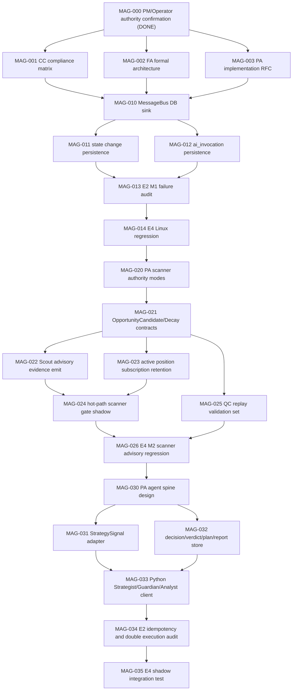

# AgentTodo M0 MAG-003 Implementation RFC

Date: 2026-05-06
Role: PA(default)
Repo root: `/Users/ncyu/Projects/TradeBot/srv`
Read-time HEAD: `6b667daf` (`Fix replay auth hermetic tests and paper enable env`)
Task: MAG-003 implementation RFC for AgentTodo M0

## Verdict

CONDITIONAL for implementation readiness.

M1 is ready to start as a first implementation wave if it is treated as an audit/event-store wave only, lands behind default-off feature flags, and passes Linux row-proof verification before any M2/M3 behavior change is enabled. M2 and M3 are not ready for production behavior changes until CC/FA sign-off is reconciled by PM, M1 proves nonzero durable rows on `trade-core`, and scanner authority remains either legacy-gated or shadow-only during the transition.

The core design direction is coherent with MAG-000: scanner output becomes advisory/evidence, Strategist owns open/hold/reduce/close/no_action decisions, Guardian owns non-bypassable veto/modify authority, and Rust remains the execution engine without hidden decision authority. The current code still has two readiness gaps:

1. Existing agent tables from `V003__trading_agent_tables.sql` are not populated by `MessageBus`, `BaseAgent` state transitions, or LLM invocation paths.
2. Rust scanner hot-path gates in `tick_pipeline/on_tick/step_4_5_dispatch.rs` still hard-block entry decisions before a Strategist/Guardian decision chain exists.

## Scope Boundary

This RFC is a design/report artifact only. It does not require production code edits.

Do not modify or revert the known unrelated WIP files:

- `helper_scripts/restart_all.sh`
- `program_code/exchange_connectors/bybit_connector/control_api_v1/replay/run_route.py`
- `program_code/exchange_connectors/bybit_connector/control_api_v1/tests/test_replay_routes_auth.py`

## Read Inputs

Required project control documents:

- `AGENTS.md`
- `CLAUDE.md`
- `TODO.md`
- `.codex/MEMORY.md`
- `.codex/agents/PA.md`
- `.claude/agents/PA.md`
- `docs/CCAgentWorkSpace/PA/profile.md`
- `docs/CCAgentWorkSpace/PA/memory.md`
- `docs/architecture/multi_agent_rework_2026-05-05/ENGINEERING_PLAN.md`
- `docs/architecture/multi_agent_rework_2026-05-05/AgentTodo.md`

Targeted implementation files inspected:

- `program_code/exchange_connectors/bybit_connector/control_api_v1/app/multi_agent_framework.py`
- `program_code/exchange_connectors/bybit_connector/control_api_v1/app/base_agent.py`
- `program_code/exchange_connectors/bybit_connector/control_api_v1/app/agent_audit_bridge.py`
- `program_code/exchange_connectors/bybit_connector/control_api_v1/app/db_pool.py`
- `program_code/exchange_connectors/bybit_connector/control_api_v1/app/strategy_wiring.py`
- `program_code/exchange_connectors/bybit_connector/control_api_v1/app/strategy_wiring_scanner.py`
- `program_code/exchange_connectors/bybit_connector/control_api_v1/app/scout_agent.py`
- `program_code/exchange_connectors/bybit_connector/control_api_v1/app/strategist_edge_eval.py`
- `program_code/exchange_connectors/bybit_connector/control_api_v1/app/guardian_agent.py`
- `program_code/exchange_connectors/bybit_connector/control_api_v1/app/executor_agent.py`
- `program_code/exchange_connectors/bybit_connector/control_api_v1/app/rust_scanner_reader.py`
- `rust/openclaw_engine/src/scanner/types.rs`
- `rust/openclaw_engine/src/scanner/registry.rs`
- `rust/openclaw_engine/src/scanner/runner.rs`
- `rust/openclaw_engine/src/scanner/market_judgment.rs`
- `rust/openclaw_engine/src/scanner/config.rs`
- `rust/openclaw_engine/src/tick_pipeline/on_tick/step_0_5_h0_gate.rs`
- `rust/openclaw_engine/src/tick_pipeline/on_tick/step_3_signals.rs`
- `rust/openclaw_engine/src/tick_pipeline/on_tick/step_4_5_dispatch.rs`
- `rust/openclaw_engine/src/tick_pipeline/mod.rs`
- `rust/openclaw_engine/src/tick_pipeline/commands.rs`
- `rust/openclaw_engine/src/intent_processor/router.rs`
- `openclaw_core/src/governance_core.rs`
- `sql/migrations/V003__trading_agent_tables.sql`
- `sql/migrations/V015__engine_mode_separation.sql`
- `helper_scripts/db/passive_wait_healthcheck.sh`

## Current Implementation Facts

`MessageBus` is the narrowest Python seam for durable agent messages. It already accepts an optional `audit_callback`, but `strategy_wiring.py` instantiates it as `MESSAGE_BUS = MessageBus()` with no durable sink. Current messages are held in memory and are not inserted into `agent.messages`.

`BaseAgent.start()`, `BaseAgent.pause()`, and `BaseAgent.stop()` change in-memory state only. They do not insert into `agent.state_changes`.

`BaseAgent._record_llm_call()` records cost-tracker metadata, but not `agent.ai_invocations`. Some direct LLM paths may also bypass this helper and need MAG-012 coverage.

`agent_audit_bridge.make_agent_audit_callback()` records agent audit events into `ChangeAuditLog`. It is a governance audit bridge, not a durable agent-event store. It should be composed with the new sink instead of replaced.

Existing DB tables from `V003__trading_agent_tables.sql`:

- `agent.messages(ts, message_id, from_agent, to_agent, message_type, priority, payload, context_id)`
- `agent.state_changes(ts, agent_name, from_state, to_state, trigger_event, details)`
- `agent.ai_invocations(ts, invocation_id, provider, model, tier, purpose, prompt_hash, input_tokens, output_tokens, cost_usd, latency_ms, success, response_summary, context_id, details)`

`V015__engine_mode_separation.sql` adds `engine_mode` only to `agent.ai_invocations`. `agent.messages` and `agent.state_changes` currently have no `engine_mode`.

Rust scanner hidden-authority points are in `rust/openclaw_engine/src/tick_pipeline/on_tick/step_4_5_dispatch.rs`:

- `symbol_registry.is_active(&intent.symbol)` can block new entry when symbol is outside scanner universe.
- `per_strategy_new_entry_rejection(intent)` can block in `demo|live_demo`.
- `scanner_ctx.route_mode` values such as `market_gate`, `exploration_only`, and `risk_policy_gate` can block before Guardian.

`step_0_5_h0_gate.rs` remains a valid hard-block seam for independent H0 market invalidity. Scanner advisory work must not weaken H0/P0/P1 hard gates.

## M1 Durable Agent Event Store

### Module Seams

Add a new Python module:

`program_code/exchange_connectors/bybit_connector/control_api_v1/app/agent_event_store.py`

Responsibilities:

- Own all inserts into `agent.messages`, `agent.state_changes`, and `agent.ai_invocations`.
- Use `db_pool.get_pg_conn()` instead of creating a separate pool.
- Accept plain dataclasses/dicts from framework code and normalize JSON with `psycopg2.extras.Json`.
- Fail soft for trading behavior but fail visible through counters and healthcheck output.
- Never write secrets, prompts, raw model responses, API keys, or stack traces into payload columns.
- Expose a small API:

```python
class AgentEventStore:
    def record_message(self, message: AgentMessage, *, engine_mode: str | None = None) -> None: ...
    def record_state_change(
        self,
        *,
        agent_name: str,
        from_state: str,
        to_state: str,
        trigger_event: str,
        details: dict[str, Any] | None = None,
        engine_mode: str | None = None,
    ) -> None: ...
    def record_ai_invocation(
        self,
        *,
        invocation_id: str,
        provider: str,
        model: str,
        tier: str | None,
        purpose: str,
        prompt_hash: str | None,
        input_tokens: int | None,
        output_tokens: int | None,
        cost_usd: Decimal | float | None,
        latency_ms: int | None,
        success: bool,
        response_summary: str | None,
        context_id: str | None,
        details: dict[str, Any] | None = None,
        engine_mode: str | None = None,
    ) -> None: ...
```

Wire `multi_agent_framework.py`:

- Keep `MessageBus` as the transport object.
- Add a dedicated `message_sink` callback or reuse the existing `audit_callback` only as a fanout wrapper.
- The durable sink must run after route validation and before subscriber delivery.
- DB failure must not prevent subscriber delivery in M1.
- The sink payload should include the original message payload plus routing metadata, but it must not mutate `AgentMessage`.

Wire `strategy_wiring.py` and `strategy_wiring_scanner.py`:

- Construct one `AgentEventStore`.
- Pass its message recording callback into `MESSAGE_BUS`.
- Preserve the existing `make_agent_audit_callback(gov_hub, role_name)` callbacks for `ChangeAuditLog`.
- Use an explicit fanout helper if both audit bridge and durable store need the same event.

Wire `base_agent.py`:

- Add optional `event_store` or `state_change_sink` dependency to `BaseAgent`.
- In `start()`, `pause()`, and `stop()`, record transitions as:
  - `INITIALIZING -> ACTIVE`, trigger `start`
  - `ACTIVE -> PAUSED`, trigger `pause`
  - `* -> STOPPED`, trigger `stop`
- Do not hold the agent lock while performing DB IO.
- On DB failure, update an in-process metric/counter and continue.

Wire `BaseAgent._record_llm_call()` and direct LLM call sites:

- Insert one `agent.ai_invocations` row per model request.
- Store `prompt_hash`, token counts, cost, latency, success, response summary, context id, and redacted details.
- Do not persist full prompt or full response.
- MAG-012 must search for direct model calls in Strategist and Analyst modules and route them through the same event store.

Healthcheck seam:

- Extend the passive DB healthcheck package used by `helper_scripts/db/passive_wait_healthcheck.sh`.
- Add an `agent_spine` or `agent_events` check that verifies recent nonzero rows for:
  - `agent.messages`
  - `agent.state_changes`
  - `agent.ai_invocations`
- The check should be WARN in default local/off mode and FAIL when `OPENCLAW_AGENT_EVENT_STORE_ENABLED=1`.

### M1 DB Mapping

Existing table: `agent.messages`

| Source | Column | Mapping |
| --- | --- | --- |
| `AgentMessage.timestamp` | `ts` | Convert epoch seconds to `TIMESTAMPTZ`; fallback to `now()` only if absent. |
| `AgentMessage.message_id` | `message_id` | Preserve UUID/string id. |
| `AgentMessage.from_agent.value` | `from_agent` | Text role name. |
| `AgentMessage.to_agent.value` | `to_agent` | Text role name. |
| `AgentMessage.message_type.value` | `message_type` | Text message type. |
| `AgentMessage.priority` | `priority` | Store decimal string because current column is `TEXT`; later migration may cast to integer if needed. |
| `AgentMessage.payload` | `payload` | JSONB, redacted and size-limited. |
| `AgentMessage.context_id` | `context_id` | Preserve if present. |

Recommended additive migration for M1:

```sql
ALTER TABLE agent.messages
  ADD COLUMN IF NOT EXISTS engine_mode TEXT;

ALTER TABLE agent.state_changes
  ADD COLUMN IF NOT EXISTS engine_mode TEXT;

CREATE INDEX IF NOT EXISTS idx_agent_state_changes_agent_ts
  ON agent.state_changes(agent_name, ts DESC);

CREATE INDEX IF NOT EXISTS idx_agent_messages_context_ts
  ON agent.messages(context_id, ts DESC);
```

Existing table: `agent.state_changes`

| Source | Column | Mapping |
| --- | --- | --- |
| Transition time | `ts` | `now()` at transition record time. |
| `BaseAgent.role.value` or configured name | `agent_name` | Text stable agent id. |
| Previous `AgentState.value` | `from_state` | Text state. |
| New `AgentState.value` | `to_state` | Text state. |
| Method or event | `trigger_event` | `start`, `pause`, `stop`, `error`, `recovered`, etc. |
| Context | `details` | JSONB with redacted reason, config mode, counters. |

Existing table: `agent.ai_invocations`

| Source | Column | Mapping |
| --- | --- | --- |
| Generated id | `invocation_id` | Deterministic request id if upstream has one; otherwise UUID. |
| Provider | `provider` | e.g. `openai`, `anthropic`, `local`, `mock`. |
| Model name | `model` | Exact model id. |
| Tier | `tier` | L1/L1.5/L2 if known. |
| Call purpose | `purpose` | `strategist_edge_eval`, `analyst_review`, etc. |
| Redacted prompt hash | `prompt_hash` | SHA-256 of normalized prompt material, not prompt text. |
| Usage | `input_tokens`, `output_tokens`, `cost_usd`, `latency_ms` | From model/cost tracker when available. |
| Result | `success`, `response_summary`, `details` | Summary only; never full response. |
| Correlation | `context_id`, `engine_mode` | Context id plus V015 `engine_mode`. |

### M1 Contract Guarantees

M1 guarantees only durable observability. It must not change trading decisions.

- If DB is unavailable, trading behavior continues in M1.
- If event serialization fails, the sink records a redacted warning counter and continues.
- High priority and critical messages are never sampled.
- Sampling, if enabled later, must be visible in `details` and healthcheck output.
- Acceptance requires recent rows in all three existing tables under Linux runtime conditions.

## Decision Chain Tables For M2/M3

The first implementable schema should be generic but typed by contract. This avoids a migration explosion while still making object chains queryable.

Add migration after M1, for example `V0XX__agent_decision_chain.sql`:

```sql
CREATE TABLE IF NOT EXISTS agent.decision_objects (
  ts TIMESTAMPTZ NOT NULL DEFAULT now(),
  object_id TEXT NOT NULL,
  object_type TEXT NOT NULL,
  agent_role TEXT NOT NULL,
  engine_mode TEXT,
  symbol TEXT,
  strategy_name TEXT,
  action TEXT,
  status TEXT NOT NULL,
  confidence DOUBLE PRECISION,
  context_id TEXT,
  decision_id TEXT,
  order_plan_id TEXT,
  lease_id TEXT,
  evidence_refs JSONB NOT NULL DEFAULT '[]'::jsonb,
  payload JSONB NOT NULL DEFAULT '{}'::jsonb,
  PRIMARY KEY (object_id, ts)
);

CREATE TABLE IF NOT EXISTS agent.decision_edges (
  ts TIMESTAMPTZ NOT NULL DEFAULT now(),
  edge_id TEXT NOT NULL,
  from_object_id TEXT NOT NULL,
  from_object_type TEXT NOT NULL,
  to_object_id TEXT NOT NULL,
  to_object_type TEXT NOT NULL,
  edge_type TEXT NOT NULL,
  context_id TEXT,
  payload JSONB NOT NULL DEFAULT '{}'::jsonb,
  PRIMARY KEY (edge_id, ts)
);

CREATE TABLE IF NOT EXISTS agent.insights (
  ts TIMESTAMPTZ NOT NULL DEFAULT now(),
  insight_id TEXT NOT NULL,
  insight_type TEXT NOT NULL,
  agent_role TEXT NOT NULL DEFAULT 'analyst',
  engine_mode TEXT,
  symbol TEXT,
  strategy_name TEXT,
  applies_to_object_id TEXT,
  applies_to_object_type TEXT,
  confidence DOUBLE PRECISION,
  severity TEXT,
  context_id TEXT,
  evidence_refs JSONB NOT NULL DEFAULT '[]'::jsonb,
  payload JSONB NOT NULL DEFAULT '{}'::jsonb,
  PRIMARY KEY (insight_id, ts)
);

CREATE INDEX IF NOT EXISTS idx_agent_decision_objects_type_ts
  ON agent.decision_objects(object_type, ts DESC);

CREATE INDEX IF NOT EXISTS idx_agent_decision_objects_symbol_ts
  ON agent.decision_objects(symbol, ts DESC);

CREATE INDEX IF NOT EXISTS idx_agent_decision_objects_context_ts
  ON agent.decision_objects(context_id, ts DESC);

CREATE INDEX IF NOT EXISTS idx_agent_decision_edges_from_ts
  ON agent.decision_edges(from_object_id, ts DESC);

CREATE INDEX IF NOT EXISTS idx_agent_decision_edges_to_ts
  ON agent.decision_edges(to_object_id, ts DESC);

CREATE INDEX IF NOT EXISTS idx_agent_insights_target_ts
  ON agent.insights(applies_to_object_id, ts DESC);
```

If TimescaleDB is available for these tables, convert them to hypertables with a 7 day chunk interval after creation. Do not make the migration require TimescaleDB in local unit tests unless existing migration conventions already do so.

### Decision Object Mapping

| Plan object | Producer | DB table | `object_type` / key fields |
| --- | --- | --- | --- |
| `ScoutIntel` | Python Scout | `agent.decision_objects` | `object_type='scout_intel'`, `agent_role='scout'`, payload contains normalized intel and raw scanner metadata refs. |
| `OpportunityCandidate` | Rust scanner and Python adapter | `agent.decision_objects` | `object_type='opportunity_candidate'`, `symbol`, `strategy_name`, `confidence=final_score`, payload contains `scan_id`, `route_mode`, `edge_bps`, `market_status`. |
| `OpportunityDecay` | Rust scanner registry / Python scanner reader | `agent.decision_objects` | `object_type='opportunity_decay'`, `status='decayed'`, payload contains previous scan id, current scan id, decay reason, active-position retention flag. |
| `StrategySignal` | Rust step 3 / Python Strategist adapter | `agent.decision_objects` | `object_type='strategy_signal'`, payload contains signal side, signal source, features, confidence, and evidence refs. |
| `StrategistDecision` | Python Strategist | `agent.decision_objects` | `object_type='strategist_decision'`, `action in open/hold/reduce/close/no_action`, `decision_id` set. |
| `PositionReview` | Python Strategist or Analyst assisted flow | `agent.decision_objects` | `object_type='position_review'`, action recommendation plus position id and review reason. |
| `GuardianVerdict` | Python Guardian | `agent.decision_objects` | `object_type='guardian_verdict'`, `status in approved/modified/rejected`, payload contains risk checks and modification details. |
| `ExecutionPlan` | Python Executor/Rust command adapter | `agent.decision_objects` | `object_type='execution_plan'`, `order_plan_id` set, payload contains sanitized order plan and required lease id when live. |
| `ExecutionReport` | Python Executor/Rust execution result | `agent.decision_objects` | `object_type='execution_report'`, payload contains accepted/rejected/fill status, external order ids redacted as needed. |
| `AnalystInsight` | Python Analyst | `agent.insights` | `insight_type` identifies post-trade, behavior, risk, or model insight. |

### Edge Types

Use `agent.decision_edges` to reconstruct the chain:

- `evidence_for`: `OpportunityCandidate` or `ScoutIntel` -> `StrategySignal`
- `signal_for`: `StrategySignal` -> `StrategistDecision`
- `reviewed_by`: `StrategistDecision` -> `GuardianVerdict`
- `modified_by`: `GuardianVerdict` -> `ExecutionPlan`
- `planned_by`: `GuardianVerdict` -> `ExecutionPlan`
- `executed_by`: `ExecutionPlan` -> `ExecutionReport`
- `analyzed_by`: `ExecutionReport` -> `AnalystInsight`
- `supersedes`: later decision object -> earlier decision object
- `decays`: `OpportunityDecay` -> `OpportunityCandidate`

### Contract IDs

All M2/M3 objects must carry stable ids:

- `scan_id`: from Rust `ScanResult.scan_id`
- `candidate_id`: `scan_id:symbol:strategy_name`
- `signal_id`: deterministic UUID or hash of `symbol`, `strategy`, signal timestamp, and source id
- `decision_id`: generated by Strategist and propagated through Guardian/Executor
- `verdict_id`: generated by Guardian
- `order_plan_id`: generated before any execution attempt
- `execution_report_id`: generated per execution outcome
- `context_id`: shared across a message/decision chain when present

Execution idempotency must key on `decision_id`, `verdict_id`, and `order_plan_id`, not only symbol/side.

### Canonical Contract Envelopes

Use the same envelope shape in Rust structs, Python dataclasses/TypedDicts, and DB `payload` JSON. Rust may use `serde` structs; Python may use frozen dataclasses plus `asdict()` or Pydantic only if the repo already has that dependency in the target package.

Common envelope:

```python
class AgentDecisionEnvelope(TypedDict):
    object_id: str
    object_type: str
    ts_ms: int
    agent_role: str
    engine_mode: str | None
    context_id: str | None
    symbol: str | None
    strategy_name: str | None
    confidence: float | None
    status: str
    evidence_refs: list[dict[str, str]]
    payload: dict[str, Any]
```

`OpportunityCandidate.payload`:

```python
class OpportunityCandidatePayload(TypedDict):
    scan_id: str
    candidate_id: str
    symbol: str
    strategy_name: str | None
    final_score: float
    raw_score: float | None
    edge_bps: float | None
    edge_bonus: float | None
    edge_n: int | None
    edge_status: str | None
    route_mode: str | None
    market_status: str | None
    route_reason: str | None
    beta_proxy: float | None
    sector: str | None
```

`OpportunityDecay.payload`:

```python
class OpportunityDecayPayload(TypedDict):
    previous_scan_id: str | None
    current_scan_id: str
    candidate_id: str
    symbol: str
    previous_status: str | None
    current_status: str
    decay_reason: str
    active_position_retained: bool
```

`StrategySignal.payload`:

```python
class StrategySignalPayload(TypedDict):
    signal_id: str
    symbol: str
    strategy_name: str
    side: str
    source: str
    confidence: float
    features: dict[str, Any]
    scanner_candidate_id: str | None
```

`StrategistDecision.payload`:

```python
class StrategistDecisionPayload(TypedDict):
    decision_id: str
    action: Literal["open", "hold", "reduce", "close", "no_action"]
    symbol: str
    strategy_name: str | None
    side: str | None
    size_hint: float | None
    thesis: str | None
    invalidation: str | None
    source_signal_id: str | None
    source_candidate_id: str | None
```

`GuardianVerdict.payload`:

```python
class GuardianVerdictPayload(TypedDict):
    verdict_id: str
    decision_id: str
    status: Literal["approved", "modified", "rejected"]
    reason: str
    checks: list[dict[str, Any]]
    modifications: dict[str, Any]
```

`ExecutionPlan.payload`:

```python
class ExecutionPlanPayload(TypedDict):
    order_plan_id: str
    decision_id: str
    verdict_id: str
    lease_id: str | None
    symbol: str
    side: str
    qty: float
    order_type: str
    limit_price: float | None
    reduce_only: bool
```

`ExecutionReport.payload`:

```python
class ExecutionReportPayload(TypedDict):
    execution_report_id: str
    order_plan_id: str
    accepted: bool
    status: str
    reason: str | None
    exchange_order_ref: str | None
    filled_qty: float | None
    average_price: float | None
```

`AnalystInsight.payload`:

```python
class AnalystInsightPayload(TypedDict):
    insight_id: str
    insight_type: str
    applies_to_object_id: str
    finding: str
    recommendation: str | None
    confidence: float | None
    severity: str | None
```

## Feature Flags

### Existing Flags To Preserve

| Flag | Default | RFC position |
| --- | --- | --- |
| `OPENCLAW_LEASE_ROUTER_GATE_ENABLED` | `0` | Keep default off. Do not couple MAG-003 rollout to router hard enforcement. |
| `OPENCLAW_LEASE_PYTHON_IPC_ENABLED` | off unless strict `1` | Preserve. Executor live execution must still require a lease when enabled by existing governance path. |

### New M1 Flags

| Flag | Default | Meaning |
| --- | --- | --- |
| `OPENCLAW_AGENT_EVENT_STORE_ENABLED` | `0` | Enables writes to `agent.messages`, `agent.state_changes`, and `agent.ai_invocations`. |
| `OPENCLAW_AGENT_EVENT_STORE_FAIL_CLOSED` | `0` | Must remain `0` for M1. Event-store failure is health-visible but does not block trading. |
| `OPENCLAW_AGENT_EVENT_STORE_HEALTH_REQUIRED` | `0` local, `1` in Linux acceptance | Makes passive healthcheck fail if recent rows are missing while event store is enabled. |
| `OPENCLAW_AGENT_EVENT_STORE_MAX_PAYLOAD_BYTES` | `65536` | Redacts/truncates oversized payloads before DB insert. |

Optional later sampling flags should default to full fidelity for high/critical events:

| Flag | Default | Meaning |
| --- | --- | --- |
| `OPENCLAW_AGENT_EVENT_STORE_SAMPLE_LOW` | `1.0` in M1 | Low-priority message sampling ratio. |
| `OPENCLAW_AGENT_EVENT_STORE_SAMPLE_NORMAL` | `1.0` in M1 | Normal-priority message sampling ratio. |
| `OPENCLAW_AGENT_EVENT_STORE_SAMPLE_HIGH` | `1.0` | High-priority messages must be retained. |
| `OPENCLAW_AGENT_EVENT_STORE_SAMPLE_CRITICAL` | `1.0` | Critical messages must be retained. |

Sampling can be reduced only after Linux row volume is measured. Prior PA memory estimated that high-frequency agent message storage could become millions of rows per day if miswired to tick loops, so the correct first-wave guard is "do not wire tick-level events into MessageBus" rather than silent sampling.

### New M2 Scanner Authority Flag

| Flag | Default | Allowed values |
| --- | --- | --- |
| `OPENCLAW_SCANNER_AUTHORITY_MODE` | `legacy_gate` | `legacy_gate`, `advisory_shadow`, `advisory_enforced` |

Mode semantics:

- `legacy_gate`: current Rust scanner gate behavior. Scanner can block new entries in `step_4_5_dispatch.rs`.
- `advisory_shadow`: no new production authority is granted to the agent spine. The scanner would-block/would-allow result is persisted as evidence and compared against Strategist/Guardian shadow output. While legacy Rust execution remains primary, this mode must not create extra live opens.
- `advisory_enforced`: scanner no longer directly blocks open/hold/reduce/close/no_action decisions. Scanner evidence is attached to Scout/Strategist/Guardian objects. H0/P0/P1 gates and Guardian veto/modify authority remain hard and non-bypassable.

Invalid or missing values must resolve to `legacy_gate` until PM explicitly approves the cutover.

### New M3 Agent Spine Flags

| Flag | Default | Allowed values |
| --- | --- | --- |
| `OPENCLAW_AGENT_SPINE_ENABLED` | `0` | `0`, `1` |
| `OPENCLAW_AGENT_SPINE_MODE` | `shadow` | `shadow`, `canary`, `primary` |

Mode semantics:

- `shadow`: build and persist the decision chain, but do not execute from it.
- `canary`: allow a narrow configured subset to use spine-produced execution plans after Strategist and Guardian objects exist and match idempotency constraints.
- `primary`: spine chain is the normal source of execution plans. Missing StrategistDecision, GuardianVerdict, ExecutionPlan, or required lease must fail closed.

Recommended helper flags:

| Flag | Default | Meaning |
| --- | --- | --- |
| `OPENCLAW_AGENT_SPINE_CANARY_SYMBOLS` | empty | Comma-separated allowlist for canary mode. Empty means no live canary orders. |
| `OPENCLAW_AGENT_SPINE_CANARY_STRATEGIES` | empty | Comma-separated allowlist for strategy canary mode. |
| `OPENCLAW_AGENT_SPINE_REQUIRE_GUARDIAN` | `1` | Must remain `1` outside tests. |

## M1 -> M2 -> M3 Rollout DAG

Task ids are from `docs/architecture/multi_agent_rework_2026-05-05/AgentTodo.md`.



Parallelism rule:

- MAG-011 and MAG-012 can run in parallel after MAG-010 creates the event-store module.
- MAG-021, MAG-022, MAG-023, and MAG-025 can run with limited parallelism if Rust/Python file scopes are disjoint.
- MAG-031 and MAG-032 can run in parallel only if one owner controls shared Rust module registration.

Hard gates:

- M2 must not enable `advisory_enforced` until M1 has Linux row proof and scanner shadow comparisons have replay coverage.
- M3 must not enable `canary` until M2 advisory evidence objects and Guardian verdict edges are persisted.
- M3 must not enable `primary` until E2 signs off on idempotency and double-execution prevention.

## Disjoint E1/E1a Write Scopes

### M1 Scopes

E1 owns MAG-010 and MAG-011:

- `program_code/exchange_connectors/bybit_connector/control_api_v1/app/agent_event_store.py`
- `program_code/exchange_connectors/bybit_connector/control_api_v1/app/multi_agent_framework.py`
- `program_code/exchange_connectors/bybit_connector/control_api_v1/app/base_agent.py`
- `program_code/exchange_connectors/bybit_connector/control_api_v1/app/strategy_wiring.py`
- `program_code/exchange_connectors/bybit_connector/control_api_v1/app/strategy_wiring_scanner.py`
- M1 unit tests for message/state persistence
- M1 additive SQL migration for `engine_mode` and indexes

E1a owns MAG-012:

- `BaseAgent._record_llm_call()` only if E1 has already added the event-store dependency seam
- Direct Strategist/Analyst LLM call sites that bypass `BaseAgent`
- Tests for AI invocation redaction, prompt hashing, and failure behavior

Conflict control:

- E1 creates the store and constructor seam first.
- E1a must not refactor `MessageBus`.
- E1a must not alter agent lifecycle methods except through the seam E1 created.

### M2 Scopes

E1 Rust owns scanner authority and Rust contract fields:

- `rust/openclaw_engine/src/scanner/types.rs`
- `rust/openclaw_engine/src/scanner/registry.rs`
- `rust/openclaw_engine/src/scanner/runner.rs`
- `rust/openclaw_engine/src/scanner/config.rs`
- `rust/openclaw_engine/src/tick_pipeline/on_tick/step_4_5_dispatch.rs`
- Rust scanner authority tests/replay fixtures

E1a Python owns Scout advisory ingestion:

- `program_code/exchange_connectors/bybit_connector/control_api_v1/app/rust_scanner_reader.py`
- `program_code/exchange_connectors/bybit_connector/control_api_v1/app/scout_agent.py`
- `program_code/exchange_connectors/bybit_connector/control_api_v1/app/strategy_wiring_scanner.py`
- Python tests for `OpportunityCandidate` and `OpportunityDecay` normalization

Conflict control:

- E1a consumes Rust output contracts but does not edit Rust scanner files.
- E1 owns `OPENCLAW_SCANNER_AUTHORITY_MODE` parsing in Rust.
- E1a may mirror the mode in Python only for reporting/UI, not for authoritative behavior.

### M3 Scopes

E1 Rust owns agent-spine integration:

- New `rust/openclaw_engine/src/agent_spine/mod.rs`
- New `rust/openclaw_engine/src/agent_spine/contracts.rs`
- New `rust/openclaw_engine/src/agent_spine/events.rs`
- New `rust/openclaw_engine/src/agent_spine/store.rs`
- `rust/openclaw_engine/src/tick_pipeline/on_tick/step_3_signals.rs`
- `rust/openclaw_engine/src/tick_pipeline/on_tick/step_4_5_dispatch.rs`
- `rust/openclaw_engine/src/tick_pipeline/commands.rs`
- Module registration files only as needed

E1a Python owns agent-spine client and agent adaptation:

- New `program_code/exchange_connectors/bybit_connector/control_api_v1/app/agent_contracts.py`
- New `program_code/exchange_connectors/bybit_connector/control_api_v1/app/agent_spine_client.py`
- `program_code/exchange_connectors/bybit_connector/control_api_v1/app/strategist_edge_eval.py`
- `program_code/exchange_connectors/bybit_connector/control_api_v1/app/guardian_agent.py`
- `program_code/exchange_connectors/bybit_connector/control_api_v1/app/executor_agent.py`
- `program_code/exchange_connectors/bybit_connector/control_api_v1/app/analyst_agent.py`

Conflict control:

- Only one owner edits `strategy_wiring.py` during M3 final integration.
- Executor must not gain strategy selection authority.
- Rust `SubmitOrder` remains an execution path, not a decision-making path.

## M2 Implementation Seams

### Scanner Contract Seams

Rust source:

- `scanner/types.rs`: add advisory fields needed by Python and DB mapping without changing existing `ScoredSymbol` identity.
- `scanner/registry.rs`: emit `OpportunityDecay` events when symbols leave or degrade, while retaining active-position monitoring.
- `scanner/runner.rs`: attach `scan_id`, active-position retention reason, and advisory route result to latest scan state.
- `scanner/market_judgment.rs`: continue computing route modes, but classify them as evidence in advisory modes.

Python source:

- `rust_scanner_reader.py`: normalize Rust candidates into `OpportunityCandidate` dicts with stable `candidate_id`.
- `scout_agent.py`: produce `ScoutIntel` and advisory candidate evidence. It must not emit close/reduce decisions.
- `strategy_wiring_scanner.py`: keep the scanner worker as evidence producer only.

### Scanner Gate Refactor

In `tick_pipeline/on_tick/step_4_5_dispatch.rs`, replace direct scanner `continue` branches with a mode-aware helper:

```rust
enum ScannerAuthorityMode {
    LegacyGate,
    AdvisoryShadow,
    AdvisoryEnforced,
}

struct ScannerGateAssessment {
    would_block: bool,
    reason: Option<String>,
    route_mode: Option<String>,
    candidate_id: Option<String>,
}
```

Required behavior:

- `LegacyGate`: preserve current `continue` branches.
- `AdvisoryShadow`: record `ScannerGateAssessment`; do not grant any new agent-spine execution authority. While legacy path remains primary, real behavior should remain conservative.
- `AdvisoryEnforced`: scanner assessment becomes evidence only. H0/P0/P1 and Guardian still block.

Do not move true H0 invalidity into scanner advisory logic. H0 remains in `step_0_5_h0_gate.rs`.

## M3 Implementation Seams

### Rust Spine

Add `rust/openclaw_engine/src/agent_spine/` with:

- `contracts.rs`: Rust structs for `StrategySignal`, `ExecutionPlan`, `ExecutionReport`, and serialized refs to Python-created `StrategistDecision` and `GuardianVerdict`.
- `events.rs`: event envelope and idempotency keys.
- `store.rs`: DB/write client or event handoff mechanism consistent with existing Rust DB conventions.
- `mod.rs`: module exports and flag parsing helpers.

Rust insertion points:

- `step_3_signals.rs`: publish `StrategySignal` shadow objects from strategy signal evaluation.
- `step_4_5_dispatch.rs`: attach scanner advisory evidence and avoid hidden scanner decision authority in advisory modes.
- `tick_pipeline/commands.rs`: accept `ExecutionPlan` objects only after Guardian approval and idempotency checks.
- `intent_processor/router.rs`: keep Decision Lease router behavior unchanged and independent.

### Python Spine

Add:

- `agent_contracts.py`: dataclasses/TypedDict contracts matching DB object types.
- `agent_spine_client.py`: durable writer/client for decision objects and edges, backed by the M1 event-store DB seam.

Adapt:

- `strategist_edge_eval.py`: emit `StrategistDecision` with action in `open`, `hold`, `reduce`, `close`, `no_action`.
- `guardian_agent.py`: emit `GuardianVerdict` with `approved`, `modified`, or `rejected`; mandatory for any non-shadow execution.
- `executor_agent.py`: consume only approved/modified verdicts, produce `ExecutionPlan` and `ExecutionReport`, and enforce idempotency.
- `analyst_agent.py`: emit `AnalystInsight`; no direct trade authority.

M3 first wave should remain `OPENCLAW_AGENT_SPINE_ENABLED=0` by default and test `shadow` mode only.

## E2 Acceptance Gates

E2 should block implementation if any of the following are true:

- M1 event-store writes can block live trading when DB is down.
- M1 writes raw prompts, raw LLM responses, API keys, secrets, or unbounded payloads.
- `agent.messages`, `agent.state_changes`, or `agent.ai_invocations` stay at zero rows after a Linux enabled-mode run.
- Scanner advisory mode still directly decides open/hold/reduce/close/no_action.
- `OpportunityDecay` can force close/reduce without Strategist and Guardian objects.
- Active positions are removed from monitoring only because scanner candidate status decayed.
- M3 Executor can choose symbol, side, size, or strategy without a StrategistDecision and GuardianVerdict.
- M3 permits execution without idempotency on `decision_id`/`order_plan_id`.
- Decision Lease enforcement is weakened or silently bypassed for live execution.

Required E2 review focus:

- DB failure behavior and health visibility.
- PII/secret/prompt redaction.
- Concurrency and lock boundaries around `MessageBus` and `BaseAgent`.
- Scanner authority mode defaults and invalid-value behavior.
- Double-execution prevention.
- Guardian non-bypassability.

## E4 Linux Verification Commands

These commands are intended for `trade-core` after implementation branches land. They are not run by this RFC.

Baseline repo state:

```bash
ssh trade-core 'cd ~/BybitOpenClaw/srv && git status --short --branch && git rev-parse --short HEAD'
```

M1 unit/regression tests:

```bash
ssh trade-core 'cd ~/BybitOpenClaw/srv && .venv/bin/python -m pytest \
  program_code/exchange_connectors/bybit_connector/control_api_v1/tests/test_agent_event_store.py \
  program_code/exchange_connectors/bybit_connector/control_api_v1/tests/test_message_bus_agent_event_store.py \
  program_code/exchange_connectors/bybit_connector/control_api_v1/tests/test_base_agent_state_persistence.py \
  program_code/exchange_connectors/bybit_connector/control_api_v1/tests/test_ai_invocation_persistence.py \
  -q'
```

M1 healthcheck and row proof:

```bash
ssh trade-core 'cd ~/BybitOpenClaw/srv && OPENCLAW_AGENT_EVENT_STORE_ENABLED=1 OPENCLAW_AGENT_EVENT_STORE_HEALTH_REQUIRED=1 bash helper_scripts/db/passive_wait_healthcheck.sh --quiet'
```

```bash
ssh trade-core 'cd ~/BybitOpenClaw/srv && .venv/bin/python - <<'"'"'PY'"'"'
from program_code.exchange_connectors.bybit_connector.control_api_v1.app.db_pool import get_pg_conn

queries = {
    "agent.messages": "SELECT count(*) FROM agent.messages WHERE ts > now() - interval '"'"'30 minutes'"'"'",
    "agent.state_changes": "SELECT count(*) FROM agent.state_changes WHERE ts > now() - interval '"'"'30 minutes'"'"'",
    "agent.ai_invocations": "SELECT count(*) FROM agent.ai_invocations WHERE ts > now() - interval '"'"'30 minutes'"'"'",
}
with get_pg_conn() as conn:
    assert conn is not None, "no postgres connection"
    with conn.cursor() as cur:
        for name, sql in queries.items():
            cur.execute(sql)
            count = cur.fetchone()[0]
            print(f"{name}: {count}")
            assert count > 0, f"{name} has no recent rows"
PY'
```

M2 Rust scanner authority tests:

```bash
ssh trade-core 'cd ~/BybitOpenClaw/srv && cargo test -p openclaw_engine scanner_authority_mode -- --nocapture'
```

M2 Python scanner evidence tests:

```bash
ssh trade-core 'cd ~/BybitOpenClaw/srv && .venv/bin/python -m pytest \
  program_code/exchange_connectors/bybit_connector/control_api_v1/tests/test_rust_scanner_reader_advisory.py \
  program_code/exchange_connectors/bybit_connector/control_api_v1/tests/test_scout_opportunity_evidence.py \
  -q'
```

M3 spine shadow tests:

```bash
ssh trade-core 'cd ~/BybitOpenClaw/srv && cargo test -p openclaw_engine agent_spine_shadow_chain -- --nocapture'
```

```bash
ssh trade-core 'cd ~/BybitOpenClaw/srv && OPENCLAW_AGENT_SPINE_ENABLED=1 OPENCLAW_AGENT_SPINE_MODE=shadow .venv/bin/python -m pytest \
  program_code/exchange_connectors/bybit_connector/control_api_v1/tests/test_agent_spine_client.py \
  program_code/exchange_connectors/bybit_connector/control_api_v1/tests/test_guardian_spine_verdict_required.py \
  program_code/exchange_connectors/bybit_connector/control_api_v1/tests/test_executor_spine_idempotency.py \
  -q'
```

M3 decision-chain row proof:

```bash
ssh trade-core 'cd ~/BybitOpenClaw/srv && .venv/bin/python - <<'"'"'PY'"'"'
from program_code.exchange_connectors.bybit_connector.control_api_v1.app.db_pool import get_pg_conn

queries = {
    "agent.decision_objects": "SELECT count(*) FROM agent.decision_objects WHERE ts > now() - interval '"'"'30 minutes'"'"'",
    "agent.decision_edges": "SELECT count(*) FROM agent.decision_edges WHERE ts > now() - interval '"'"'30 minutes'"'"'",
    "agent.insights": "SELECT count(*) FROM agent.insights WHERE ts > now() - interval '"'"'30 minutes'"'"'",
}
with get_pg_conn() as conn:
    assert conn is not None, "no postgres connection"
    with conn.cursor() as cur:
        for name, sql in queries.items():
            cur.execute(sql)
            count = cur.fetchone()[0]
            print(f"{name}: {count}")
            assert count > 0, f"{name} has no recent rows"
PY'
```

## Rollback And Fail-Closed Behavior

M1 rollback:

- Set `OPENCLAW_AGENT_EVENT_STORE_ENABLED=0`.
- Keep trading behavior unchanged.
- Healthcheck should report disabled/not required instead of failing.

M1 fail behavior:

- DB write failure must be fail-soft for trading and fail-visible in logs/healthcheck.
- Serialization/redaction failure must drop only that event and increment a counter.

M2 rollback:

- Set `OPENCLAW_SCANNER_AUTHORITY_MODE=legacy_gate`.
- Restart/reload the Rust service using the existing runtime procedure.
- No DB rollback should be needed because advisory objects are append-only evidence.

M2 fail behavior:

- Invalid scanner authority mode resolves to `legacy_gate`.
- Missing scanner evidence cannot create an open/reduce/close decision.
- Active-position monitoring must be retained even when opportunity status decays.

M3 rollback:

- Set `OPENCLAW_AGENT_SPINE_ENABLED=0`.
- Keep `OPENCLAW_AGENT_SPINE_MODE=shadow` until PM authorizes canary.
- Keep `OPENCLAW_SCANNER_AUTHORITY_MODE=legacy_gate` or `advisory_shadow` unless M3 canary has passed.

M3 fail behavior:

- In `shadow`, spine failure must not alter legacy behavior.
- In `canary` or `primary`, missing `StrategistDecision`, missing `GuardianVerdict`, missing `ExecutionPlan`, missing idempotency key, or missing required Decision Lease must fail closed for new execution.
- Guardian rejection is terminal for that decision chain unless a new StrategistDecision is produced.
- Executor may reject or report failure, but must not rewrite the trading decision.

## Implementation Packet

First wave to assign:

1. MAG-010: create `agent_event_store.py`, wire `MessageBus`, add message persistence tests.
2. MAG-011: wire `BaseAgent` state transitions and healthcheck row proof.
3. MAG-012: wire AI invocation persistence and redaction tests.
4. MAG-013: E2 review for DB failure, prompt secrecy, and event-store health.
5. MAG-014: E4 Linux verification with event store enabled.

Do not start M2 behavior changes until MAG-014 passes. M2 contract work can draft fixtures, but runtime authority must remain `legacy_gate` until PM accepts M1 evidence.

Second wave:

1. MAG-020: finalize scanner mode semantics exactly as above.
2. MAG-021: add `OpportunityCandidate` and `OpportunityDecay` contracts.
3. MAG-022/MAG-023: emit advisory evidence and retain active-position monitoring.
4. MAG-024/MAG-025/MAG-026: shadow scanner gate replay and Linux regression.

Third wave:

1. MAG-030: freeze agent-spine contracts after M2 evidence schema is stable.
2. MAG-031/MAG-032/MAG-033: build Rust signal adapter, decision-chain store, and Python client.
3. MAG-034/MAG-035: verify idempotency and shadow-chain rows.

Final PA position: implementation may proceed conditionally with M1 only. Any M2/M3 authority change requires PM reconciliation of CC/FA reports, Linux row proof, and E2/E4 acceptance gates.
