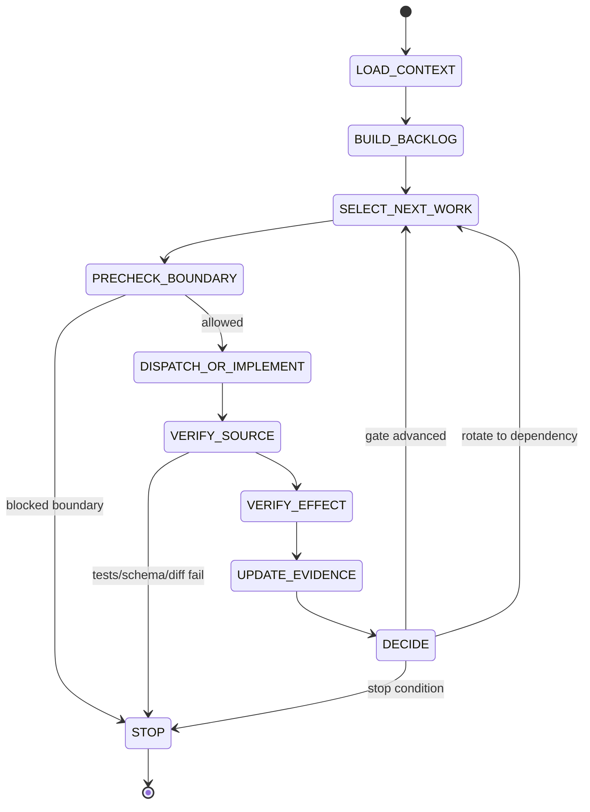

# 2026-07-06 AI/ML Roadmap Autonomous Completion Loop Design

PM sign-off: `APPROVED-AS-ENGINEERING-GOVERNANCE-DESIGN`

Revision: `2026-07-06-continuous-state-v2`

Scope: design an autonomous engineering loop that can advance, evaluate, and stop work for the
AI/ML trading roadmap signed on 2026-07-06. This is not a trading loop and not runtime authority.
No runtime mutation, DB write, exchange/API/private read, MCP install/config, secret access,
order/probe, Cost Gate change, deploy, or live/mainnet action was performed.

## Executive Verdict

The roadmap needs an autonomous completion loop, but the loop must optimize engineering proof, not
trading discretion.

Correct shape:

1. load current authority from `TODO.md` and the signed roadmap/audit reports;
2. build a dependency-gated backlog;
3. select the highest-priority unblocked engineering work item;
4. dispatch or implement only inside that work item's allowed action boundary;
5. run source/test/schema/evidence verification;
6. evaluate whether the implementation produced measurable gate movement;
7. always write a machine-readable state packet;
8. continue, rotate, or stop from that state packet.

The loop must be fail-closed. It cannot convert a planning document into order authority. It can
only prepare source/contracts/tests/reports until an existing PM->E3->BB path grants a specific
runtime or exchange-facing window.

## 2026-07-06 Continuous-State Correction

The first dry-run implementation cycle produced `WP1-PROOF-PACKET-V1` and an
`implementation_effect_review_v1`, but it stopped after one `ADVANCED` cycle and did not write a
state packet. That exposed a design ambiguity: `roadmap_loop_state_packet_v1` was described as a
stop packet, not as the durable loop cursor.

Correction:

- `roadmap_loop_state_packet_v1` is mandatory after every iteration, including `ADVANCED`.
- `ADVANCED` is not terminal. A launcher seeing `status=ADVANCED` or
  `status=ADVANCED_WITH_CONCERNS` must select `next_work_id` and continue while budget remains.
- A single-cycle run is allowed only when the prompt explicitly sets `max_iterations=1` or
  `mode=single_iteration`.
- If a prior iteration has an effect review but no state packet, the next launcher must write a
  recovery state packet with `status=ADVANCED_WITH_CONCERNS`, reference the missing packet concern,
  and continue from the recorded next action.
- Source feature work must use the configured repo role chain. PM direct implementation is an
  exception only for docs/state/report edits, or when the operator explicitly requests a
  single-agent/no-subagent run. If required sub-agent tools are unavailable, stop as
  `STOP_DISPATCH_BLOCKED` rather than silently treating local PM code as a full loop sign-off.

## Inputs

Primary sources:

- `TODO.md`: active blocker is still
  `P0-STANDING-DEMO-LOSS-CONTROL-ENVELOPE-REFRESH-CURRENT-HEAD`; standing Demo auth expired at
  `2026-07-01T17:16:05Z`; current candidate remains
  `grid_trading|ETHUSDT|Buy` with zero candidate-matched order/fill/fee/slippage proof.
- `docs/agents/profit-first-autonomy-loop.md`: existing runtime/profit loop; this design must not
  weaken its Demo envelope, proof, learning I/O, or anti-repeat rules.
- `docs/CCAgentWorkSpace/PM/workspace/reports/2026-07-06--ai_ml_trade_engineering_roadmap_after_maker_challenge.md`
- `docs/CCAgentWorkSpace/PM/workspace/reports/2026-07-06--ai_ml_roadmap_adversarial_audit.md`
- PM/Codex dispatch rules in `AGENTS.md`, `CLAUDE.md`, `.codex/AGENT_DISPATCH_PROTOCOL.md`, and
  `.codex/SUBAGENT_EXECUTION_RULES.md`.

Dispatch note: PM handled this design locally. Skipped fresh sub-agent dispatch because this task is
synthesis of already signed roadmap/audit inputs, not new quant research, security review, runtime
work, or implementation. The future loop below defines when it must dispatch QC/MIT/AI-E/CC/FA/PA,
E1/E2/E4/QA, or E3/BB.

## Core Principle

Treat the roadmap as a dependency graph, not a calendar.

Dates are planning estimates. A phase advances only when its gate has a machine-checkable artifact
and the effect review says the gate actually moved. If the loop cannot produce new evidence, it must
stop or rotate. It must not issue "continue observing" as progress.

## State Machine



State meanings:

| State | Required action | Fail-closed output |
|---|---|---|
| `LOAD_CONTEXT` | Read boot rules, `TODO.md`, signed roadmap/audit, latest relevant reports. | `STOP_SOURCE_MISSING` |
| `BUILD_BACKLOG` | Build WP0-WP8 work graph with dependencies and current gate status. | `STOP_NO_BACKLOG` |
| `SELECT_NEXT_WORK` | Pick highest priority unblocked work; if blocked, pick dependency. | `STOP_NO_UNBLOCKED_WORK` |
| `PRECHECK_BOUNDARY` | Validate allowed/denied actions, authority, dirty worktree, current head. | `STOP_BOUNDARY` |
| `DISPATCH_OR_IMPLEMENT` | Dispatch correct role chain or make narrow PM source/docs edit if allowed. | `STOP_DISPATCH_BLOCKED` |
| `VERIFY_SOURCE` | Run focused tests, schema validators, static guards, diff checks. | `STOP_TEST` |
| `VERIFY_EFFECT` | Compare pre/post gates, artifacts, and residual blockers. | `STOP_NO_DELTA` |
| `UPDATE_EVIDENCE` | Write PM report, Operator summary, index/memory/effect review/state packet. | `STOP_EVIDENCE_WRITE` |
| `DECIDE` | Continue, rotate, or stop based on the state packet and budgets. | `STOP_*` |

## Work Item Contract

Every loop iteration consumes one `roadmap_work_item_v1`:

```json
{
  "schema_version": "roadmap_work_item_v1",
  "work_id": "WP1-PROOF-PACKET-V1",
  "roadmap_wp": "WP1",
  "phase": "evidence_contract",
  "priority": "P0",
  "owner_chain": ["PM", "PA", "E1", "E2", "E4", "QA", "PM"],
  "preconditions": [
    "no_conflicting_P0_loss_control_runtime_action",
    "source_head_known",
    "acceptance_tests_defined"
  ],
  "allowed_actions": [
    "source_edit",
    "docs_edit",
    "test_edit",
    "local_mac_tests",
    "read_only_repo_inspection"
  ],
  "denied_actions": [
    "runtime_mutation",
    "db_write",
    "exchange_contact",
    "private_read",
    "mcp_server_start",
    "secret_access",
    "order_or_probe",
    "cost_gate_change",
    "live_or_mainnet"
  ],
  "files": [],
  "acceptance": [],
  "verification_commands": [],
  "effect_metrics": [],
  "kill_gates": [],
  "evidence_refs": []
}
```

Fields are deliberately explicit. The loop may not infer authority from a title such as
"proof packet", "bandit", "MCP", or "router".

## Backlog Dependency Graph

The loop's initial graph is:

| Gate | Work package | Blocks | Advance condition |
|---|---|---|---|
| `G0` | Context/current-state loaded | all work | `TODO.md` and signed reports loaded; dirty worktree classified |
| `G1` | Current-head standing envelope refresh | order-capable outcome collection | Fresh envelope or explicit fail-closed blocker under PM->E3->BB |
| `G2` | `proof_packet_v1` contract | training labels, outcome review, bandits | Schema/validator/tests define candidate-matched after-cost proof |
| `G3` | PIT dataset manifest contract | supervised models, registry serving | Rebuildable `as_of_ts` dataset manifest with hash/split/leakage fields |
| `G4` | First candidate outcome or precise no-fill blocker | reward learning | Candidate-matched fill/fee/slippage packet or machine-checkable no-fill diagnosis |
| `G5` | Registry-authorized advisory serving | shadow AI advice | Registry row carries dataset/label/split/leakage/serving hashes |
| `G6` | Demo mutation envelope | controlled parameter changes | Bounded mutation contract with rollback/proof linkage |
| `G7` | Controlled Demo bandit shadow | allocation learning | Real reward ledger exists; bandit remains shadow or envelope-scoped |
| `G8` | Side-lane source-only work | niche challenge/M12/MCP | New-listing, M12, MCP each has pinned offline/source-only gate |

Strict order:

- `G2` and `G3` can proceed before runtime outcomes because they are source/test contracts.
- `G4` cannot proceed while standing envelope or same-window runtime gates are blocked.
- `G5` cannot claim promotion-serving readiness until `G2` and `G3` are green.
- `G7` cannot run bandit allocation without real candidate-matched rewards.
- `G8` side lanes must stay source-only unless a later explicit review opens a narrower gate.

## Selection Algorithm

The loop selects work with this policy:

1. Read `TODO.md` first. Any P0 loss-control or runtime blocker outranks roadmap convenience.
2. Prefer source/test contract work that reduces a P0/P1 blocker without touching runtime.
3. If the selected work is blocked by a dependency, select the dependency instead.
4. If two work items are both unblocked, choose the one with higher downstream unblock value:
   ProofPacket > PIT manifest > registry serving > Demo mutation envelope > bandit > side lanes.
5. If the same blocker appears in two consecutive cycles with no new artifact, stop as
   `STOP_NO_DELTA` or rotate candidate/work item. Do not re-run the same audit.
6. If a work item needs runtime, private read, exchange contact, order/probe, MCP credential, DB
   write, or Cost Gate change, stop and require the existing human/PM gate.

Pseudo-code:

```python
while budget_remaining() and iterations_remaining():
    ctx = load_context()
    prior_state = recover_latest_state_or_effect_review(ctx)
    if prior_state.status in {"STOPPED", "BLOCKED"}:
        return prior_state

    backlog = build_backlog(ctx)
    item = select_next_work(backlog, ctx, prior_state)
    boundary = precheck_boundary(item, ctx)
    if boundary.stop:
        return write_state_packet(boundary)

    result = dispatch_or_implement(item)
    source_verdict = verify_source(item, result)
    if source_verdict.stop:
        return write_state_packet(source_verdict)

    effect = evaluate_effect(item, source_verdict)
    write_effect_review(item, effect)

    state = write_state_packet(effect)
    if state.status in {"ADVANCED", "ADVANCED_WITH_CONCERNS", "ROTATED"}:
        continue
    return state

return write_state_packet("STOP_BUDGET")
```

## Effect Evaluation

Every iteration writes `implementation_effect_review_v1`:

```json
{
  "schema_version": "implementation_effect_review_v1",
  "work_id": "WP1-PROOF-PACKET-V1",
  "pre_state": {
    "gate": "G2",
    "status": "blocked",
    "blockers": []
  },
  "post_state": {
    "gate": "G2",
    "status": "ready_for_adapter_wiring",
    "blockers": []
  },
  "tests": [],
  "artifacts": [],
  "gate_delta": "blocked_to_ready",
  "evidence_delta": "new_machine_checkable_contract",
  "risk_delta": "no_authority_expansion",
  "regressions": [],
  "boundary_check": {
    "runtime_mutation": false,
    "order_capable": false,
    "mcp_runtime": false,
    "cost_gate_change": false,
    "live_or_mainnet": false
  },
  "verdict": "EFFECTIVE"
}
```

Valid verdicts:

- `EFFECTIVE`: gate advanced and tests/evidence are machine-checkable.
- `PARTIAL`: artifact exists but downstream gate still blocked; continue only if next dependency is
  explicit.
- `NO_DELTA`: no gate movement or artifact delta.
- `REGRESSED`: tests, schema, source boundary, or proof quality got worse.
- `BLOCKED`: missing authority, data, evidence, or runtime condition.

Minimum effect metrics:

| Metric | Good signal | Bad signal |
|---|---|---|
| `gate_delta` | blocked -> ready, draft -> accepted, stale -> current | unchanged blocker |
| `artifact_delta` | new schema/validator/report/state packet hash | prose-only claim |
| `test_delta` | focused tests/static guards pass | skipped or unrelated tests only |
| `risk_delta` | no new authority; denied actions still denied | runtime/order/MCP scope creep |
| `proof_delta` | candidate-matched lineage improved | cleanup/unmatched/replay-only proof |
| `next_action_quality` | one concrete next work item | "continue observe" |

## Stop Conditions

The loop stops automatically on:

| Stop code | Trigger | Required next safe action |
|---|---|---|
| `STOP_LOSS_CONTROL` | expired/missing standing auth, Guardian not acceptable, missing fresh envelope | PM->E3->BB refresh or wait |
| `STOP_BOUNDARY` | work requires runtime write, private read, exchange contact, MCP server/credential, order/probe, Cost Gate change, live/mainnet | operator/PM gated decision |
| `STOP_EVIDENCE` | cannot produce machine-checkable artifact; proof inputs unmatched or proof-excluded | implement missing contract or rotate |
| `STOP_TEST` | focused tests/static guards/schema validators/diff check fail | fix or dispatch E1/E2/E4 |
| `STOP_SOURCE_DRIFT` | source head moves outside approved drift policy | regenerate request or rotate |
| `STOP_NO_DELTA` | two consecutive cycles produce no gate/artifact movement | rotate work item or mark blocker |
| `STOP_BUDGET` | time/cost/token/test budget exhausted | write handoff packet |
| `STOP_HUMAN_DECISION` | capital/VIP/MM program, live/tiny-live, MCP credential, infrastructure spend, or risk envelope expansion decision needed | operator decision |

## State Packet Contract

Every iteration writes `roadmap_loop_state_packet_v1`. It is a durable loop cursor, not only a stop
artifact.

Allowed statuses:

- `ADVANCED`: gate moved and verification passed.
- `ADVANCED_WITH_CONCERNS`: gate moved, but review/chain/recovery concerns remain.
- `ROTATED`: current work item is stale/blocked; next work item is selected.
- `STOPPED`: terminal stop condition reached.
- `BLOCKED`: cannot continue without missing context, tooling, authority, or operator decision.

State packet contract:

```json
{
  "schema_version": "roadmap_loop_state_packet_v1",
  "status": "ADVANCED",
  "state_reason": "G2 source contract advanced",
  "last_completed_work_id": "WP1-PROOF-PACKET-V1",
  "current_gate": "G2",
  "next_work_id": "WP2-PIT-DATASET-MANIFEST",
  "next_safe_action": "run PIT dataset manifest contract loop cycle",
  "stop_reason": null,
  "blocking_gate": null,
  "effect_review_ref": "",
  "evidence_refs": [],
  "concerns": [],
  "denied_actions": [
    "order_or_probe",
    "private_read",
    "runtime_mutation",
    "mcp_runtime",
    "cost_gate_change",
    "live_or_mainnet"
  ],
  "repo_head": "",
  "origin_head": "",
  "created_at": ""
}
```

Stop packets use the same schema with `status=STOPPED` and a non-null `stop_reason`. Advance
packets must include `next_work_id`; if no safe next work exists, status must be `STOPPED` or
`BLOCKED`.

Recovery rule:

- If the latest artifact is `implementation_effect_review_v1` with `verdict=EFFECTIVE` but no
  matching state packet, write a recovery state packet:
  `status=ADVANCED_WITH_CONCERNS`,
  `state_reason=effect_review_existed_without_state_packet`,
  `last_completed_work_id=<effect.work_id>`, and `next_work_id` from the PM report/effect review.
- Do not reimplement the completed work. Continue from `next_work_id`.

## Allowed Automation

The loop may automate:

- repo/source inspection;
- docs/spec/report generation;
- schema/contract/validator implementation;
- tests/static guards/local Mac verification;
- read-only replay/offline research with sealed inputs;
- PM report, Operator summary, index, and memory updates;
- sub-agent dispatch using bound repo roles.

The loop may not automate without a separate gate:

- Linux runtime mutation or deploy;
- PG writes or migrations;
- private exchange/account reads;
- Bybit/IBKR MCP server start or credential use;
- API key/secret handling;
- bounded Demo order/probe;
- Cost Gate lowering;
- live/tiny-live/mainnet;
- capital/VIP/MM program decisions.

## Dispatch Rules Inside The Loop

Use local PM only for small synthesis, state packet writing, index/memory updates, or already scoped
docs. Otherwise dispatch is part of the loop, not optional:

| Work class | Required chain |
|---|---|
| Source feature/bug | `PM -> PA -> E1/E1a -> E2 -> E4 -> QA -> PM` |
| Architecture/compliance | `PM -> CC -> FA -> PA -> PM` |
| Quant/ML/data | `PM -> QC -> MIT -> AI-E -> PM` |
| Runtime/security/exchange-facing | `PM -> E3 -> BB -> PM` |
| Critical model/trading gate | combine relevant chains, with E2/E4/QA before sign-off |

Sub-agent prompt must include the work item contract, denied actions, expected output path, and
the four-state completion contract. If a role returns `BLOCKED`, the loop must not retry the same
prompt unchanged.

If sub-agent tooling is unavailable or policy blocks spawning required roles:

- source feature work stops as `STOP_DISPATCH_BLOCKED`, or
- operator explicitly changes the run mode to `single_agent_source_patch_allowed=true`, in which case
  the state packet must be `ADVANCED_WITH_CONCERNS` until a separate E2/E4/QA-style review closes the
  concern.

## How This Completes WP0-WP8

| Roadmap WP | Loop treatment |
|---|---|
| WP0 standing envelope | Always selected first when runtime/order-capable work is requested and auth is stale. |
| WP1 ProofPacket | First safe source implementation candidate; contracts/tests only before adapter wiring. |
| WP2 PIT manifest | Parallel-safe source contract after or alongside WP1; mandatory before model claims. |
| WP3 registry serving | Starts only after proof/PIT contracts exist; advisory-only. |
| WP4 DreamEngine/advisory hardening | Requires `not_authority=true`, cost logging, and proof/PIT refs. |
| WP5 Demo bandit | Blocked until real reward ledger exists and DemoMutationEnvelope is accepted. |
| WP6 new-listing/event challenge | Offline, pre-registered, anti-cherry-pick; no exchange contact by default. |
| WP7 M12 router | Design/spec refresh first; measured as cost reduction, not alpha. |
| WP8 official MCP matrix | Pinned source-only inventory; no server, credentials, private reads, or orders. |

## Suggested First Five Cycles

1. `G0`: write loop design and state contract. This report is that design artifact.
2. `G2`: implement `proof_packet_v1` source contract, validator, fixtures, and tests.
3. `G3`: implement PIT dataset manifest contract and rebuild/hash checks.
4. `G1`: if operator/PM wants runtime progress, refresh standing Demo loss-control envelope through
   existing E3/BB path; otherwise remain source-only.
5. `G5`: extend registry metadata for advisory serving only after proof/PIT contracts are green.

If cycle 4 cannot pass due expired/missing authority or source drift, stop with
`STOP_LOSS_CONTROL` or `STOP_SOURCE_DRIFT`; do not advance to bandits or runtime learning.

Current recovery after the observed WP1 run:

1. Detect `docs/CCAgentWorkSpace/PM/workspace/reports/2026-07-06--ai_ml_roadmap_loop_wp1_proof_packet_contract.effect_review.json`.
2. If no matching `*.state_packet.json` exists, write
   `2026-07-06--ai_ml_roadmap_loop_wp1_proof_packet_contract.state_packet.json` with
   `status=ADVANCED_WITH_CONCERNS` and `next_work_id=WP2-PIT-DATASET-MANIFEST`.
3. Preserve concern: `source_feature_chain_shortened_no_independent_E2_E4_QA`.
4. Either dispatch a narrow review of commit `b9867ac9e` before WP2, or carry the concern into the
   WP2 state packet until closed.
5. Continue to `WP2-PIT-DATASET-MANIFEST`; do not rerun WP1 unless review finds a blocker.

## Self-Audit

Adversarial checks against this design:

- Does it accidentally authorize trading? No. Runtime/order/private/MCP/live actions are denied
  unless a separate existing gate approves an exact scope.
- Does it ignore current TODO state? No. `TODO.md` is the first active-state authority, and the
  expired standing envelope remains the runtime blocker.
- Does it let calendar pressure advance phases? No. Gates, not dates, advance the loop.
- Does it let models train on bad labels? No. ProofPacket and PIT manifest are upstream gates.
- Does it let MCP become execution authority? No. MCP is source-only/pinned/offline unless a future
  E3/BB gate narrows a diagnostic scope.
- Does it risk infinite no-op loops? It stops after repeated no-delta and requires rotate/blocker.
- Does it create hidden state? No. Each iteration writes effect review and a mandatory state packet.

Residual risk:

- This is a design, not an implemented controller. The first implementation ticket should build the
  work item/effect/stop packet validators before any recurring automation.
- Full autonomous dispatch should not be enabled until the loop can prove it writes durable state
  and respects dirty-worktree/sub-agent hygiene rules.

## Implementation Plan For The Loop Itself

Phase A, source-only controller contracts:

- Add `roadmap_work_item_v1`, `implementation_effect_review_v1`, and
  `roadmap_loop_state_packet_v1` schemas/validators.
- Add fixtures for `EFFECTIVE`, `NO_DELTA`, `STOP_BOUNDARY`, `STOP_LOSS_CONTROL`, and
  `STOP_TEST`.
- Add a dry-run selector that reads a static backlog and emits the next work item without editing.

Phase B, report/state writer:

- Write PM report + Operator summary from the effect review.
- Update document index and PM memory only for signed checkpoints.
- Refuse to edit `TODO.md` unless the work item explicitly owns TODO lifecycle and has read
  `docs/agents/todo-maintenance.md`.

Phase C, bounded dispatch:

- Bind role chains per work class.
- Require exact prompt package and denied-actions block.
- Parse `DONE` / `DONE_WITH_CONCERNS` / `NEEDS_CONTEXT` / `BLOCKED`.
- Stop on unknown status or conflicting evidence.

Phase D, optional scheduler:

- Only after A-C are green, a non-runtime scheduler may run source/docs/test tasks.
- Scheduler must be disabled by default and must not run runtime or exchange-facing work.

Estimated effort:

- Phase A: 1-2 engineering days.
- Phase B: 1-2 engineering days.
- Phase C: 2-4 engineering days.
- Phase D: 2-5 engineering days, only after operator approval.

## Final Sign-Off

PM signs this design as a safe engineering governance direction.

Immediate safe next engineering move remains one of:

1. `proof_packet_v1` source contract and tests;
2. PIT dataset manifest contract and tests;
3. current-head standing envelope refresh under existing PM->E3->BB process.

Do not start with RL, MCP runtime, M12 implementation, bandit runtime, model promotion,
Cost Gate lowering, or live/tiny-live.
