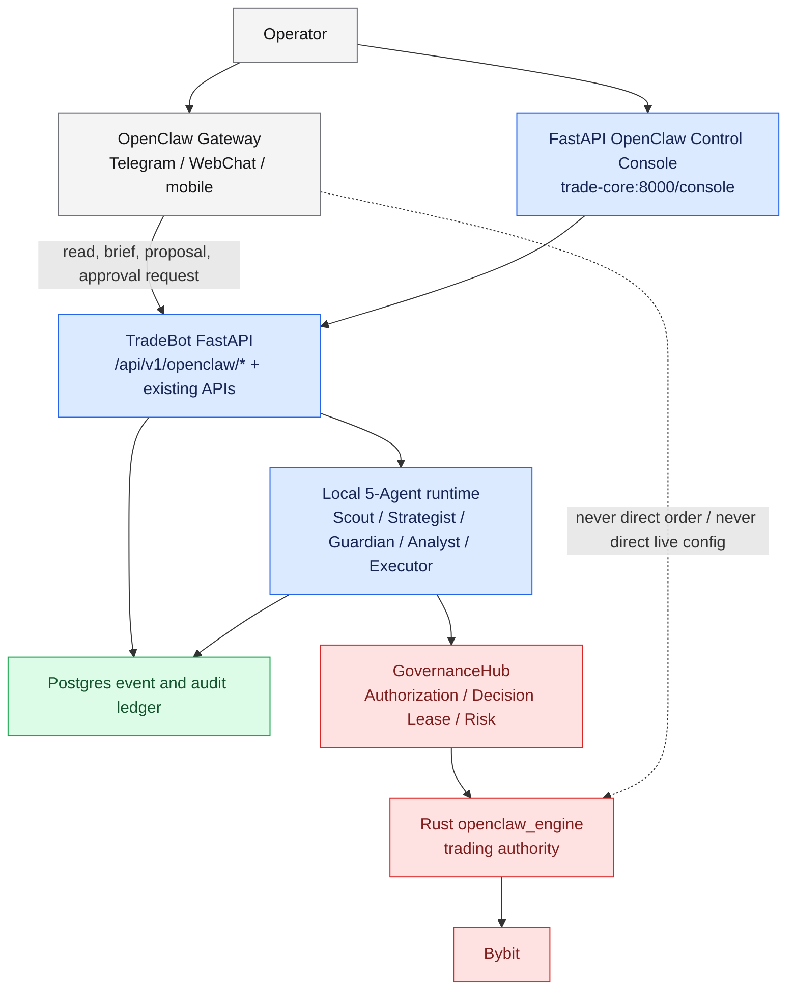

# OpenClaw Control Plane Repositioning

Date: 2026-05-06
Status: Accepted PM architecture overlay
Supersedes: the early interpretation that the external OpenClaw GUI / Gateway is the trading multi-agent conductor

## Decision

OpenClaw is no longer treated as a second trading GUI or as the runtime home for the five trading agents.

The canonical product surface is the existing FastAPI console at `http://trade-core:8000/console`, now positioned as the **OpenClaw Control Console**. The external OpenClaw Gateway is an optional communication and agent-entry layer for Telegram/WebChat/mobile/operator conversations. It must not become a trading authority, a second source of truth, or a parallel GUI.

Local 5-Agent runtime remains inside TradeBot:

- Scout / Strategist / Guardian / Analyst / Executor stay local to the FastAPI + Postgres + Rust engine stack.
- Rust `openclaw_engine` remains the trading, risk, execution, and hot-config authority.
- OpenClaw Gateway can read state, produce summaries, create proposals, and request approvals through TradeBot APIs.
- Any action with trading, risk, live authorization, deploy, or config impact must still pass existing TradeBot governance, Decision Lease, and operator approval gates.

## Why This Changes The Original Design

The March multi-agent design assumed OpenClaw would be the conductor because the project initially expected to use OpenClaw's own multi-agent routing, memory, cron, Web UI, and channel surfaces directly.

The implemented system evolved differently:

- The production-like runtime is the local Rust/Python TradeBot stack.
- The operator actually uses `trade-core:8000/console`, not OpenClaw's own dashboard.
- Python 5-Agent code is already present as an advisory/shadow trading cognition layer.
- The Rust engine is already the execution authority and must remain independent of gateway availability.
- A second GUI would split state, authorization, and operator attention.

The corrected architecture uses OpenClaw for what it is strongest at: multi-channel agent access, session routing, model/tool gateway behavior, and mobile/operator interaction. It does not use OpenClaw as the trading core.

## Authority Map

## In-Scope OpenClaw Gateway Uses

1. Operator asks natural-language status questions from Telegram/WebChat.
2. Gateway sends P0/P1/P2 alerts to mobile channels.
3. Gateway runs a daily or hourly supervisor brief.
4. Gateway asks a cloud model only after local agents have compressed facts into a bounded escalation packet.
5. Gateway creates `Proposal` records through TradeBot APIs.
6. Gateway forwards operator approve/reject responses to TradeBot approval APIs.
7. Gateway can trigger safe read-only or offline tasks such as report generation and replay requests, subject to TradeBot policy.

## Explicitly Out Of Scope

- No separate OpenClaw trading GUI.
- No iframe of the existing console inside OpenClaw dashboard.
- No direct Bybit credentials in OpenClaw.
- No direct order placement from OpenClaw.
- No direct live TOML or risk config mutation from OpenClaw.
- No third-party skill access to trading secrets.
- No OpenClaw Gateway dependency in the Rust hot path.

## Cloud AI Escalation Policy

The five local agents should not independently call cloud LLMs whenever they have a question.

The required shape is:

1. Each local agent emits structured observations and questions.
2. A local supervisor compresses those observations into a bounded `EscalationPacket`.
3. Local Ollama / deterministic rules handle normal summarization first.
4. Cloud L2 is called only for high-value cases: healthcheck FAIL, persistent negative edge, strategy regression, major anomaly, operator-requested deep analysis, or scheduled daily brief.
5. Cloud response can create proposals, not direct actions.
6. Every cloud call must persist model, purpose, cost, latency, prompt hash, response summary, and linked proposal/diagnosis IDs.

## Consequences

- `MessageBus` remains a legacy/advisory local communication trace, not a canonical decision spine.
- `agent.messages` may record legacy bus traffic for audit, but the authoritative decision chain must be typed objects: evidence / StrategistDecision / GuardianVerdict / ExecutionPlan / Decision Lease / ExecutionReport / AnalystInsight.
- `tab-agents.html` should evolve into the OpenClaw / Agent Control surface inside the existing console.
- External OpenClaw dashboard is dormant unless needed for gateway configuration.
- README, CLAUDE, TODO, and AgentTodo must describe one GUI and two agent layers: local runtime agents plus external gateway agents.
