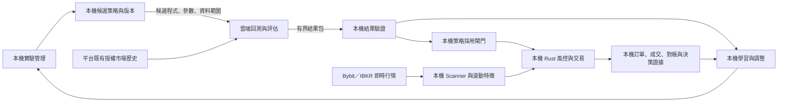

# AE 本機學習與雲端歷史回測架構評估報告

| 項目 | 說明 |
|---|---|
| 文件日期 | 2026-10-03 |
| 適用範圍 | Bybit 策略研究與交易；後續 IBKR 普通股票及 ETF 資料接入 |
| 文件性質 | 架構修改建議與工程驗收要求；平台選型仍屬候選 |
| 建議結論 | 本機草擬、學習與交易；成熟雲端平台保存市場歷史並執行回測及評估；有限結果回傳本機形成迭代閉環 |
| 驗證範圍 | 官方文件、公開價格與既有源碼檢查；尚未完成帳戶級雲端實跑及獨立架構審核 |

## 一、框架設計修改意見

### 1.1 目標與修改原則

降低全市場行情長期保存所造成的本機磁碟、記憶體及讀取負擔，同時保留本機策略決策權、交易執行權與自有學習資料。目標架構採用兩個獨立運行的迴圈：

- **研究迴圈**：本機生成候選策略 → 雲端使用既有歷史資料回測與評估 → 本機接收結果、學習及調整 → 提交下一個候選。
- **交易迴圈**：本機接收即時行情 → 已驗收策略計算 → Rust 風控與下單 → 訂單、成交及帳戶對帳 → 保存必要學習證據。

研究工作採非同步排程，不隨 Scanner 每次掃描觸發完整回測。雲端研究不可用時，暫停新研究；既有交易策略依本機行情新鮮度、風控及恢復規則運行。

### 1.2 功能分工

| 功能 | 本機責任 | 雲端責任 |
|---|---|---|
| 策略草擬 | 提出假說、選擇策略模板、特徵與參數，管理候選版本 | 執行已提交候選所需的評估程式 |
| 學習與調整 | 結合自有交易樣本與回測結果，校準成本、風險及候選選擇 | 回傳約定的分期、樣本外、成本壓力及交易摘要 |
| 歷史資料 | 保存查詢規格、來源、版本與必要驗收切片 | 保存並提供授權市場歷史，完成大規模回播 |
| 即時觀察 | Scanner、即時 feed、滾動特徵與必要啟動窗口 | 不承擔本機即時交易的決策依賴 |
| 模型與策略採用 | 驗證產物，執行既有 registry、Guardian、Decision Lease 及回退流程 | 不取得策略採用或交易授權 |
| 交易及實帳 | Rust 風控、下單、撤單、拒單處理、恢復與對帳 | 不持有券商交易憑證 |
| 開發維護 | 人工按需使用 GPT／Codex／Claude Code | 平台 AI 功能不列入 AE 日常運行必要條件 |

本機學習可涵蓋規則及參數調整、候選排序、執行成本校準和以自有必要樣本進行模型擬合。若未來模型需要完整市場逐樣本特徵及標籤，須另行確定合法取得方式與本機工作集。摘要指標不能替代任意模型的完整訓練資料；雲端模型擬合不納入本案預設範圍。

### 1.3 目標架構

### 1.4 Scanner 與資料保存方式

Scanner 的市場觀察能力保留，長期行情寫入與即時計算分離。記憶體容量以「同時訂閱商品數 × 最大必要窗口 × 每筆資料實際佔用」設定；容量應受窗口限制，不隨歷史年數累積。

| 資料類別 | 目標保存方式 | 保留依據 |
|---|---|---|
| 全市場長期 tick、order book、歷史 bars | 留在雲端平台 | 平台資料覆蓋與授權 |
| 即時 feed 與 Scanner 特徵 | 本機 RAM 滾動窗口、有限 checkpoint | 指標 warmup、重啟及行情中斷恢復需求 |
| 真實訂單、成交、撤單、拒單、費用及對帳 | 本機持久保存並建立備份恢復流程 | 自有交易事實與稽核需求 |
| 決策特徵、策略／模型版本及必要行情片段 | 綁定決策事件保存 | 決策重建、滑價及風險校準 |
| 未成交、拒絕及未採用候選 | 保存抽樣規則與有界負樣本 | 控制只保留成功成交的選擇偏差 |
| 回測報告、實驗紀錄與 lineage | 本機有限結果包及版本化 metadata | 迭代決策、試驗追蹤與重現能力 |

本機仍需要有限即時行情及必要歷史切片。回測移至雲端只能移除長期研究資料庫及大規模歷史計算負擔；即時掃描的 CPU、RAM 與行情訂閱成本仍須量測。

### 1.5 策略暴露與平台信任

本方案接受回測所需的有限策略暴露。上傳內容限於候選程式、參數、特徵規格、資料範圍及成本假設；不預設上傳完整儲存庫、帳戶流水、持倉或學習資料庫。

QuantConnect 聲明私有程式及智慧財產權屬使用者，並以權限限制員工存取；該承諾仍依賴平台治理。傳輸加密、靜態加密與程式混淆不代表執行時策略對平台不可見。公開分享與私有專案的條款應分開處理。[Security and IP](https://www.quantconnect.com/docs/v2/cloud-platform/security-and-ip)、[Terms §3](https://www.quantconnect.com/terms/)

## 二、工程要求

### 2.1 模組與驗收契約

| 編號 | 工程要求 | 驗收證據 |
|---|---|---|
| E01 | 本機候選策略版本化：程式／規格 hash、參數、特徵、資產範圍及成本假設 | 同一候選可由唯一版本重建；結果不得配對至其他版本 |
| E02 | 可替換的雲端回測介面：提交、查詢、取消、結果讀取及錯誤分類 | 一個固定候選完成提交至結果驗證；平台 adapter 不取得交易權限 |
| E03 | 工作去重與恢復：request ID、遠端 job ID、提交狀態及重複結果處理 | 提交逾時後先核對工作存在性；不因重試重複建立作業 |
| E04 | 有界結果契約：schema、大小、版本、來源及品質狀態檢查 | 錯誤 hash、缺欄位、過大輸出、重複結果及資料品質失敗均被拒絕 |
| E05 | 本機／雲端策略一致性 | 固定測試資料上的指標、信號及 order intent 一致；成交差異有明確模型解釋 |
| E06 | 成交與成本模型符合候選策略 | 費用、滑價、限價成交、部分成交、funding／公司行動均有設定及測試 |
| E07 | 試驗與樣本外治理 | 記錄全部候選及失敗試驗；時間切分、purge／embargo、holdout 使用次數可查 |
| E08 | 研究資源與費用控制 | 預先設定併發、候選數、時間、結果大小及預算上限；超限作業不獲准提交 |
| E09 | 本機交易與研究故障隔離 | 雲端停機不阻塞即時交易流程；行情失效由本機風控限制新增風險 |
| E10 | 開發 Agent 非運行依賴 | 移除雲端 AI 憑證、關閉 GPT／CC 後，完成啟動、重啟、草擬、推論及恢復驗證 |
| E11 | 本機學習與策略採用分離 | 結果或模型更新須通過既有採用閘門；版本可回退，雲端報告不能直接授予下單權 |
| E12 | 行情保存改造前完成依賴盤點 | 每個現有行情消費者具有替代來源、必要窗口、恢復方式及驗收記錄 |

E05 至少覆蓋 indicator warmup、事件時間、時區、精度、rounding、sizing、費用、funding 及股票公司行動。使用 LEAN 與 Rust 兩個引擎時，優先限制候選規格及模板範圍；若無法證明一致性，該候選不接入此後端。

對 L2／隊列敏感策略，K 線高低價觸及限價不能直接視為 maker 成交。此類策略需額外訂單簿、隊列假設及本機 shadow 執行證據；只有 bars 的驗證不構成策略採用依據。

### 2.2 結果包最低內容

結果包須包含以下資訊，具體 schema 與限制在第一個實際候選驗證前凍結：

- 工作與版本：request ID、job ID、候選 hash、引擎與 adapter 版本。
- 資料：來源、商品、查詢區間、粒度、時區、版本可得性及缺口檢查。
- 方法：時間切分、交易成本、撮合假設、試驗序號及已使用的驗證窗口。
- 評估：分期與樣本外報酬、回撤、交易數、成本敏感度、失效區間及必要交易摘要。
- 狀態：完整／不完整／失敗、警告、截斷或抽樣規則，以及執行耗時及可取得的費用資料。

完整 tick／book、無上限圖表與日誌不納入預設回傳。回傳內容不足以支持指定學習任務時，停止該任務。來源簽名及 hash 僅證明來源或完整性，不能代替資料與模擬方法驗證。

### 2.3 Bybit 與 IBKR 資料契約

| 範圍 | 必需語義 | 驗收重點 |
|---|---|---|
| Bybit 合約 | 合約 identity、上市／退市、trade／quote、時區、funding、mark／index 及所需微結構欄位 | 逐 symbol／期間確認覆蓋；margin-rate、funding 與完整 L2 不得混為一談 |
| IBKR 普通股票／ETF | conId、venue、幣別、歷史 ticker mapping、交易日曆及 DST | 研究資料與券商即時 feed 分開；驗證延遲／即時、單一 venue／consolidated 及訂閱限制 |
| 股票價格與 universe | raw／adjusted 定義、拆股、股息、退市、改名及當時可投資範圍 | 使用歷史成分及存續狀態，避免存活者偏差 |
| 可選財報基本面 | 財報期間、發布／提交時間、可得時間及修訂版本 | 不以今天重編的財報回填過去已知資訊 |

IBKR 範圍沿用 `stock_etf_cash`，真實 broker contact 與交易活化仍依既有規則另行控制。本案不擴增融資、放空或衍生品範圍。

### 2.4 現有實作的修改重點

源碼檢查基準為 `af12fc9e0b75925ad0404a351018cebd21598277`；以下為源碼觀察，未代表生產環境驗收：

| 觀察 | 工程處理 |
|---|---|
| 已有本地 LLM factory、local evaluator 及 heuristic 路徑 | 保留本機草擬能力，驗證模型不可用時的有限降級 |
| 一般 Layer2 有遠端 provider 預設及回退路徑；已查入口為 operator/manual | 釐清日常運行入口；本機模式禁止隱式切換至遠端 Agent |
| 部分本地 evaluator 使用 `cloud_api` 或固定雲費標記 | 費用與來源改為實際呼叫證據，避免錯誤計費及依賴判斷 |
| ALR runner 的 `model_training_performed=False` 與實際 fit 管線並存 | 分開呈現資料整理、擬合、驗收、採用及效果，驗收真正的學習更新 |
| 現有 retention 只覆蓋部分市場表 | 盤點表、索引、WAL、logs、backup 及消費者後，再調整寫入與保留策略 |

### 2.5 導入階段

| 階段 | 工作範圍 | 放行條件 |
|---|---|---|
| G0：平台適配 | 固定一個既有 Bybit 候選、資料清單、個人方案及結果需求 | 資料、API、保存／匯出權與完整費用均符合要求 |
| G1：機制驗證 | 非機密測試候選完成雲端提交、計算及有限結果回傳 | job／版本配對、去重、輸出限制與錯誤處理通過；記錄實測費用及本機資源高水位 |
| G2：策略驗證 | 既有候選兩端一致性、資料核對、樣本外及成本壓力測試 | 信號／order intent 一致；策略必需欄位齊備；未重複消耗驗證窗口 |
| G3：資料保存改造 | 以有界窗口與決策證據取代不必要的長期行情寫入 | 消費者與重啟恢復通過，保留回退窗口，實測磁碟及 I/O 變化 |
| G4：股票擴展 | IBKR 股票／ETF 專屬資料及研究流程驗收 | 公司行動、退市／改名、歷史 universe、時段及資料權限通過 |

G1 僅驗證傳輸與計算機制，不替代 G2 的實際策略驗證。進入任何真實交易階段仍須遵守既有交易授權及採用流程。

## 三、雲端解決方案建議

### 3.1 候選方案比較

| 方案 | 歷史保存與雲端計算 | 個人使用及成本 | 建議定位 |
|---|---|---|---|
| **QuantConnect Cloud／LEAN** | 平台持有市場歷史，執行 server-side backtest，提供 API／CLI 及結果讀取 | Free 提供有限節點；Quant Researcher 面向個人並提供 API。席位與 B2-8 節點公開價合計 $24/月 | **首要驗證候選**；指定資料、跨引擎一致性、結果完整性及帳戶條件待驗收 |
| TradingView Deep Backtesting | 託管 Pine 回測；文件上限為 200 萬 bars／100 萬 trades | Premium 起；調研頁面顯示 €59.95/月、年繳，等值 €719.40/年；可能另加行情費 | 輔助人工研究；正式批次回測 API 未獲本案驗證，不作 AE 主後端 |
| Quantiacs Cloud | Python／Jupyter 雲端研究與回測 | 文件列免費入口及每策略 8 GB RAM；指定資料與私人產物權利待核 | 次選；權重組合回測與 Bybit 訂單微結構適配性不足以直接確認 |
| 自有雲端 worker | 在自有雲帳戶取得行情並執行 evaluator | 算力、資料、暫存、網路、日誌與維護分項計費 | 平台資料或模型不適配時的備選；仍需自主管理資料取得與維護 |

Tardis、Databento、EODHD 為資料供應候選，IBKR 為券商及交易行情來源；它們本身不構成本案所需的託管歷史回測方案。[QC Results](https://www.quantconnect.com/docs/v2/cloud-platform/backtesting/results)、[QC Tier Features](https://www.quantconnect.com/docs/v2/cloud-platform/organizations/tier-features)、[TradingView Deep Backtesting](https://www.tradingview.com/support/solutions/43000666265-how-deep-backtesting-works/)、[TradingView Pricing](https://www.tradingview.com/pricing/)、[Quantiacs](https://quantiacs.com/documentation/en/quick_start/quick_start.html)

### 3.2 QuantConnect 接入方式

本機 orchestrator 透過正式 API／CLI 提交候選及參數，在雲端編譯與回測，再讀取結果。官方 `lean cloud backtest --push` 支持將本機修改推送後執行雲端回測；REST 文件列有統計、圖表、訂單、交易、insights 及 logs 讀取。此路徑不要求平台 AI 草擬或遠端模型訓練。[Cloud CLI](https://www.quantconnect.com/docs/v2/lean-cli/api-reference/lean-cloud-backtest)、[Read Backtest](https://www.quantconnect.com/docs/v2/cloud-platform/api-reference/backtest-management/read-backtest)

回測報告、自有專案程式與 Object Store 模型檔案的匯出權須分開確認：

| 產物 | 官方功能及限制 | 本案處理 |
|---|---|---|
| 回測統計、圖表、訂單與交易結果 | 提供正常結果下載／讀取 | 驗證所需欄位、分頁、截斷及合法保存方式 |
| 自有專案程式 | 支持 `lean cloud pull` | 本機維持策略版本正本 |
| Object Store 檔案及訓練模型 | 下載限 Institution 層級及 derived-data agreement；Researcher 等個人常用層級不包含 | 不依賴雲端任意模型下載；不得以 logs／charts 編碼模型或原始行情繞過限制 |

來源：[結果匯出](https://www.quantconnect.com/docs/v2/cloud-platform/backtesting/results)、[Source Pull](https://www.quantconnect.com/docs/v2/lean-cli/api-reference/lean-cloud-pull)、[Object Store](https://www.quantconnect.com/docs/v2/cloud-platform/object-store)。

### 3.3 費用規劃

價格觀察日為 2026-10-03。QuantConnect 價格取自未登入公開價目頁的 `pricing-plans-json`；以下為規劃基礎，不含尚未確認的資料加購、稅費或帳戶差異。

| 項目 | 月繳 USD | 年繳 USD | 用途 |
|---|---:|---:|---|
| Quant Researcher 席位 | 10 | 96 | 個人付費層級及 API 權限 |
| B2-8 回測節點 | 14 | 144 | 2 CPU／8 GB，單節點起步 |
| **基礎組合** | **24/月** | **240/年，等值 20/月** | 候選工作負載的起步配置 |
| R1-4 notebook 節點 | 12 | 120 | 本機研究模式不預設購買 |
| Researcher Pack | 84 | 888 | 另含 live、agent、support 等；不是本案必要配置 |

$24/月不代表絕對最低價；席位與既有免費節點能否組合仍待帳戶核實。首次組織的免費 B-MICRO 文件列 20 秒啟動延遲與每日 200 次上限；付費 CPU 有 fair-use 限制。平台 Optimization 使用獨立算力，費用不應預設包含在普通回測節點。本案先由本機產生有限候選、依序執行普通回測。[官方價格](https://www.quantconnect.com/pricing/)、[節點與配額](https://www.quantconnect.com/docs/v2/cloud-platform/organizations/resources)

已包含的雲端資料不重複加計外購資料費，也不把本地歷史下載價格視為雲端使用成本。IBKR 本機即時行情訂閱獨立計價；不需為此研究架構購買雲端 live node。

自有 worker 的算力成本可作備選比較：AWS Fargate 官方 US East、Linux x86 範例費率下，4 vCPU＋16 GB 約 $0.23305/小時，20 小時約 $4.66，100 小時約 $23.30；預設 20 GB 暫存包含在內。此數值不含資料授權、網路、IPv4、日誌及維護，亦不代表選定區域或完整方案總價。[Fargate Pricing](https://aws.amazon.com/fargate/pricing/)

### 3.4 資料可靠性與適配限制

- **Bybit**：官方文件同頁的起始日期分別為 August 2020 與 October 2019；listing 與 docs 亦存在433／631 pairs 及供應商標記差異。Cloud Access 雖列 Free，該價格欄文案卻稱 margin-rate。須以指定合約、期間及欄位的實際權限與資料驗收消除不確定性。[Bybit Docs](https://www.quantconnect.com/docs/v2/writing-algorithms/datasets/quantconnect/bybit-crypto-future-price-data)、[Listing](https://www.quantconnect.com/data/bybit-cryptofuture-price-data)
- **美股／ETF**：Security Master 提供公司行動與歷史 identity 支持，但不是底層價量資料。其 LEAN 使用限制與雲端使用、資料下載授權應分開核對，不能推定可直接供自有 Rust worker 使用。[Security Master](https://www.quantconnect.com/docs/v2/writing-algorithms/datasets/quantconnect/us-equity-security-master)
- **重現能力**：優先保存可取得的資料 revision、引擎版本及查詢規格。若平台不能固定歷史版本，報告須標示重現限制；只保留 hash 而無法取回同版資料，不構成完整可重現性。

## 四、可實行性分析

### 4.1 綜合判定

**架構具備文件層面的可行性，建議進入單一候選的有限接入驗證。** QuantConnect 的託管歷史回測與結果讀取功能符合研究閉環的基本要求；本機可持續掌握策略生成、學習與採用決策。選型放行仍取決於指定策略的資料需求、輸出權利、引擎一致性及總成本。

| 評估維度 | 判定 | 待完成條件 |
|---|---|---|
| 雲端歷史回測功能 | 官方文件確認存在 | 帳戶級提交、權限、隊列、完整結果與異常流程驗證 |
| 個人可用性 | Researcher 官方定位符合個人用途 | 地區、資料 entitlement、自動化用途及付款配置核對 |
| 本機學習迭代 | 規則／參數及自有樣本學習方向可行 | 證明回傳內容足夠支持指定學習任務 |
| 本機資源減壓 | 可移除長期全市場研究倉庫的設計需求 | 量測現有表、WAL、logs、backup、RAM 及 I/O，驗證實際改善 |
| 策略與成交一致性 | 尚未驗證 | 既有候選的跨引擎及成本／成交測試 |
| 平台完整成本 | 基礎組合已有公開價格 | 指定資料及工作負載的帳戶級完整費用 |
| IBKR 股票擴展 | 資料契約已納入設計 | 股票專屬樣本及行情權限驗收 |
| AE 運行獨立性 | 已有本機能力源碼基礎 | 關閉開發 Agent 後的真正 AE 運行驗證 |
| 獨立架構審核 | 尚未完成 | 補齊獨立審核結論；本文件不作通過聲明 |

既有單日市場樣本的離線擬合試驗，只支持該試驗的資料處理及本機模型保存機制；不能替代本案雲端接入、全歷史資料可靠性或策略績效驗證。

### 4.2 主要風險與否決條件

| 風險 | 控制措施 | 否決／停止條件 |
|---|---|---|
| 資料不適配 | 先固定策略必需欄位及期間 | 缺少 L2、funding、歷史 universe 等必要輸入 |
| 兩端語義偏差 | 小型固定資料逐事件比較 | 信號／order intent 差異無法解釋或修正 |
| 反覆調參造成過度擬合 | 凍結樣本外窗口、候選總數及成本壓力方法 | 未使用的驗證資料耗盡或試驗紀錄不完整 |
| 回傳不足或匯出受限 | 實際核對結果、分頁及授權 | 本機學習必要內容無法合法取得／保存 |
| 本機資料再次無限增長 | 結果大小、窗口、checkpoint 及抽樣上限 | 本機容量隨歷史年數持續線性增長且無合理自有證據需求 |
| 雲端故障影響交易 | 研究 queue 與交易 fast path 分離 | 回測服務不可用會阻塞本機交易、風控或對帳 |
| 費用失控 | 提交前預算檢查、併發與時限控制 | 指定工作負載超出已批准預算或研究價值 |

### 4.3 決策建議

採用「本機學習與策略控制＋成熟平台歷史回測」作為目標框架，以 QuantConnect 作第一個適配驗證對象。先完成 G0—G2，再決定平台採用與行情保存改造；G3 通過後才擴展至 G4 股票研究。

若 QuantConnect 無法滿足既有候選的資料或成交模型需求，保留該候選在其他合適後端驗證，並按必要範圍啟用自有雲端 worker 備選。平台回測績效不能替代本機策略採用及真實交易授權。

### 4.4 九項修正的納入位置

| 修正事項 | 已納入的正文 |
|---|---|
| 需求與架構：使用平台已存歷史與託管回測 | 1.1—1.3、3.1、4.3 |
| 學習有效性：反饋內容與本機學習種類一致 | 1.2、2.2、4.1 |
| 真實執行：成交與跨引擎一致性 | 2.1 E05—E06、4.2 |
| 資料可靠性：具體覆蓋、版本與品質驗收 | 2.3、3.4 |
| 經濟性：必要成本與套裝分開 | 2.1 E08、3.3 |
| 保密及權限：有限上傳與本機採用權 | 1.2、1.5、2.1 E09—E11 |
| 統計可信度：試驗紀錄、holdout 與過度擬合控制 | 2.1 E07、2.2、4.2 |
| 容量與可恢復性：有界保存與改造前驗收 | 1.4、2.1 E12、2.5 G3 |
| IBKR 股票：專屬資料語義與獨立驗收 | 2.3、2.5 G4、3.4 |
