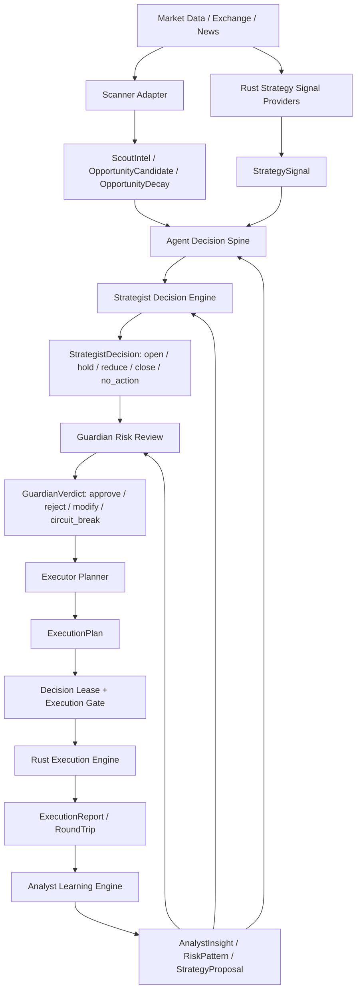

# Multi-Agent Rework Engineering Plan

Date: 2026-05-05
Status: Draft for PM/CC/FA/PA review
Scope: Convert the current mixed Rust trading engine + Python 5-Agent advisory layer into a real, auditable, intelligent multi-agent decision system.

## 1. Executive Summary

The original EX-06/DOC-04 design defines a real multi-agent trading architecture:

- Scout discovers market intelligence.
- Strategist owns trading decisions.
- Guardian owns risk veto and risk modification.
- Executor owns execution quality, not trade direction.
- Analyst owns learning and strategy evolution.
- Conductor coordinates lifecycle, arbitration, and compute allocation.

The current system has useful agent-shaped code, but the decision authority is split:

- Rust `openclaw_engine` is the real trading authority.
- Python 5-Agent is partly live but mostly advisory/shadow.
- Scanner provides useful market opportunity data, but in Rust hot path it also acts as an opening gate.
- MessageBus is structured, but the durable agent event store is not yet the actual audit spine.
- Analyst and Guardian feedback loops exist in pieces, but do not yet drive a full closed-loop strategy evolution system.

Target state:

Build one authoritative Agent Decision Spine. Scanner, Rust strategies, AI reasoning, risk checks, and execution all feed typed, persisted decision objects through this spine. No module should have hidden trade authority merely because it sits earlier in the hot path.

## 2. Non-Negotiable Invariants

These rules carry over from existing governance design and must not be relaxed:

1. H0 deterministic checks remain independent and run before any AI-driven decision.
2. P0/P1 hard risk limits remain outside agent discretion.
3. Guardian verdict cannot be bypassed by Strategist, Scanner, Executor, or Conductor.
4. AI output is never an immediate order; execution still requires Decision Lease and execution gate.
5. Scanner is infrastructure for Scout and Strategist evidence. Scanner is not a trade authority.
6. Rust engine remains the only low-latency execution engine, but not an independent hidden decision authority.
7. All agent-relevant messages, decisions, AI calls, and state changes must be persisted for audit.
8. Live behavior changes must be flag-gated and replay/canary validated before activation.

## 3. Current Architecture Gaps

### 3.1 Decision Authority Is Split

Current fact:

- Python 5-Agent path can produce Strategist intents, Guardian verdicts, and Executor shadow/IPC reports.
- Rust strategies and IntentProcessor are still the actual trade path.
- The two paths are not one unified decision system.

Risk:

- The operator cannot clearly answer: "Which agent decided this trade, using which evidence, under which risk verdict?"
- Agent intelligence can become decorative if the Rust hot path continues deciding independently.

### 3.2 Scanner Acts Above Its Intended Authority

Current fact:

- ScoutWorker reads scanner opportunities and emits Scout intel. This matches the intended design.
- Rust tick pipeline also blocks new opens if a symbol is not in scanner active universe or if scanner route mode is market-gated.

Risk:

- Scanner ranking churn can create regular batches of open/skip behavior.
- Scanner can indirectly become a Gate even though its intended role is reconnaissance.
- A symbol dropping from scanner candidates is currently not represented as a structured "opportunity weakened" observation for Strategist review.

### 3.3 MessageBus Is Not Yet the Durable Spine

Current fact:

- MessageBus stores messages in process memory.
- Audit callbacks exist, but `agent.messages`, `agent.state_changes`, and `agent.ai_invocations` are still called out as all-time zero-row blockers in active docs.

Risk:

- Multi-agent reasoning is not reconstructable from DB.
- Analyst cannot reliably learn from full decision context.

### 3.4 Agent Depth Is Uneven

Current fact:

- ScoutAgent is mostly an intel wrapper and router.
- StrategistAgent has LLM/heuristic edge evaluation but weak strategy matching and portfolio reasoning.
- GuardianAgent is useful but mostly deterministic five-check review.
- AnalystAgent has L1/L2 outputs but only partial consumption.
- ExecutorAgent is mostly an execution adapter with shadow/IPC behavior, not yet a smart execution planner.
- Conductor is mostly registry/health and does not yet actively coordinate the trading decision loop.

Risk:

- Some modules pass the deletion test poorly: deleting them would not yet remove true trading intelligence, only wiring and logs.

## 4. Definition of a Real Agent in This System

An OpenClaw trading agent is real only if it has all of the following:

1. Role objective: a stable responsibility that is not just a function name.
2. Private state: local memory, counters, or learned preferences that affect later behavior.
3. Typed inputs: structured objects, not free text.
4. Typed outputs: persisted decisions or recommendations with confidence, reasons, and data-quality level.
5. Authority bounds: explicit actions it may and may not take.
6. Feedback loop: outcomes are consumed later by the same or another agent.
7. Auditability: the full path is reconstructable from database events.

Modules that only wrap a function call or forward a message are infrastructure, not agents.

## 5. Target Architecture

Key design:

- Rust remains the execution engine.
- Python remains a reasoning provider where it adds value.
- Postgres becomes the shared durable agent event store.
- The Agent Decision Spine is the narrow seam that all trade-relevant decisions must pass through.

## 6. Core Module Seams

### 6.1 Agent Decision Spine

Purpose:

- Own the canonical decision lifecycle.
- Persist every agent decision object.
- Enforce ordering: Scout/strategy evidence -> StrategistDecision -> GuardianVerdict -> ExecutionPlan -> Decision Lease -> order.

Recommended implementation:

- Rust-first authoritative module for hot-path enforcement.
- Python adapters for LLM-heavy reasoning.
- DB tables as shared audit and replay surface.

Initial Rust module candidates:

- `rust/openclaw_engine/src/agent_spine/`
- `rust/openclaw_engine/src/agent_spine/events.rs`
- `rust/openclaw_engine/src/agent_spine/contracts.rs`
- `rust/openclaw_engine/src/agent_spine/router.rs`
- `rust/openclaw_engine/src/agent_spine/store.rs`

Initial Python module candidates:

- `program_code/exchange_connectors/bybit_connector/control_api_v1/app/agent_spine_client.py`
- `program_code/exchange_connectors/bybit_connector/control_api_v1/app/agent_contracts.py`

### 6.2 Scanner Adapter

Purpose:

- Convert scanner results into Scout-owned evidence.
- Keep active position market data alive.
- Emit opportunity weakening as review input, not an automatic close or block.

Scanner outputs:

- `OpportunityCandidate`: symbol appears attractive.
- `OpportunityDecay`: symbol's opportunity score weakened, dropped from top set, or was replaced by stronger candidates.
- `MarketRiskAlert`: hard market condition, liquidity issue, exchange anomaly, delisting/suspension, abnormal spread.

Authority:

- May recommend.
- May request Strategist/Guardian review.
- May mark data quality or liquidity eligibility evidence.
- Must not close positions.
- Must not directly decide opening eligibility except for true H0-style hard facts such as delisted, suspended, missing instrument info, or impossible order constraints.

### 6.3 Rust Strategy Signal Provider Adapter

Purpose:

- Convert MA/Grid/Funding/BB/etc. strategy outputs into `StrategySignal`.
- Stop treating raw Rust strategy actions as already-authorized trade actions.

StrategySignal fields:

- symbol
- strategy
- direction
- proposed_size
- confidence or score
- expected_edge_bps
- fee/slippage estimate
- regime
- scanner_context reference
- thesis evidence
- invalidation condition

### 6.4 Strategist Decision Engine

Purpose:

- Own tactical trading decisions.
- Decide open/hold/reduce/close/no_action.
- Match strategy to symbol and regime.
- Allocate portfolio attention and capital.

Inputs:

- ScoutIntel
- OpportunityCandidate
- OpportunityDecay
- StrategySignal
- AnalystInsight
- Guardian rejection history
- current positions
- cost/fee/slippage/AI attention tax

Outputs:

- `StrategistDecision`
- `PositionReview`
- `PortfolioAllocation`

Required behavior:

- Scanner decay does not cause automatic close.
- Scanner decay on an open position creates a PositionReview.
- PositionReview asks: hold, reduce, tighten exit, stop adding, or close when arbitrage/edge logic says net exit is beneficial.
- New symbols are not limited at the scanner ingestion layer. Capacity limits apply later at data subscription, portfolio allocation, and Guardian risk review.
- `min_hold_cycles` should be enforced as a churn guard for position review, not as a reason to ignore real risk alerts.

### 6.5 Guardian Risk Engine

Purpose:

- Convert Strategist decisions into approved/rejected/modified/circuit-break verdicts.
- Own P2 adaptive risk inside P0/P1 bounds.

Required improvements:

- Dynamic correlation matrix rather than hardcoded BTC/ETH pair.
- Per-strategy drawdown and loss-streak review.
- Event and scanner-risk awareness.
- Risk verdict feedback persisted and consumed by Strategist.
- Clear distinction between hard risk reject and soft risk modification.

### 6.6 Executor Planner

Purpose:

- Decide how to execute an approved decision.
- Not decide symbol, direction, or trade thesis.

ExecutionPlan fields:

- order style: market / limit / post_only / TWAP / split
- urgency
- max slippage
- maker preference
- reduce_only flag
- local stop plan
- anti-hunt stop policy
- lease scope and ttl

Required improvements:

- Convert approved intents into execution plans before IPC submit.
- Report execution quality back to Analyst.
- Keep shadow/live mode explicit in every ExecutionReport.

### 6.7 Analyst Learning Engine

Purpose:

- Close the learning loop.

Initial scope:

- L1: attribution and per-strategy/per-symbol/per-regime metrics.
- L2: pattern discovery.
- L3: testable hypotheses and experiment proposals.

Later scope:

- L4 strategy evolution.
- L5 meta-learning.

Required improvements:

- AnalystInsight must be durable.
- Strategist and Guardian must consume AnalystInsight through typed logic, not just logs.
- Every insight must label fact/inference/hypothesis.

### 6.8 Conductor

Purpose:

- Coordinate agenda, resource allocation, health, and conflict arbitration.

Required improvements:

- Conductor should schedule agent review tasks.
- Conductor should allocate AI budget by priority.
- Conductor should surface unresolved conflicts.
- Conductor should not directly place orders or override Guardian.

## 7. Canonical Decision Objects

### 7.1 ScoutIntel

Produced by Scout.

Required fields:

- event_id
- source
- symbols
- timestamp
- freshness
- data_quality: fact / inference / hypothesis
- relevance_score
- sentiment_score
- evidence_refs
- scanner_context_ref

### 7.2 OpportunityCandidate

Produced by Scanner Adapter under Scout ownership.

Required fields:

- symbol
- scan_id
- final_score
- strategy_judgments
- market_regime
- trend_phase
- route_mode as evidence, not authority
- reason
- evidence_quality

### 7.3 OpportunityDecay

Produced when scanner view weakens.

Required fields:

- symbol
- previous_score
- current_score
- decay_reason: weakened / displaced / market_gate / stale_data / risk_policy / removed_from_top_set
- replacement_symbols
- has_open_position
- recommended_review_urgency

Important:

`OpportunityDecay` is not a close command.

### 7.4 StrategySignal

Produced by Rust strategies or AI strategy modules.

Required fields:

- symbol
- strategy
- direction
- raw_signal_strength
- expected_edge_bps
- expected_cost_bps
- confidence
- regime
- invalidation
- evidence_refs

### 7.5 StrategistDecision

Produced by Strategist.

Allowed actions:

- open
- hold
- reduce
- close
- no_action
- pause_new_entries_for_symbol

Required fields:

- decision_id
- action
- symbol
- strategy
- direction
- size
- expected_net_edge
- thesis
- invalidation_condition
- evidence_refs
- confidence
- portfolio_impact
- min_hold_state

### 7.6 PositionReview

Produced by Strategist when existing positions need review.

Triggers:

- scanner decay
- Analyst risk pattern
- Guardian risk pattern
- adverse PnL drift
- cost_edge_ratio deterioration
- regime shift
- time stop nearing

Outputs:

- hold
- reduce
- tighten_exit
- stop_adding
- close_when_net_positive
- close_now_if_risk_requires

### 7.7 GuardianVerdict

Produced by Guardian.

Allowed results:

- approved
- rejected
- modified
- circuit_break

Required fields:

- decision_id
- verdict
- reason
- risk_score
- p0_p1_status
- p2_modifications
- max_size
- max_leverage
- stop_requirements
- cool_down_requirements

### 7.8 ExecutionPlan

Produced by Executor.

Required fields:

- decision_id
- order_plan_id
- symbol
- side
- qty
- order_style
- urgency
- max_slippage_bps
- maker_preference
- local_stop_policy
- lease_scope
- lease_ttl

### 7.9 ExecutionReport

Produced by Executor/Rust engine.

Required fields:

- order_plan_id
- decision_id
- success
- reject_reason
- fill_qty
- avg_price
- slippage_bps
- fees
- execution_latency_ms
- engine_mode
- shadow_or_live

### 7.10 AnalystInsight

Produced by Analyst.

Required fields:

- insight_id
- insight_type: pattern / risk_pattern / strategy_proposal / hypothesis
- applies_to_strategy
- applies_to_symbol
- applies_to_regime
- confidence
- evidence_refs
- fact_inference_hypothesis
- recommended_consumer: Strategist / Guardian / Scout / Operator

## 8. Database and Audit Plan

Immediate DB targets:

- `agent.messages`
- `agent.state_changes`
- `agent.ai_invocations`
- new or extended `agent.decisions`
- new or extended `agent.decision_edges`
- new or extended `agent.insights`

Minimum persistence requirements:

1. Every MessageBus send writes an `agent.messages` row.
2. Every agent lifecycle change writes `agent.state_changes`.
3. Every L1/L1.5/L2 call writes `agent.ai_invocations`, including model, latency, cost, prompt hash, output hash, success/failure.
4. Every StrategistDecision, GuardianVerdict, ExecutionPlan, ExecutionReport, AnalystInsight writes a durable row.
5. Each object carries `evidence_refs` so the decision chain is reconstructable.

Acceptance query:

For any order or rejected decision, an operator must be able to retrieve:

- scanner/Scout evidence
- strategy signal
- Strategist decision
- Guardian verdict
- Execution plan
- Decision Lease id if execution reached lease stage
- execution report or rejection reason
- Analyst attribution after close

## 9. Migration Strategy

### Phase 0: Contract Freeze

Goal:

- Freeze canonical object schemas before code changes.

Work:

- Add typed schema docs.
- Add Rust/Python contract structs.
- Add DB migration draft.
- Add replay fixture requirements.

Gate:

- CC/FA/PA sign-off on authority boundaries.

### Phase 1: Durable Agent Event Store

Goal:

- Close the current audit gap before deeper behavior changes.

Work:

- Wire MessageBus DB sink.
- Persist state changes and AI invocations.
- Add order-to-agent-decision lookup query.
- Add health dashboard counters for nonzero rows.

Gate:

- `agent.messages`, `agent.state_changes`, `agent.ai_invocations` have current-cycle rows in Linux runtime.

### Phase 2: Scanner Demotion to Advisory Evidence

Goal:

- Remove scanner as implicit trade authority.

Work:

- Keep hard H0 eligibility filters for delisted/suspended/no instrument/no min order.
- Convert scanner market gate/route mode into `OpportunityCandidate` and `OpportunityDecay`.
- Keep active positions subscribed to market data even if they drop from scanner top candidates.
- Preserve scanner active universe only as data subscription optimization, not trade decision.
- Remove direct scanner-based open blocking from Rust dispatch, or convert it into a Strategist/Guardian evidence input behind a feature flag.

Feature flags:

- `OPENCLAW_SCANNER_AUTHORITY_MODE=legacy_gate|advisory_shadow|advisory_enforced`
- default initially: `legacy_gate`
- target after validation: `advisory_enforced`

Gate:

- Replay proves scanner rotation no longer creates hidden open/skip waves.
- Open positions dropping from scanner create PositionReview, not close commands.

### Phase 3: Agent Decision Spine Shadow

Goal:

- Run the new spine in shadow while Rust legacy path remains active.

Work:

- Rust strategies emit `StrategySignal`.
- Scanner emits `OpportunityCandidate` and `OpportunityDecay`.
- Python Strategist emits `StrategistDecision`.
- Guardian emits `GuardianVerdict`.
- Executor emits shadow `ExecutionPlan`.
- Compare legacy Rust decisions vs spine decisions.

Feature flags:

- `OPENCLAW_AGENT_SPINE_ENABLED=0|1`
- `OPENCLAW_AGENT_SPINE_MODE=shadow|canary|primary`

Gate:

- 7-day replay or equivalent fast replay has explainability coverage for every decision.
- No missing evidence chains.

### Phase 4: Strategist V2

Goal:

- Turn Strategist from edge classifier into real tactical decision engine.

Work:

- Implement strategy matching across MA/Grid/Funding/BB/Breakout/etc.
- Implement portfolio allocation and symbol prioritization.
- Implement PositionReview logic.
- Consume Guardian rejection stats.
- Consume AnalystInsight and TruthRegistry.
- Add cost-edge and AI-attention-tax inputs.

Gate:

- StrategistDecision includes action, strategy, direction, expected net edge, thesis, invalidation, portfolio impact.
- Replay shows decisions are not equivalent to raw scanner score sorting.

### Phase 5: Guardian V2

Goal:

- Upgrade Guardian from five-check reviewer to adaptive risk agent.

Work:

- Dynamic correlation.
- Per-strategy drawdown and loss streaks.
- Event and scanner-risk response.
- Risk modification policy.
- Circuit breaker integration.

Gate:

- Guardian can reject, modify, reduce, pause, or circuit-break with persisted reason.
- Guardian feedback changes later Strategist behavior.

### Phase 6: Executor Planner

Goal:

- Upgrade Executor from order adapter to execution-quality agent.

Work:

- Implement ExecutionPlan.
- Add maker/post-only preference.
- Add split/TWAP where applicable.
- Add max slippage enforcement.
- Add local anti-hunt stop policy handoff.
- Persist execution quality metrics.

Gate:

- ExecutionReport closes the loop to Analyst.
- Executor still never chooses symbol or direction.

### Phase 7: Analyst Learning Loop

Goal:

- Make Analyst outputs operationally consumed.

Work:

- Persist AnalystInsight.
- Strategist consumes pattern/risk insights.
- Guardian consumes risk patterns.
- Analyst emits L3 hypotheses for shadow experiments.

Gate:

- A known losing pattern can reduce strategy weight or raise review threshold in the next cycle.
- Every learning action is traceable to a fact/inference/hypothesis label.

### Phase 8: Cutover and Canary

Goal:

- Make Agent Decision Spine the primary authority under constrained mode.

Work:

- Enable shadow -> canary -> primary progression.
- Keep emergency fallback to legacy Rust path if spine fails closed.
- Add operator dashboard for decision chain.
- Add live preconditions to LG-4/LG-5 gates.

Gate:

- No trade reaches execution without StrategistDecision + GuardianVerdict + ExecutionPlan + Decision Lease.

## 10. Testing Strategy

### Unit Tests

- Contract serialization/deserialization.
- Scanner Adapter conversion.
- Strategist PositionReview.
- Guardian dynamic risk verdict.
- Executor ExecutionPlan.
- AnalystInsight consumption.

### Integration Tests

- Scout -> Strategist -> Guardian -> Executor -> Analyst message flow.
- Rust StrategySignal -> Agent Decision Spine -> ExecutionPlan.
- Scanner decay -> PositionReview, no close.
- Guardian reject -> Strategist feedback.
- Analyst losing pattern -> Strategist weight change.

### Replay Tests

- Replay historical scanner churn windows.
- Replay regular wave profit/loss periods.
- Compare legacy path vs new spine.
- Verify every simulated trade has complete evidence chain.

### Runtime Checks

- Linux DB row count check for agent schema.
- Agent health and heartbeat.
- AI invocation cost logs.
- Feature flag state.
- Shadow/live execution path explicit in reports.

## 11. Scanner-Specific Acceptance Criteria

Scanner is considered fixed only when all are true:

1. Scanner can add unlimited new candidates to the candidate ledger per cycle.
2. Data subscription capacity is managed separately from candidate discovery.
3. Active positions remain market-data monitored even if not top scanner candidates.
4. Scanner removal/decay emits `OpportunityDecay`.
5. `OpportunityDecay` triggers PositionReview, not auto close.
6. New opens are blocked only by H0/P0/P1/Guardian, not by raw scanner ranking absence.
7. If scanner observes hard market invalidity, that observation is represented as H0 eligibility evidence or Guardian risk evidence with explicit reason.

## 12. Engineering Risks

### Risk: Double Execution

Path A and Rust legacy path can both try to execute.

Mitigation:

- Spine starts shadow-only.
- Every decision has idempotency key.
- Executor deduplicates by decision_id/order_plan_id.
- Legacy path remains primary until cutover.

### Risk: Latency Regression

Agent reasoning may be slower than tick path.

Mitigation:

- Rust hot path emits signals quickly.
- Strategist decisions can be cached by symbol/regime.
- L2 reasoning runs async and affects later cycles.
- H0 hard safety remains local.

### Risk: AI Overreach

LLM output could bypass deterministic gates.

Mitigation:

- LLM only produces typed recommendations.
- H4 schema validation.
- Guardian/P0/P1/Decision Lease still required.

### Risk: Scanner Overcorrection

Removing scanner gate may increase low-quality opens.

Mitigation:

- Advisory shadow first.
- Guardian can use scanner route evidence.
- Strategist portfolio allocation controls capacity.
- Replay scanner churn windows before enabling.

## 13. Out of Scope

Not included in this rework:

- New trading strategy math.
- Live credential changes.
- Bybit product-family expansion.
- UI redesign beyond showing decision-chain evidence.
- Direct L4/L5 autonomous live strategy deployment.

## 14. Success Definition

This project is successful when:

1. A completed or rejected trade has a full, queryable decision chain.
2. Scanner no longer acts as hidden trade authority.
3. Strategist makes explicit open/hold/reduce/close decisions with thesis and invalidation.
4. Guardian feedback changes future Strategist behavior.
5. Analyst insights are consumed, not merely logged.
6. Executor produces execution plans and quality reports.
7. Conductor coordinates lifecycle, resource, and unresolved conflicts.
8. The operator can distinguish facts, inferences, and hypotheses for every decision.
