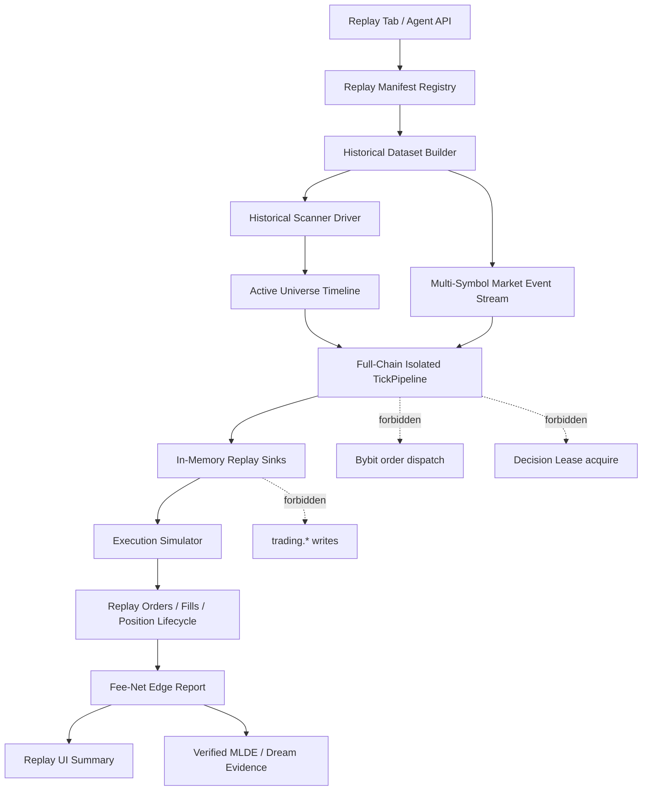

> **SUPERSEDED** by [ref21_full_chain_replay_engine_dev_plan_v1_3.md](2026-05-06--ref21_full_chain_replay_engine_dev_plan_v1_3.md) -- retained for historical reference.

# REF-21 Full-Chain Replay Engine Dev Plan V1

**Date:** 2026-05-06  
**Status:** Superseded by `2026-05-06--ref21_full_chain_replay_engine_dev_plan_v1_1.md` -> ultimately by V1.3
**Owner:** PM  
**Supersedes:** `docs/execution_plan/2026-05-XX--ref21_s1_recorder_spec_placeholder.md` for the active REF-21 scope  
**Upstream contracts:**
- `docs/references/2026-05-03--reality_calibrated_fast_replay_governance_v2.md`
- `docs/references/2026-05-03--ref20_paper_replay_lab_governance_v2.md`
- `docs/execution_plan/2026-05-03--ref20_paper_replay_lab_dev_plan_v3.md`
- `docs/execution_plan/2026-05-04--ref20_gap_closure_reality_backtest_plan_v1.md`

---

> **Supersession note (2026-05-06):** 8-agent A1-A8 review rated this V1 plan
> `REVISE`. Active REF-21 governance now lives in
> `2026-05-06--ref21_full_chain_replay_engine_dev_plan_v1_1.md`, which converts
> the review blockers into mandatory B-gates. This V1 file remains for history
> only and must not be used to authorize R2/R3 implementation.

## 0. PM Decision

Current REF-20 Quick Replay is useful as a single-symbol smoke lane, but it does
not solve the operator's main development pain:

> after every strategy or program change, the operator needs a fast way to see
> what the whole system would have done over an equivalent 7-day market window,
> without waiting 7 live/demo days to accumulate data.

REF-21 therefore promotes the replay target from **single-symbol strategy replay**
to **full-chain historical simulation**:

```text
historical market universe
  -> historical scanner decisions
  -> active symbol universe churn
  -> TickPipeline indicators / signals
  -> strategies
  -> intent processing / risk gates
  -> simulated order lifecycle
  -> exits / stops / risk closes
  -> fee-net edge performance report
  -> verified evidence for MLDE / DreamEngine exploration
```

REF-21 does not replace demo / live_demo validation. It compresses the feedback
loop and gives a stronger, source-tagged, post-fee estimate of whether a code or
parameter change is worth spending real runtime on.

---

## 1. Product Goal

### 1.1 Operator workflow

Default Replay tab workflow must become:

1. Operator changes strategy code, strategy params, risk params, or scanner config.
2. Operator opens Replay tab.
3. Operator selects:
   - a time range, defaulting to the latest available 7 days,
   - engine snapshot: `demo current config` or `live current config`,
   - universe preset: current scanner config / pinned + dynamic universe.
4. Operator clicks **Run 7D Full-Chain Replay**.
5. System returns a single report showing:
   - scanner universe changes,
   - strategy decisions,
   - accepted / rejected risk decisions,
   - entries, exits, fees, slippage assumptions,
   - post-fee edge performance,
   - confidence and data-source caveats.

The operator should not need to choose a single symbol or hand-build a manifest
for the default path. The current detailed manifest / fixture / experiment UI
stays available under **Advanced**.

### 1.2 Agent workflow

Agents must be able to call the same engine through a bounded API for:

- baseline-vs-candidate strategy parameter comparison,
- risk parameter exploration,
- MLDE rank / veto,
- DreamEngine parameter proposal exploration,
- opportunity / regret analysis where outcome evidence exists.

Agent runs must remain source-tagged, quota-bound, manifest-backed, and advisory.
They must not directly mutate demo / live / live_demo.

---

## 2. Hard Boundaries

1. Replay never submits orders to Bybit.
2. Replay never acquires Decision Lease.
3. Replay never writes to `trading.fills`, `trading.orders`, or live/demo order tables.
4. Replay-derived learning rows must use explicit replay evidence tags and the
   verified insert path from REF-19 / REF-20.
5. MLDE and DreamEngine are called as advisory components, not rewritten into
   replay-only modules.
6. Replay reports cannot output `live_approved`.
7. S2 public-data replay cannot claim exact maker queue reality.
8. Any paid data source remains out of scope unless separately approved by the
   operator with cost, vendor, symbols, and time range.

---

## 3. Current Gap Assessment

### 3.1 What REF-20 currently does

Current one-click Quick Replay:

- fetches Bybit public klines for one symbol,
- writes an S2 fixture,
- snapshots one selected strategy and engine risk config,
- registers / runs / finalizes through the existing replay routes,
- drives `ReplayStrategyAdapter` + `ReplayRiskAdapter`.

This is good for a narrow parameter smoke test.

### 3.2 What it does not do

It does not yet:

- replay scanner decisions,
- replay active-symbol churn,
- run multiple strategies over the scanner-selected universe,
- feed a full multi-symbol `PriceEvent` stream into the same `TickPipeline`,
- rebuild indicators from warmup history for every active symbol,
- produce scanner attribution for each intent,
- model a realistic order lifecycle beyond immediate simulated fills,
- summarize portfolio-level edge over a 7-day development window.

Therefore, current Quick Replay is not equivalent to 7 days of full system data
accumulation. REF-21 is the correction.

---

## 4. Target Architecture



### 4.1 Historical Dataset Builder

Build one replay dataset for the selected time range.

Minimum S2 free-data contents:

| Data | Source | Purpose |
|---|---|---|
| kline OHLCV | Bybit public `/v5/market/kline` | indicators, strategy triggers, PnL marks |
| ticker snapshots | Bybit public ticker history or reconstructed periodic snapshots | scanner scoring inputs |
| funding rate | Bybit public funding history / ticker snapshots | funding strategy and attribution |
| open interest | Bybit public OI where available | scanner / breakout context |
| instrument info | current Bybit instrument info snapshot | tick size, qty step, min notional |

S2 is free and enough for a valuable full-chain behavioral replay, but execution
confidence is limited because it lacks queue-level orderbook history.

S1 local recorder is the next fidelity tier:

| Data | Recorder target | Purpose |
|---|---|---|
| L1 / L50 orderbook snapshots | local compressed recorder | maker queue / spread / BBO simulation |
| public trades | local recorder | adverse selection / latency calibration |
| ticker / funding / OI snapshots | local recorder | scanner re-run fidelity |
| real demo/live_demo orders and fills | existing runtime DB + S1 normalized view | calibration labels |

### 4.2 Historical Scanner Driver

The replay engine must not preselect symbols manually. It must replay the scanner
cycle from historical data:

- load the same `ScannerConfig`,
- load the same strategy policy config,
- load the same edge estimate snapshot or declared historical edge snapshot,
- run the same pure scorer functions where possible,
- apply pinned symbols, max dynamic symbols, anti-churn, correlation filter,
- produce `ScanResult` snapshots with `scan_id`, candidates, added, removed,
  active symbols, route reasons, and per-strategy judgments.

The output is an **active universe timeline**. The `TickPipeline` only receives
strategy-dispatch events for symbols active at each simulated timestamp, while
scanner warmup data remains available to compute the next scan.

### 4.3 Full-Chain Isolated TickPipeline

REF-21 should move beyond the current mini-adapter runner. The target runner
uses a replay-isolated `TickPipeline` construction:

- same kline aggregation,
- same indicator computation,
- same signal engine,
- same strategy dispatch,
- same scanner gate,
- same intent/risk path where side effects can be redirected,
- same position risk / exit checks,
- no exchange dispatch,
- no DB writer channels,
- no IPC server,
- no Decision Lease.

Implementation direction:

1. Add a `ReplayProfile::FullChainIsolated` or equivalent manifest mode.
2. Add `TickPipeline::new_replay_isolated(...)` or a builder variant with:
   - no-op or in-memory writer sinks,
   - replay symbol registry from scanner timeline,
   - replay account state,
   - exchange executor replaced by execution simulator,
   - forbidden-path runtime guard.
3. Keep the existing single-symbol adapter path as **Advanced / Legacy strategy
   smoke**.

### 4.4 Execution Simulator

The simulator must separate decision correctness from exchange reality.

Minimum free S2 model:

- maker / taker fee rates from account fee cache or conservative defaults,
- maker vs taker chosen from time-in-force and order type,
- spread approximation from available BBO or OHLC fallback,
- slippage bands from risk config / calibration defaults,
- deterministic seeded fills for reproducibility,
- fee deducted from balance and reported per fill,
- rejected risk decisions retained as zero-qty decision evidence, not dropped.

S1 model after local recorder:

- maker fill probability,
- maker timeout probability,
- maker latency distribution,
- adverse selection bps,
- taker slippage quantiles,
- reject / timeout empirical rates,
- confidence labels by strategy / symbol / regime cell.

---

## 5. Report Contract

The default report must answer one question:

> If the current demo/live strategy stack had run over this historical window,
> what would scanner, strategy, risk, execution, and exit have done after fees?

Required summary fields:

| Category | Metrics |
|---|---|
| Run | git sha, engine binary sha, config hashes, source tier, confidence, runtime environment |
| Scanner | scan cycles, active universe timeline, added/removed count, candidate route reasons |
| Decisions | strategy actions, intents, accepts, rejects, reject gates, h0 blocks |
| Execution | simulated orders, fills, maker/taker split, timeouts, slippage bands |
| Fees | maker fee, taker fee, total fees, fee-net PnL, net bps after fee |
| Risk / Exit | stop exits, phys-lock exits, risk closes, drawdown, exposure, leverage |
| Edge | q10/q50/q90 net bps, baseline delta, per strategy / symbol / regime breakdown |
| Data quality | warmup completeness, source mix, missing feature counts, calibration freshness |
| Verdict | reject / defer_data / defer_reality / research_only / demo_candidate when allowed |

Every aggregate that mixes tiers must show source mix.

---

## 6. GUI Contract

### 6.1 Default tab

The default Replay tab should be a simple full-chain panel:

- Time range picker with default `Last 7 days`.
- Engine snapshot: `Demo current config` / `Live current config`.
- Universe preset:
  - `Current scanner config` default,
  - `Pinned only` for fast debug,
  - `Top N dynamic` for bounded cost.
- Starting balance.
- Run button: `Run 7D Full-Chain Replay`.
- Result summary:
  - edge score,
  - net bps after fee,
  - trade count,
  - reject count,
  - max drawdown,
  - confidence badge,
  - source tier badge.

The operator should not see manifest JSON, fixture URI, experiment ID, or run ID
unless they switch to Advanced.

### 6.2 Advanced tab

Keep current detailed controls under Advanced:

- manifest JSON,
- fixture URI,
- experiment registration,
- run / finalize,
- load report,
- single-symbol smoke path,
- debug artifact links.

---

## 7. Agent / MLDE / DreamEngine Contract

Agents call replay through a bounded exploration API, not through ad-hoc scripts.

Minimum API shapes:

```text
POST /api/v1/replay/full-chain/run
POST /api/v1/replay/full-chain/compare
POST /api/v1/replay/agent/exploration-batch
GET  /api/v1/replay/report/{experiment_id}
```

Exploration batch requirements:

- max candidates per batch,
- total candidate count `K`,
- OOS embargo metadata,
- deterministic random seed,
- manifest per candidate,
- baseline run pinned,
- source-tier validation before advisory insert,
- no direct demo/live mutation.

MLDE may rank / veto replay candidates only after report verification.
DreamEngine may propose parameter hypotheses, but the output remains an advisory
proposal and must flow through existing demo applier / governance gates.

---

## 8. Data and Cost Policy

Default path stays zero external cost:

1. Use Bybit public historical S2 data for immediate full-chain replay.
2. Start S1 local recorder for future high-fidelity replay.
3. Use existing demo/live_demo real fills for calibration.
4. Do not buy historical L2 data until S2 + locally accumulated S1 proves that
   missing queue depth is the binding accuracy limit.

Storage posture for S1:

- start with pinned + active dynamic symbols only,
- compress snapshots,
- retain high-resolution recent data first,
- downsample older orderbook data,
- expose storage cap and retention in settings before enabling sustained S1.

---

## 9. Implementation Waves

### Wave R0 — Design Baseline

**Scope:** docs only  
**Acceptance:**

- This file lands and supersedes the REF-21 placeholder.
- REF-21 is registered in the specification register.
- No runtime behavior changes.

### Wave R1 — Full-Chain Manifest and Dataset Builder

**Scope:** Python route + fixture schema + tests  
**Deliverables:**

- full-chain manifest mode,
- multi-symbol S2 dataset builder,
- dataset contains scanner input snapshots and market event stream,
- data-window size guard,
- hermetic tests for multi-symbol fixture generation.

### Wave R2 — Historical Scanner Driver

**Scope:** Rust scanner replay module  
**Deliverables:**

- pure historical scanner driver,
- same scorer / policy / anti-churn semantics,
- active universe timeline,
- scan snapshots persisted to replay artifacts,
- tests proving symbol churn changes strategy eligibility.

### Wave R3 — Isolated Full-Chain TickPipeline Runner

**Scope:** Rust `replay_runner` mode  
**Deliverables:**

- replay-isolated `TickPipeline` builder,
- in-memory sinks for signals / intents / verdicts / fills,
- no exchange / DB / lease forbidden paths,
- multi-strategy, multi-symbol run,
- fee-net balance accounting,
- exit and risk-close lifecycle captured.

### Wave R4 — One-Click GUI

**Scope:** Replay tab UX  
**Deliverables:**

- default `Run 7D Full-Chain Replay` panel,
- current advanced UI moved behind Advanced,
- progress + final report summary,
- operator copy clearly states confidence limits.

### Wave R5 — S1 Local Recorder

**Scope:** runtime recorder + retention policy  
**Deliverables:**

- L1/L50 orderbook / trades / ticker / funding / OI recorder,
- compressed local storage,
- retention / quota controls,
- reader API for replay dataset builder,
- recorder healthcheck.

### Wave R6 — Calibration and Agent Exploration

**Scope:** MLDE / Dream advisory integration  
**Deliverables:**

- maker / taker execution calibration,
- confidence bands,
- replay exploration batch API,
- verified MLDE advisory insert path,
- DreamEngine replay proposal path,
- PBO / DSR / OOS embargo gates.

---

## 10. Acceptance Criteria

REF-21 is not accepted until all of the following are true:

1. A 7-day replay run can cover multiple scanner-selected symbols.
2. Scanner active universe changes during replay are visible in the report.
3. Strategy decisions are produced by the same strategy implementations used by
   demo/live where possible.
4. Risk decisions include accepted and rejected paths with gate reasons.
5. Fees are deducted from headline performance.
6. Entry and exit lifecycle is reconstructable.
7. Report includes post-fee net bps and q10/q50/q90 uncertainty bands.
8. Report includes per-strategy, per-symbol, and per-regime breakdown.
9. The default GUI does not require manifest or fixture knowledge.
10. Advanced keeps the low-level REF-20 controls.
11. Replay runner has a forbidden-path audit proving no order submit, no lease,
    no DB writer channel, no live config mutation.
12. MLDE / Dream can consume only verified replay reports and cannot apply
    parameters directly.
13. Linux full replay suite is green.
14. Linux runtime route is loaded behind auth and returns a bounded response on
    PG / data degradation.

---

## 11. Near-Term Decision

PM recommendation:

1. Keep the current Quick Replay as **Advanced / single-symbol smoke**.
2. Build REF-21 as the new default Replay experience.
3. Start with S2 full-chain replay because it is free and immediately useful.
4. Start S1 recorder early because it is the path to more realistic maker
   execution without paid historical data.
5. Do not spend money on paid L2 data until S2 + local S1 evidence identifies a
   specific accuracy gap that cannot be solved internally.

This directly addresses the operator's development bottleneck while preserving
the existing governance boundary: replay accelerates learning and candidate
selection, but does not become a live authority.

---

## 12. Revision History

| Version | Date | Author | Notes |
|---|---|---|---|
| V1 | 2026-05-06 | PM | Promotes REF-21 from S1 recorder placeholder to full-chain replay engine plan; defines scanner-to-exit simulation, GUI, data tiers, MLDE/Dream boundaries, and phased implementation. |
