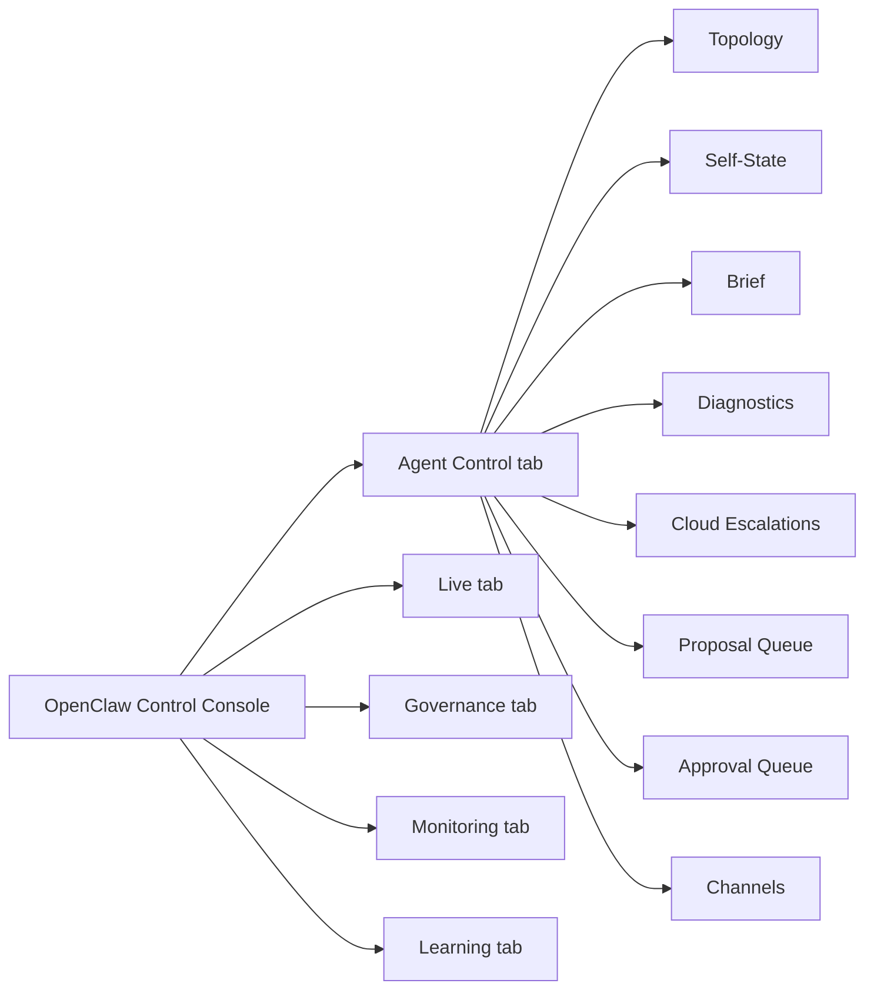

# GUI Plan: OpenClaw Control Console

Date: 2026-05-06
Status: Draft GUI improvement plan
Parent architecture: `docs/architecture/2026-05-06--openclaw_control_plane_repositioning.md`
Related plan: `docs/execution_plan/2026-05-06--openclaw_gateway_development_plan.md`

## Decision

There must be one operator GUI.

The existing FastAPI console at `http://trade-core:8000/console` remains the canonical GUI and should be explicitly branded as **OpenClaw Control Console**. OpenClaw Gateway is integrated as a backend/channel capability and status surface inside this console. It does not get a second trading dashboard.

## UX Principles

1. One control surface: no second OpenClaw GUI for trading operations.
2. No iframe embedding of the external OpenClaw dashboard.
3. OpenClaw capability appears as native tabs/cards in the existing console.
4. Operator approval always happens through the canonical approval queue, even if the request originated from Telegram/WebChat.
5. Trading-impacting proposals are visually separate from read-only reports.
6. Every AI/cloud answer shows evidence, cost, model, freshness, and approval state.

## Console Information Architecture

Current `tab-agents.html` should evolve into the first OpenClaw-native surface:

| Section | Purpose | Data source |
|---|---|---|
| Agent Topology | Show local runtime agents, OpenClaw Gateway agents, channels, and availability. | `/api/v1/openclaw/status` + existing `/api/v1/agents/roster` |
| Self-State | Current agent/system self-awareness: health, blockers, data freshness, AI availability, cost. | `/api/v1/openclaw/self-state` |
| Situation Brief | Latest hourly/daily supervisor brief. | `/api/v1/openclaw/brief/latest` |
| Diagnostics | Structured issues with fact/inference/hypothesis labels. | `/api/v1/openclaw/diagnostics` |
| Cloud Escalations | Cloud L2 calls, cost, model, prompt hash, response summary, linked proposals. | `/api/v1/openclaw/escalations` |
| Proposal Queue | Suggested actions, evidence, status, required approval class. | `/api/v1/openclaw/proposals` |
| Approval Queue | Operator approve/reject actions for proposals that may change state. | proposal approval endpoints |
| Channels | Telegram/WebChat/mobile channel status, allowlists, last inbound/outbound messages. | `/api/v1/openclaw/status` |

## Proposed Tab Shape



## Phase Plan

| Phase | Name | Work | Acceptance |
|---|---|---|---|
| GUI-OC-0 | Naming and nav cleanup | Rename console copy to OpenClaw Control Console. Clarify external OpenClaw dashboard is not canonical. | README/CLAUDE and GUI labels agree. |
| GUI-OC-1 | Read-only status cards | Add gateway/channel status, local 5-Agent topology, and self-state cards to `tab-agents.html`. | No new write endpoints; degraded states render clearly. |
| GUI-OC-2 | Brief and diagnostics | Add situation brief and diagnostics panels with evidence links and freshness. | Operator can answer "what changed and why should I care" from one tab. |
| GUI-OC-3 | Cloud escalation ledger | Add cloud-call cost/model/purpose table and response summaries. | Every cloud answer is traceable and cost-visible. |
| GUI-OC-4 | Proposal queue | Add proposal cards with risk class, evidence, owner, status, expiry, and action buttons. | Read-only proposals can be acknowledged; write-like proposals require explicit approve/reject. |
| GUI-OC-5 | Approval workflow | Wire approve/reject UX to backend approval endpoints and GovernanceHub paths. | Expired or unauthorized approvals fail closed and render a clear reason. |
| GUI-OC-6 | Mobile/channel parity | Add status for Telegram/WebChat channel delivery and allowlist posture. | Operator sees whether mobile approval/alerting is online. |
| GUI-OC-7 | Live readiness overlay | Surface pending OpenClaw/Agent blockers in Live tab readiness checklist without duplicating state. | Live tab links to Agent Control details rather than re-implementing cards. |

## Backend Aggregation Contract

The GUI must not reconstruct agent state by stitching raw tables together in JavaScript. The backend should provide bounded view models:

```text
GET /api/v1/openclaw/status
GET /api/v1/openclaw/self-state
GET /api/v1/openclaw/brief/latest
GET /api/v1/openclaw/diagnostics
GET /api/v1/openclaw/escalations
GET /api/v1/openclaw/proposals
```

Frontend rules:

- Use `ocApi` / existing auth path.
- Render degraded envelopes as cards, not blank panels.
- Do not expose raw prompt text; show prompt hash and safe summary.
- Do not show approve buttons unless backend says `operator_action_required=true`.
- Do not add manual order controls to Agent Control.
- Clear polling intervals when iframe tab deactivates.

## Visual Direction

This is an operational console, not a marketing dashboard.

- Dense, scan-first layout.
- Cards only for individual repeated objects: proposal, diagnosis, channel, escalation.
- No large hero sections.
- Status chips use existing console vocabulary: PASS / WARN / FAIL / DEGRADED / PENDING / APPROVED / REJECTED / EXPIRED.
- Trading-impacting proposals must use a stronger visual treatment than read-only reports.
- Mobile layout must keep approval buttons at safe touch sizes and show proposal expiry prominently.

## Test Strategy

Static and unit coverage:

- HTML structure validation for new panels.
- JS render tests for empty/degraded/loaded/error states.
- XSS tests for diagnosis/proposal text.
- Approval button hidden unless backend flag permits.
- Polling cleanup on tab deactivate.
- Endpoint schema fixture tests for all six view models.

Integration coverage:

- proposal create -> GUI render -> approve -> backend records approval,
- expired proposal approve fails closed,
- gateway down still renders console,
- cloud escalation row without AI invocation row produces healthcheck WARN,
- mobile-origin proposal appears in the same console queue.

## Migration Notes

Existing `tab-agents.html` should not be deleted. It is the natural home for the new Agent Control surface because it already contains the 5-Agent roster and `agent-tracker.js` integration.

Do not move trade execution controls into the Agent tab. Live trading controls remain under Live/Governance surfaces and continue to use existing authority paths.
