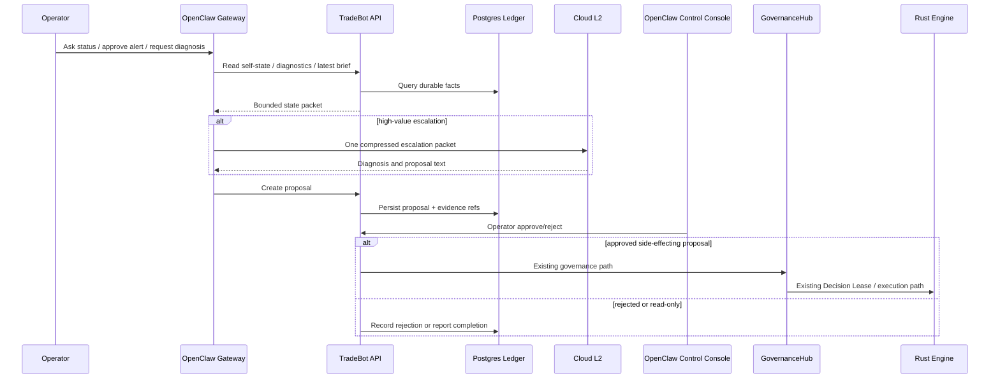

# OpenClaw Gateway Development Plan

Date: 2026-05-06
Status: Draft implementation plan
Parent architecture: `docs/architecture/2026-05-06--openclaw_control_plane_repositioning.md`

## Goal

Use OpenClaw's gateway capabilities without moving trading authority out of TradeBot.

OpenClaw should provide mobile/operator access, multi-channel alerting, agent-session routing, model/tool gateway behavior, and a supervisor path for high-value cloud AI escalation. It should not replace the local 5-Agent runtime, the FastAPI console, GovernanceHub, Decision Lease, or the Rust engine.

## Target Shape



## Scope Boundaries

OpenClaw Gateway may:

- send and receive Telegram/WebChat/mobile messages,
- call read-only TradeBot APIs,
- create proposal records,
- route operator approve/reject intent to TradeBot approval endpoints,
- run scheduled briefs and diagnosis tasks,
- call cloud AI under explicit budget and escalation policy.

OpenClaw Gateway may not:

- hold Bybit API keys,
- call order endpoints directly,
- mutate live/demo risk configs directly,
- bypass GovernanceHub, Decision Lease, or Rust enforcement,
- run unreviewed third-party skills with access to project secrets,
- become required for safe trading runtime operation.

## Phase Plan

| Phase | Name | Work | Acceptance |
|---|---|---|---|
| OC-GW-0 | Authority lockdown | Document and enforce no direct trading authority for OpenClaw. Add allowlist of permitted TradeBot endpoints. | Security review confirms no direct order/config/secret path. |
| OC-GW-1 | Gateway health bridge | Add read-only `/api/v1/openclaw/status` exposing gateway reachability, configured channels, allowlist posture, and auth mode. | Console shows gateway status; outage is visible but not trading-fatal. |
| OC-GW-2 | Read-only state APIs | Add `/self-state`, `/brief/latest`, `/diagnostics`, `/escalations` aggregation endpoints. | Gateway and GUI consume the same state packet; no frontend cross-table ad hoc SQL assumptions. |
| OC-GW-3 | Telegram alert lane | Configure P0/P1/P2 alert routing from TradeBot to OpenClaw channel gateway. | Operator receives test alerts; all alerts carry severity, evidence link, and ack URL. |
| OC-GW-4 | Supervisor brief | Implement local daily/hourly supervisor summary from durable state, with optional cloud L2 escalation. | Brief appears in GUI and mobile; cloud calls are cost-capped and persisted. |
| OC-GW-5 | Proposal intake | Add proposal create/read APIs and OpenClaw webhook/client integration. | Gateway can create read-only and approval-required proposals; nothing executes on creation. |
| OC-GW-6 | Approval relay | Add approve/reject relay from OpenClaw messages back to TradeBot. | Approval endpoint enforces operator auth and existing governance path. |
| OC-GW-7 | Audit and healthchecks | Add passive healthchecks for stale gateway, failed proposal persistence, missing cloud invocation rows, and unexpected forbidden endpoint attempts. | Silent-dead or policy violation produces WARN/FAIL. |

## Required TradeBot API Surface

Initial endpoints:

```text
GET  /api/v1/openclaw/status
GET  /api/v1/openclaw/self-state
GET  /api/v1/openclaw/brief/latest
GET  /api/v1/openclaw/diagnostics
GET  /api/v1/openclaw/escalations
GET  /api/v1/openclaw/proposals
POST /api/v1/openclaw/proposals
POST /api/v1/openclaw/proposals/{proposal_id}/approve
POST /api/v1/openclaw/proposals/{proposal_id}/reject
```

Endpoint policy:

- read endpoints return degraded envelopes instead of 5xx where possible,
- write endpoints only write proposals/approvals, not orders,
- approval endpoints delegate to existing operator auth and governance paths,
- all OpenClaw-originated requests carry source, channel, sender, auth profile, and request ID,
- every proposal links to facts, diagnostics, or replay evidence.

## Data Model Concepts

Minimum durable objects:

| Object | Purpose | Trading authority |
|---|---|---|
| `SelfStateSnapshot` | Periodic state summary for agents, runtime, DB, models, costs, and blockers. | None |
| `Diagnosis` | Structured issue: facts, inference, hypothesis, severity, evidence links. | None |
| `EscalationPacket` | Bounded packet sent to cloud AI. | None |
| `Proposal` | Suggested action with scope, risk class, evidence, and required approval. | None until approved |
| `ApprovalDecision` | Operator approve/reject/expire record. | Delegates to governance path |
| `ChannelEvent` | OpenClaw channel inbound/outbound audit trace. | None |

## Cloud Cost Policy

Default behavior:

- Local 5-Agent observations are free or local-model first.
- One supervisor compresses observations before any cloud call.
- Cloud calls are scheduled daily plus event-triggered only.
- Budget is daily and monthly, not per-agent unlimited.
- The cloud model never sees raw secrets, Bybit keys, or unrestricted DB dumps.

Escalation triggers:

- healthcheck FAIL,
- persistent realized edge regression,
- execution quality shock,
- strategy anomaly,
- governance contradiction,
- operator-requested deep analysis,
- daily brief if local confidence is low.

## Verification

Minimum checks before enabling operator channels:

- forbidden endpoint static scan for OpenClaw client code,
- auth and allowlist tests for approve/reject,
- proposal creation is idempotent by request ID,
- gateway outage does not affect Rust engine health,
- cloud invocation rows exist for every cloud call,
- mobile approval cannot approve expired proposals,
- all write-like proposals show in the console approval queue before execution.

## Rollback

OpenClaw Gateway can be disabled without stopping trading runtime:

1. Disable gateway service or remove channel token.
2. Keep TradeBot console available.
3. Mark `/api/v1/openclaw/status.degraded=true`.
4. Proposal queue remains readable in the console.
5. No pending proposal auto-approves during outage.
