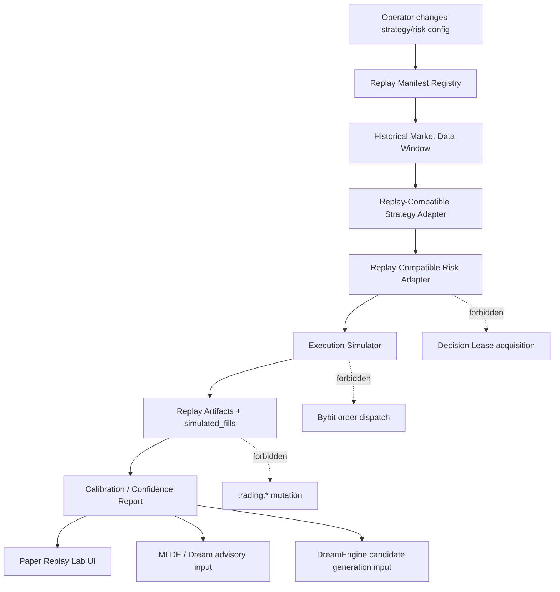

# REF-20 Gap Closure Plan V1 — Reality-Calibrated Backtest Stabilization

**Date:** 2026-05-04  
**Status:** P0 stabilization plan, not yet implemented  
**Owner:** PM  
**Trigger:** 2026-05-04 Codex production-readiness review findings  
**Upstream contracts:**
- `docs/references/2026-05-03--ref20_paper_replay_lab_governance_v2.md`
- `docs/execution_plan/2026-05-03--ref20_paper_replay_lab_dev_plan_v3.md`
- `docs/execution_plan/2026-05-03--ref20_implementation_workplan_v1.md`
- `docs/execution_plan/2026-05-03--ref20_sprint4_final_closure.md`

---

## 0. PM Decision

REF-20 remains valuable as a schema / route / UI-shell foundation, but it is **not
yet a usable reality-calibrated backtest**.

The production closure document is preserved as historical record. This plan is
the forward stabilization contract that must be completed before any operator,
MLDE, DreamEngine, or agent can treat Paper Replay Lab output as evidence for
strategy, risk, or handoff decisions.

**Current label:** `REF-20 P6 closed-with-known-gap`  
**Target label after this plan:** `REF-20 Reality-Calibrated Fast Replay usable for demo research`  
**Still never allowed:** live order execution, live parameter mutation, or Decision
Lease acquisition from the replay runner.

---

## 1. Review Findings Accepted

### P0-1 Runner is not the real decision path

File: `rust/openclaw_engine/src/replay/runner.rs`

Accepted. The current `replay_runner` explicitly avoids:

- `IntentProcessor`
- `TickPipeline`
- exchange / Bybit modules
- governance modules
- DB writer channels

It emits one synthetic long fill per symbol at close price with `qty=1.0` and
does not model fees, slippage, latency, order book, partial fills, or strategy
sizing. This means it cannot validate strategy/risk parameter changes.

### P0-2 API cannot find the deployed runner by default

File: `program_code/exchange_connectors/bybit_connector/control_api_v1/replay/route_helpers.py`

Accepted. The API resolves:

```text
$OPENCLAW_BASE_DIR/rust/openclaw_engine/target/release/replay_runner
```

but the cargo workspace emits:

```text
$OPENCLAW_BASE_DIR/rust/target/release/replay_runner
```

The same path bug exists in `helper_scripts/ci/replay_runner_symbol_audit.sh`.
Linux audit evidence: build succeeds, binary lookup fails.

### P1-1 Paper UI still marks Replay as disabled

File: `program_code/exchange_connectors/bybit_connector/control_api_v1/app/static/tab-paper.html`

Accepted. The UI exposes the Replay subtab as disabled / under development, so
the operator surface does not present an actually usable backtest lab.

---

## 2. Additional Gaps Found During Review

| ID | Severity | Gap | Required decision |
|---|---|---|---|
| G1 | P0 | `replay.*` Linux tables exist but all runtime evidence tables have 0 rows | first authenticated E2E run is mandatory |
| G2 | P0 | `replay.run_state.manifest_id` has FK to `replay.experiments`, but there is no proven manifest registration flow before `/run` | add manifest registration or atomic run registration |
| G3 | P1 | `/api/v1/replay/health` returns 404; only `/health/signature` exists | add contract health route |
| G4 | P1 | `/manifest/verify` production SQL archive path returns 501 without test key | wire SQL/archive verification |
| G5 | P1 | replay maintenance cron scripts exist but are not installed on Linux | install or explicitly downgrade retention / observation claims |
| G6 | P1 | closure skipped 14d no-live-mutation, KPI, and governance incident observation | cannot claim production-quality evidence until replacement gates pass |
| G7 | P1 | current UI copy says backend is pending even after P6 closure | UI must track backend readiness truth |
| G8 | P2 | `mlde_demo_applier.py` and `intent_processor/tests.rs` remain over hard LOC cap | backlog remains; not a replay blocker |

---

## 3. Non-Negotiable Product Goal

The operator pain is specific:

> every strategy or parameter edit currently requires waiting hours/days for new
> paper/demo data. REF-20 must compress this feedback loop to minutes while
> staying honest about reality gaps.

Therefore the target system must test:

1. strategy decisions,
2. risk gate outcomes,
3. strategy parameter changes,
4. risk parameter changes,
5. fee-aware PnL,
6. data-window / OOS discipline,
7. confidence labels and calibration uncertainty.

It may exclude exchange operational failures in the first usable phase, but it
must still model practical fees and report that exchange-rejection modeling is
out of scope for that run.

---

## 4. Hard Boundaries

### Replay isolation

`replay_runner` may share pure strategy / risk / decision modules only after they
are extracted or gated so they cannot import or call:

- Bybit REST / WS dispatch,
- exchange credentials,
- live / live_demo order submission,
- Decision Lease acquisition,
- `trading.*` mutation writers,
- live `learning.*` advisory writers,
- global paper state mutation.

### MLDE and DreamEngine role

MLDE and DreamEngine are **not** being repurposed into replay engines.

Allowed:

- generate candidate strategy/risk parameter sets,
- rank / veto candidates,
- explain regimes and counterfactual hypotheses,
- consume verified replay artifacts as advisory evidence,
- write through verified evidence paths only.

Forbidden:

- direct live mutation,
- direct demo/live order execution,
- bypassing replay manifest verification,
- treating synthetic / uncalibrated replay as real outcome,
- changing MLDE / DreamEngine's long-term purpose into a single replay feature.

### Paper engine role

The old paper engine may be reused only as a compatibility shell or UX lineage.
It must not be treated as the truth layer for backtest execution because its
state model is known to be distorted. Reality-Calibrated Fast Replay must own a
separate replay evidence trail.

---

## 5. Target Architecture



### Core design

1. **Manifest first:** every run has a physical `replay.experiments` row before
   runner spawn.
2. **Same config snapshot:** baseline and candidate runs record
   `strategy_config_sha256` and `risk_config_sha256`.
3. **Replay-compatible adapters:** strategy and risk logic must be invoked via
   pure adapters that expose the same decision semantics without live side
   effects.
4. **Fee-aware execution simulator:** first usable phase must include maker/taker
   fee model and configurable spread/slippage model.
5. **Confidence label is binding:** `none`, `limited`, `calibrated` must be
   derived from data tier and calibration freshness, not marketing copy.

---

## 6. Implementation Waves

### Wave R0 — Truth Reset and Gate Reclassification

**Owner chain:** PM -> PA -> E2 -> E4 -> PM  
**Files:** docs only

Tasks:

1. Mark current REF-20 as `closed-with-known-gap`.
2. Add this plan to active execution docs.
3. Add TODO references for P0/P1 gaps only if implementation is not started in
   the same sprint.

Acceptance:

- This file is committed and pushed.
- No existing closure document is rewritten as if the review never happened.

### Wave R1 — Runtime Usability Repair

**Owner chain:** PM -> E1 -> E2 -> E4 -> PM  
**Files likely touched:**

- `program_code/exchange_connectors/bybit_connector/control_api_v1/replay/route_helpers.py`
- `helper_scripts/ci/replay_runner_symbol_audit.sh`
- `helper_scripts/restart_all.sh` if API env export is missing
- route tests under `control_api_v1/tests/`

Tasks:

1. Fix binary resolution order:
   - `OPENCLAW_REPLAY_RUNNER_BIN`,
   - `$OPENCLAW_BASE_DIR/rust/target/release/replay_runner`,
   - `$OPENCLAW_BASE_DIR/rust/target/debug/replay_runner`,
   - legacy `rust/openclaw_engine/target/...` only as compatibility fallback.
2. Fix `replay_runner_symbol_audit.sh` to audit the actual workspace target.
3. Ensure API process has deterministic `OPENCLAW_BASE_DIR` and
   `OPENCLAW_DATA_DIR`.
4. Add `/api/v1/replay/health`.

Acceptance:

- Linux symbol audit returns 0.
- `/api/v1/replay/health` returns 200 behind the intended auth policy.
- `/run` no longer fails with `replay_runner_binary_missing`.

### Wave R2 — Manifest Registry and Verification Repair

**Owner chain:** PM -> E3 -> E1 -> E2 -> E4 -> PM  
**Files likely touched:**

- `app/replay_routes.py`
- `replay/manifest_signer.py`
- `replay/security_guards.py`
- SQL helper / migration only if a missing table or function is confirmed

Tasks:

1. Add or expose a production manifest registration path.
2. Guarantee `/run` cannot insert dangling `run_state.manifest_id`.
3. Wire SQL/archive-backed manifest verification so `/manifest/verify` does not
   depend on `OPENCLAW_REPLAY_VERIFY_TEST_KEY`.
4. Make idempotency key behavior explicit for manifest registration and run
   spawn.

Acceptance:

- Authenticated manifest registration creates one `replay.experiments` row.
- Authenticated `/run` creates one `replay.run_state` row referencing the same
  experiment.
- Invalid signature / expired key / mismatched hash fail closed.

### Wave R3 — First Real Runtime E2E Evidence

**Owner chain:** PM -> E1 -> E4 -> QA -> PM  
**Runtime:** Linux `trade-core`

Tasks:

1. Run a minimal authenticated replay on Linux.
2. Persist run_state, report_artifacts, and simulated_fills.
3. Store artifact path under allowlisted replay artifact root.
4. Produce an operator-readable report.

Acceptance SQL:

```sql
SELECT COUNT(*) FROM replay.experiments;
SELECT COUNT(*) FROM replay.run_state;
SELECT COUNT(*) FROM replay.report_artifacts;
SELECT COUNT(*) FROM replay.simulated_fills;
```

All four must be `> 0` after the smoke run.

### Wave R4 — Paper Replay Lab UI Enablement

**Owner chain:** PM -> A3 -> E1a -> E2 -> E4 -> QA -> PM  
**Files likely touched:**

- `app/static/tab-paper.html`
- `app/static/app-paper.js`
- shared disabled-state UI helper if needed

Tasks:

1. Replace static disabled Replay subtab with backend-readiness gated enablement.
2. Show execution confidence, data tier, fee model, and calibration status before
   result interpretation.
3. Keep manual submit/cancel retired.
4. Add empty, running, failed, completed, and degraded states.

Acceptance:

- Replay tab is enabled only when backend health is green.
- UI never labels current smoke replay as calibrated.
- No manual order controls reappear.

### Wave R5 — Real Decision/Risk Replay Path

**Owner chain:** PM -> PA -> QC -> E1 -> E2 -> E4 -> PM  
**Primary objective:** replace the synthetic close-price walker with a real
replay-compatible decision path.

Tasks:

1. Inventory current live strategy and risk call graph:
   - strategy signal generation,
   - intent creation,
   - risk checks,
   - sizing,
   - stop / TP logic,
   - cost gate inputs.
2. Extract or gate pure components so replay can call them without live side
   effects.
3. Add `ReplayStrategyAdapter` and `ReplayRiskAdapter`.
4. Ensure changing a strategy/risk parameter changes replay decisions when that
   parameter is decision-relevant.
5. Record per-decision evidence:
   - signal id,
   - risk decision,
   - rejected reason,
   - intended side/qty/price,
   - simulated fill outcome.

Acceptance:

- A known parameter delta changes replay decisions in a controlled fixture.
- A known risk limit delta changes pass/reject outcomes.
- Replay output includes both accepted and rejected decision records.
- No forbidden live symbols appear in `nm` / runtime guard checks.

### Wave R6 — Fee and Execution Calibration

**Owner chain:** PM -> QC -> MIT -> E1 -> E2 -> E4 -> PM  
**Primary objective:** make replay honest enough to save development time without
pretending to be exchange-perfect.

Tasks:

1. Implement maker/taker fee model from current Bybit fee configuration.
2. Add spread/slippage model with explicit assumptions.
3. Calibrate against demo/live_demo historical fills where available.
4. Add run-level labels:
   - `execution_confidence='none'`: synthetic / uncalibrated,
   - `limited`: fee-aware with partial calibration,
   - `calibrated`: sufficient recent fill coverage by strategy/symbol/regime.
5. Exclude exchange operational failures in first usable phase only if the report
   states this explicitly.

Acceptance:

- Fee model is never omitted from PnL.
- Calibration report includes sample count, freshness, and confidence.
- If calibration sample is weak, report is downgraded automatically.

### Wave R7 — MLDE / Dream Advisory Integration

**Owner chain:** PM -> QC -> MIT -> AI-E -> E1 -> E2 -> E4 -> PM

Tasks:

1. Let DreamEngine generate replay candidate hypotheses without forking its core
   purpose.
2. Let MLDE rank/veto candidates using verified replay artifacts.
3. Route all replay-derived advisory rows through
   `learning.verify_replay_evidence_and_insert()`.
4. Prevent unverified replay rows from reaching demo applier or handoff.

Acceptance:

- MLDE/Dream can consume verified replay outputs.
- No replay-derived row without `replay_experiment_id` and `manifest_hash`
  reaches applier logic.
- Advisory output is labeled as replay-derived, never real outcome.

### Wave R8 — Maintenance, Retention, and Observation

**Owner chain:** PM -> E3 -> E1 -> E4 -> QA -> PM

Tasks:

1. Install replay cron jobs or document why each is intentionally manual:
   - key rotation check,
   - key archive cleanup,
   - artifact prune,
   - Wave9 no-live-mutation watch,
   - business KPI collector,
   - audit incident scan.
2. Add healthcheck probes for:
   - runner binary path,
   - manifest registry rows,
   - artifact retention,
   - failed run rate,
   - stale running rows.
3. Enforce artifact TTL / quota posture.

Acceptance:

- Linux `crontab -l` shows required replay jobs or a signed manual replacement.
- Healthcheck reports replay readiness without relying on empty-table vacuous
  truth.

### Wave R9 — Reality-Calibrated Usability Sign-off

**Owner chain:** PM -> E2 -> E4 -> QA -> PM

Sign-off requires:

1. At least 5 successful replay runs across at least 2 strategies.
2. At least 1 parameter-change replay proving decisions or risk outcomes differ.
3. At least 1 fee-aware report.
4. 0 live / trading mutation during replay window.
5. UI replay flow usable by operator without manual DB insertion.
6. MLDE/Dream advisory path remains non-commanding.
7. All confidence labels match calibration evidence.

---

## 7. Acceptance Matrix

| Gate | Must prove | Evidence |
|---|---|---|
| A1 | API can spawn runner | authenticated `/run` + Linux process/artifact |
| A2 | DB lineage exists | nonzero experiments/run_state/artifacts/fills |
| A3 | No dangling manifest FK | `/run` cannot create orphan run_state |
| A4 | Actual strategy path | parameter delta changes decision trace |
| A5 | Actual risk path | risk delta changes accept/reject trace |
| A6 | Fee-aware PnL | fee model in every report |
| A7 | Confidence honesty | weak calibration downgrades output |
| A8 | UI usable | Replay subtab enabled only when backend ready |
| A9 | No live mutation | watch query + audit log |
| A10 | ML/Dream boundary | advisory only, verified insert only |

---

## 8. Tests and Runtime Checks

Minimum required before R9:

```bash
cargo test --release --bin replay_runner --features replay_isolated
cargo test -p openclaw_engine --lib
pytest program_code/exchange_connectors/bybit_connector/control_api_v1/tests -q
bash helper_scripts/ci/replay_runner_symbol_audit.sh
```

Linux runtime checks:

```bash
curl -i http://127.0.0.1:8000/api/v1/replay/health
curl -i http://127.0.0.1:8000/api/v1/replay/list
```

DB checks:

```sql
SELECT COUNT(*) FROM replay.experiments;
SELECT COUNT(*) FROM replay.run_state;
SELECT COUNT(*) FROM replay.report_artifacts;
SELECT COUNT(*) FROM replay.simulated_fills;
SELECT COUNT(*) FROM replay.handoff_requests;
SELECT COUNT(*) FROM replay.mlde_replay_veto_log;
```

Safety checks:

```sql
SELECT COUNT(*) FROM trading.fills WHERE created_at >= :replay_window_start;
SELECT COUNT(*) FROM learning.governance_audit_log
 WHERE event_type LIKE 'replay_%'
   AND severity IN ('high','critical');
```

---

## 9. Work Sequencing

Recommended sprint order:

1. **Sprint A:** R1 + R2 + R3  
   Goal: make the current scaffold actually runnable and evidenced.
2. **Sprint B:** R4 + R5  
   Goal: make UI usable and replace synthetic walker with decision/risk replay.
3. **Sprint C:** R6 + R7  
   Goal: calibration and MLDE/Dream advisory integration.
4. **Sprint D:** R8 + R9  
   Goal: maintenance, observation, and reality-calibrated sign-off.

Do not start R7 before R5 produces real decision/risk evidence. MLDE/Dream
should not learn from a synthetic close-price walker.

---

## 10. Open Questions

1. Which historical data tier should be the first actionable target: S2 public
   OHLCV, S3 enriched demo captures, or S4 private orderbook replay?
2. Should first usable replay focus on grid and ma_crossover only, because they
   have the highest current sample count?
3. Should exchange rejection / Bybit operational failure modeling remain out of
   scope until after fee/slippage calibration is stable?
4. Should the old paper engine be retired further or retained as session-state UI
   only?

PM default answers until contradicted:

1. start with S3 enriched demo captures on Linux,
2. focus grid + ma_crossover first,
3. exclude exchange operational failures in the first usable phase but disclose
   the exclusion,
4. retain paper engine as UI/session compatibility only, not evidence truth.

---

## 11. PM Sign-off

PM verdict for current REF-20 as of 2026-05-04:

**CONDITIONAL / BLOCKED FOR TRUE BACKTEST USE.**

Allowed now:

- continue development using REF-20 schema and route foundation,
- fix runtime spawn / manifest / UI gaps,
- run smoke replay as non-actionable infrastructure test.

Not allowed now:

- use current replay output to judge strategy quality,
- use current replay output to tune live/demo risk,
- feed current synthetic replay output into MLDE/Dream as real evidence,
- advertise Paper Replay Lab as solving the operator's fast backtest pain.

This plan becomes complete only when Wave R9 acceptance is met.
