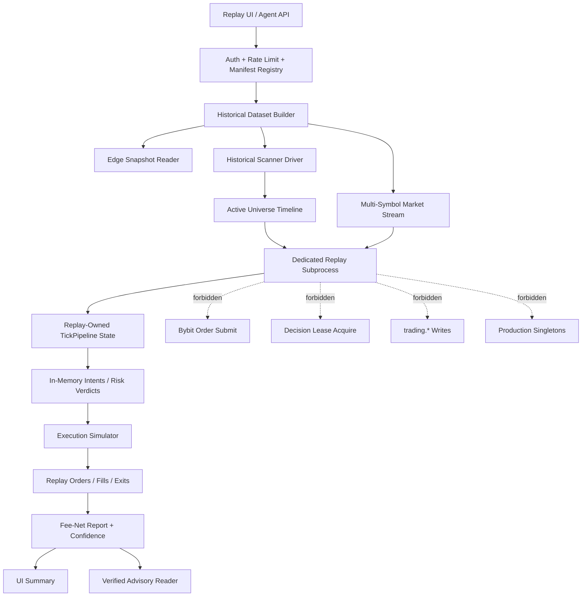

# REF-21 Full-Chain Replay Engine Dev Plan V1.1

**Date:** 2026-05-06  
**Status:** Revised design baseline / implementation blocked until B-gates pass  
**Owner:** PM  
**Supersedes:** `2026-05-06--ref21_full_chain_replay_engine_dev_plan_v1.md`  
**Audit input:** 8-agent A1-A8 consensus review, overall rating `REVISE`  
**Current code note:** commit `18efb965` added a provisional dataset-only
`/api/v1/replay/full-chain/prepare` endpoint. It does **not** satisfy REF-21
acceptance and must not be exposed as a completed full-chain replay.

---

## 0. PM Decision Change From V1

V1 correctly identified the product target, but it was not complete enough to
enter full implementation. The review chain found structural blockers in process
isolation, forbidden-path enforcement, data leakage, market-data reality,
agent governance, GUI safety, and acceptance criteria.

REF-21 is therefore redefined as:

> a bounded, source-tagged **7-day in-sample replay sandbox for code and
> parameter iteration**, with explicit out-of-sample gates when claims are used
> for advisory learning or candidate promotion.

It is **not** equivalent to seven days of unseen live/demo data accumulation.
Replay compresses feedback on what the current stack would have done under a
declared historical window; it does not create new market evidence.

No wave beyond the existing provisional dataset endpoint may proceed until the
B-gates in Section 2 are implemented or explicitly waived by PM + operator.

---

## 1. Non-Negotiable Product Goal

The default Replay tab target remains:

1. Operator changes strategy code, strategy params, risk params, or scanner config.
2. Operator selects a historical window, defaulting to the latest available 7
   days but labelled as in-sample unless freeze/OOS criteria pass.
3. Operator selects `Demo config snapshot` or `Live config snapshot`.
4. Operator clicks `Run 7D Full-Chain Replay`.
5. System reports scanner, strategy, risk, execution, exit, fees, confidence,
   and data-quality caveats.

Default UI must not expose manifest JSON, fixture URI, experiment ID, or run ID.
The detailed REF-20 controls remain under Advanced.

---

## 2. B-Gates Before Further Implementation

### B1 Dedicated Subprocess Contract

REF-21 R3 must extend the existing dedicated subprocess runner model:

- canonical binary: `srv/rust/openclaw_engine/src/bin/replay_runner.rs`,
- no same-process embedding of production singletons,
- no use of live `_BYBIT_CLIENT`, `KLINE_MANAGER`, `GovernanceHub`,
  `ExecutorAgent`, DB writer channels, IPC server, or Decision Lease clients,
- existing forbidden subprocess acceptance tests remain authoritative.

V1 wording that implied same-process `TickPipeline` reuse is superseded. The
implementation target is a replay subprocess with replay-owned state.

### B2 Forbidden Dispatch Must Fail Closed

All dispatch/write/lease/exchange setter paths used by `TickPipeline` must have
two layers:

- compile-time separation where replay components do not implement live dispatch
  traits,
- runtime defense-in-depth where isolated replay profile panics or hard-errors
  if a live tx/client/sink is installed or requested.

Silent `if let Some(tx)` skips are not acceptable in isolated replay. Acceptance
must cover every live dispatch setter currently reachable from
`tick_pipeline/on_tick/step_4_5_dispatch.rs`.

### B3 Production State Pollution Test

Replay must prove it does not mutate production singleton/cache state. Acceptance:

- capture production singleton/cache snapshots before a replay run,
- run a representative multi-symbol replay,
- capture snapshots after,
- assert byte-equal or structurally equal for production `KlineManager`,
  `IndicatorEngine`, `SignalEngine`, scanner state, and live/demo routing state.

Any intentional mutable replay state must live in replay-owned structs only.

### B4 Edge Estimate Snapshot Schema

Scanner replay cannot use current edge estimates for historical windows. Before
historical scanner replay:

- add a versioned `edge_estimate_snapshots` hypertable or equivalent immutable
  append-only table,
- include `asof_ts`, `source_tier`, `config_hash`, `strategy_hash`,
  `symbol`, `strategy`, regime/cell key, and estimate payload hash,
- scanner driver must query `WHERE asof_ts <= window_start - embargo` for OOS
  mode, or mark the run `IN_SAMPLE_EDGE_CURRENT` and block learning promotion.

Migration number is reserved as `V###` and must be assigned after DB migration
inventory review.

### B5 Strategy Freeze And OOS Semantics

Every full-chain manifest must declare:

- `strategy_freeze_date`,
- `strategy_git_sha`,
- `strategy_config_hash`,
- `risk_config_hash`,
- `scanner_config_hash`,
- `window_start`,
- `window_end`,
- `oos_embargo`.

Learning/advisory promotion requires `strategy_freeze_date <= window_start -
oos_embargo`. If this fails, the run remains `IN_SAMPLE_SANDBOX` and the GUI
shows an in-sample warning.

### B6 Replay Learning Gates

Replay evidence cannot leak into learning reads by convention alone. R6 must add:

- tier promotion matrix from `synthetic_replay` -> `calibrated_replay` ->
  `verified_replay_advisory`,
- PG `CHECK` constraints or equivalent enum constraints on replay evidence tier,
- `learning.read_replay_eligible_fills()` SECURITY DEFINER reader,
- verified insert function mirroring the REF-19/REF-20 V055/V037 governance
  pattern,
- SELECT-side filters so unverified replay rows cannot be read as training data.

### B7 S2 Maker Fill Clamp

S2 has no queue depth. Therefore S2 execution confidence must be pessimistic:

- maker fill probability is capped at `min(model, live_demo_30d_p25)`,
- if calibration labels are unavailable, cap defaults to a conservative PM-set
  value and confidence becomes `S2_OPTIMISTIC_BOUND`,
- q10/q50/q90 must include model-misspecification caveat, not only bootstrap
  sampling uncertainty,
- report must separate decision correctness from execution realism.

### B8 Agent Endpoint Auth, Rate Limit, And K Cap

All REF-21 agent/exploration endpoints must inherit REF-20 replay governance:

- `replay:write` or stricter dedicated scope,
- operator role or signed agent principal,
- per-actor `_replay_limiter` equivalent, default 10/min,
- candidate count `K <= 100` by default,
- `K <= 1000` only with operator override and audit reason,
- no direct mutation of demo/live/live_demo params.

### B9 Decision Lease Canary Compatibility

R3 overlaps with SM-02 R04 Decision Lease router retrofit. Acceptance must run
with both:

- `OPENCLAW_LEASE_ROUTER_GATE_ENABLED=0`,
- `OPENCLAW_LEASE_ROUTER_GATE_ENABLED=1`.

Replay must never acquire a lease in either mode, and all six router acquire
call sites must be covered by the forbidden-path audit.

### B10 Bybit Data Reality And Rate Safety

Dataset builder must not fabricate unavailable Bybit history:

- no historical ticker endpoint is assumed unless verified by source code/API
  contract at implementation time,
- reconstructed ticker/BBO fields must be labelled as reconstructed,
- current instrument info snapshots must be fixture-frozen with `asof_fetch_ts`
  and drift caveat,
- fee cache is read-only and tier drift is shown,
- public API puller has a hard ceiling `<= 50 req/s`,
- production `trade-core` IP must not be used for bulk replay backfill unless
  explicitly approved; default bulk jobs run from a separate IP or offline batch.

### B11 Error And Degradation Criteria

Acceptance cannot be “Linux replay suite green” only. Required failure cases:

- Bybit 429 / 5xx,
- missing klines,
- fixture missing/corrupt,
- disk full or permission denied,
- DB unavailable,
- scanner snapshot unavailable,
- edge snapshot unavailable,
- MLDE/Dream timeout,
- report finalize partial failure,
- cancellation mid-run.

Each must return bounded JSON with reason codes and must not leave a run in an
ambiguous success state.

### B12 GUI Safety

Default UI copy must avoid live-action ambiguity:

- label: `Live config snapshot (simulation only, no orders)`,
- persistent `SIMULATION ONLY` badge,
- explain `net bps` as post-fee return units or show percent beside it,
- show confidence badge text: `S2 optimistic bound`, `S1 calibrated`, etc.,
- show progress, cancel, estimated time, and retry-safe error states,
- Advanced contains manifests and fixture details.

---

## 3. Target Architecture V1.1

The dedicated replay subprocess owns all mutable replay state. Production code
may contribute pure scorer/strategy/risk functions only through explicit
dependency injection or extracted pure modules.

---

## 4. Manifest And Idempotency Contract

Full-chain manifest must be canonical JSON with a stable sha256:

- sorted keys,
- no volatile timestamps inside the hash domain except declared fetch/run fields,
- fixture hashes referenced by content hash, not only path,
- config hashes included,
- strategy/risk/scanner freeze fields included,
- max manifest size target `<= 256KB`.

If multi-symbol metadata exceeds the cap, store large payloads as artifacts and
reference their hashes in the manifest.

Idempotency:

- same actor + same canonical manifest + same code/config hashes returns the
  existing experiment unless `force_new=true`,
- duplicate clicks must not launch duplicate runs by default,
- cancellation and retry semantics are explicit in the registry.

---

## 5. Data Tiers And Promotion Matrix

| Tier | Meaning | May Train ML? | May Rank Candidates? | May Suggest Demo Candidate? |
|---|---|---:|---:|---:|
| `synthetic_replay` | fabricated or toy fixture | No | No | No |
| `s2_public_replay` | Bybit public OHLCV/funding/OI/instrument snapshots | No | Yes, sandbox only | No |
| `s2_oos_replay` | S2 with freeze/OOS embargo and edge snapshots | No | Yes | Research only |
| `s1_calibrated_replay` | local recorder plus live_demo calibration | Via verified reader only | Yes | Possible with gates |
| `verified_replay_advisory` | accepted by verified insert path | Via security-definer path only | Yes | Advisory only |

Promotion requires a verified report, source mix, freeze/OOS status, calibration
freshness, and no forbidden-path audit failures.

---

## 6. Revised Implementation Waves

### R0 Design Baseline

**Status:** V1 completed but superseded by this V1.1.  
**Acceptance:** V1.1 lands, register points to V1.1, V1 marked superseded.

### R1 Dataset Builder Foundation

**Status:** provisional endpoint exists in `18efb965`.  
**Allowed next work:** harden it under V1.1, not expand into full run claims.

Required additions before R1 acceptance:

- manifest canonical hash/idempotency design,
- scanner input source labels,
- request limiter if exposed to high-volume agents,
- fixture URI scheme/path allowlist,
- Bybit rate ceiling and bulk-IP policy,
- tests for Bybit 429/5xx, disk write failure, fixture hash, duplicate click.

### R2 Historical Scanner Driver

Blocked by B4/B5. Must use edge snapshots or mark in-sample. Must output:

- scan cycles,
- candidates,
- active symbols,
- added/removed symbols,
- route reasons,
- strategy eligibility by timestamp.

### R3 Dedicated Full-Chain Replay Runner

Blocked by B1/B2/B3/B7/B9. Must extend the existing replay subprocess and prove:

- no order submit,
- no lease acquire,
- no production DB writes,
- no production singleton mutation,
- multi-symbol/multi-strategy decisions,
- accepted and rejected risk verdicts,
- fee-net balance accounting,
- exits/risk closes captured.

### R4 One-Click GUI

Blocked by B12 and R3. The GUI cannot call dataset-only prepare as if it were
complete replay. It may expose `Prepare Dataset` only under Advanced until R3
reporting is real.

### R5 S1 Local Recorder

Adds local L1/L50/order/trade/ticker/funding/OI snapshots with retention caps,
compression, healthcheck, and replay reader API. S1 is required before maker
execution confidence can rise above S2 optimistic bound.

### R6 MLDE / Dream Exploration

Blocked by B6/B8. MLDE and DreamEngine remain advisory:

- Dream may propose hypotheses,
- MLDE may rank/veto verified reports,
- neither writes demo/live/live_demo params directly,
- all candidate application still flows through existing governance/applier gates.

---

## 7. Quantified Acceptance Criteria

REF-21 is not accepted until all are true:

1. 7-day replay covers at least two scanner-selected symbols and one dynamic
   active-universe change in a deterministic fixture test.
2. Scanner replay uses an edge snapshot with `asof_ts <= window_start - embargo`
   or report is hard-labelled `IN_SAMPLE_SANDBOX`.
3. Strategy decisions come from the same pure strategy implementation or an
   explicitly reviewed replay adapter with parity tests.
4. Risk decisions include accepted and rejected verdicts with gate reason codes;
   zero-qty rejections remain visible in report artifacts.
5. Headline PnL is fee-net; maker/taker fees are deducted from replay balance.
6. Execution report separates decision edge from execution-realism confidence.
7. S2 maker fills are capped by calibration clamp and labelled
   `S2_OPTIMISTIC_BOUND`.
8. Report includes net bps/percent, q10/q50/q90, max drawdown, trade count,
   reject count, and source mix.
9. Per-strategy, per-symbol, and per-regime breakdowns are present.
10. GUI default path requires no manifest/fixture knowledge and shows simulation
    badge, progress, cancel, and bounded error states.
11. Forbidden-path audit passes for order submit, lease acquire, DB writes,
    IPC live dispatch, and production singleton mutation.
12. Agent endpoints enforce auth, rate limits, K caps, and audit logging.
13. Learning reads can only consume replay rows through the verified
    security-definer reader.
14. Linux suites include unit, integration, forbidden-path, degradation, and
    route-load tests.

---

## 8. Immediate Next Review Chain

Before coding beyond R1 hardening:

1. PM finalizes this V1.1 and records it in the spec register.
2. CC + E3 review B1/B2/B3/B4/B8/B9/B12.
3. MIT reviews B4/B6 schema and replay-learning gates.
4. QC reviews B5/B7 OOS semantics and maker clamp.
5. BB reviews B10 Bybit data/rate/IP policy.
6. FA reviews Section 7 quantified acceptance criteria.

Only after this chain returns at least Conditional/B may R2/R3 implementation
begin.

---

## 9. Revision History

| Version | Date | Author | Notes |
|---|---|---|---|
| V1 | 2026-05-06 | PM | Initial product/architecture baseline; superseded after 8-agent audit found structural blockers. |
| V1.1 | 2026-05-06 | PM | Converts A1-A8 consensus blockers into B-gates, revises replay claims, reaffirms dedicated subprocess model, adds OOS/edge snapshot/tier promotion/auth/rate/GUI/acceptance contracts. |
