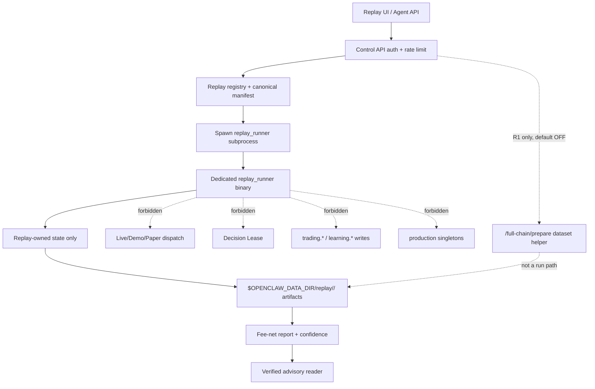

# REF-21 Full-Chain Replay Engine Dev Plan V1.3

**Date:** 2026-05-06  
**Status:** Active revised design / R2-R3 blocked behind V1.3 P0 gates  
**Owner:** PM  
**Supersedes:** `2026-05-06--ref21_full_chain_replay_engine_dev_plan_v1_2.md`  
**Audit input:** V1.2 8-agent adversarial closure review, overall rating
`REVISE -> V1.3 consensus`  
**Runtime state:** `/api/v1/replay/full-chain/prepare` remains default-OFF behind
`OPENCLAW_REPLAY_PREPARE_ENABLED=0`. R1 hardening may continue; GUI remains
unbound. R2/R3 dispatch is forbidden until V1.3 P0 gates pass.

---

## 0. PM Decision

V1.2 closed the V1.1 endpoint bypass by adding a default-OFF flag, but the
closure review found five remaining P0 design blockers:

1. negative-edge fail-open in tier promotion,
2. V057/V058/V059 migration DDL not specified or dry-run,
3. subprocess isolation not tied to the real deployment path,
4. write confinement still missing high-impact state/audit paths,
5. tier-promotion approval and metric calculation not tamper-resistant.

V1.3 keeps REF-21 blocked from R2/R3 until those are closed. The only allowed
near-term implementation is **R1 hardening of the disabled dataset endpoint**.

---

## 1. Architecture Boundary



Control API worker code may validate auth, register manifests, and spawn the
dedicated runner. It must not execute full-chain scanner/strategy/risk replay
inside the uvicorn worker process.

---

## 2. Emergency R1 Endpoint Gate

`POST /api/v1/replay/full-chain/prepare` remains a disabled R1 hardening tool:

- default env: `OPENCLAW_REPLAY_PREPARE_ENABLED=0`,
- disabled response: HTTP 403 with `replay_full_chain_prepare_disabled`,
- disabled path must not fetch market data, scanner state, strategy params, or
  risk config,
- no default GUI binding,
- enabled sessions require structured append-only audit rows.

### 2.1 Emergency Audit Log DDL Sketch

Reserved migration component: `V060_replay_emergency_audit_log`.

```sql
CREATE TABLE audit.replay_emergency_log (
    event_id UUID PRIMARY KEY DEFAULT gen_random_uuid(),
    ts TIMESTAMPTZ NOT NULL DEFAULT now(),
    actor_id TEXT NOT NULL CHECK (actor_id !~ '[\r\n]'),
    actor_type TEXT NOT NULL CHECK (actor_type IN ('human', 'agent', 'system')),
    route TEXT NOT NULL CHECK (route = '/api/v1/replay/full-chain/prepare'),
    enabled_flag BOOLEAN NOT NULL,
    window_start TIMESTAMPTZ,
    window_end TIMESTAMPTZ,
    symbols TEXT[] NOT NULL DEFAULT '{}',
    source_tier TEXT NOT NULL,
    request_count INTEGER NOT NULL CHECK (request_count >= 0),
    manifest_hash BYTEA,
    reason TEXT NOT NULL CHECK (reason !~ '[\r\n]'),
    payload_jsonb JSONB NOT NULL DEFAULT '{}'::jsonb
);

REVOKE UPDATE, DELETE ON audit.replay_emergency_log FROM PUBLIC;
```

Application logs may mirror this row, but the database row is the authority.

---

## 3. Dedicated Subprocess Deploy Path

Full-chain run route shape:

```text
POST /api/v1/replay/full-chain/run
  -> auth / limiter / K cap
  -> canonical manifest hash
  -> pg_advisory_xact_lock(manifest_hash)
  -> write manifest artifact with O_EXCL
  -> spawn srv/rust/openclaw_engine/src/bin/replay_runner.rs
  -> collect artifacts
  -> finalize report
```

Subprocess environment policy:

- start from an explicit allowlist, not inherited process env,
- allow only `OPENCLAW_DATA_DIR`, replay-specific read-only config paths, and
  logging variables required for diagnostics,
- deny `OPENCLAW_ALLOW_MAINNET`, all `BYBIT_*` credential env vars,
  `OPENCLAW_IPC_SECRET*`, live secret paths, and direct write-capable database
  URLs,
- do not load or watch `authorization.json`,
- no IPC server and no Decision Lease client.

R1 dataset preparation may remain in the Control API only while disabled by
default. Any production-enabled dataset builder must either move to a bounded
offline worker/subprocess or prove it has an independent Bybit rate bucket and
cannot starve live/demo market access.

Build-time gate:

```text
cargo tree -p openclaw_engine --bin replay_runner --no-default-features
```

must be checked by CI for forbidden dependencies on live router/executor modules.

---

## 4. Write Confinement

Replay subprocess may write only:

- `replay.*` schema through reviewed replay writers,
- `$OPENCLAW_DATA_DIR/replay/<run_id>/` via O_EXCL + run_id lock,
- append-only audit procedures explicitly listed in the manifest.

Forbidden writes include:

- `trading.*`,
- `learning.*` except via verified SECURITY DEFINER reader/insert functions,
- arbitrary `audit.*` writes outside approved append-only procedures,
- `agent.messages`,
- `settings/*.toml`,
- `mode_state.json`,
- `engine_state.json`,
- `engine_maintenance.flag`,
- `/tmp/openclaw/*.lock`,
- passive healthcheck / watchdog sentinel files,
- `authorization.json`,
- live/demo secret files.

Concurrency gate:

- `pg_advisory_xact_lock(hash(run_id))`,
- O_EXCL artifact creation,
- `fcntl`/platform-equivalent lock for run directory,
- duplicate manifest returns existing run unless `force_new=true`.

---

## 5. Migration Step 0 And DDL Sketches

Before any V057/V058/V059 code is written, MIT must run a Linux PG dry-run per
`memory/feedback_v_migration_pg_dry_run.md` and record:

- preflight on current `trade-core` schema,
- migration apply in transaction,
- rollback proof or disposable DB proof,
- Guard A/B/C results,
- grants/revokes diff,
- query plan sanity for expected replay reads.

### 5.1 V057 Replay Evidence Tiers

```sql
CREATE TYPE replay.replay_evidence_tier_v057 AS ENUM (
    'synthetic_replay',
    's2_public_replay',
    's2_oos_replay',
    's1_calibrated_replay',
    'verified_replay_advisory',
    'legacy_calibrated_replay_pending_review',
    'legacy_counterfactual_replay_pending_review'
);

CREATE TABLE replay.tier_promotion_approval (
    approval_id UUID PRIMARY KEY DEFAULT gen_random_uuid(),
    report_id UUID NOT NULL,
    from_tier replay.replay_evidence_tier_v057 NOT NULL,
    to_tier replay.replay_evidence_tier_v057 NOT NULL,
    state TEXT NOT NULL CHECK (state IN ('requested', 'approved', 'rejected')),
    metrics_hash BYTEA NOT NULL,
    manifest_hash BYTEA NOT NULL,
    approver_actor_id TEXT NOT NULL CHECK (approver_actor_id !~ '[\r\n]'),
    approver_role TEXT NOT NULL CHECK (approver_role IN ('PM', 'QC', 'MIT')),
    signature_payload_sha256 BYTEA NOT NULL,
    approval_signature BYTEA NOT NULL,
    mfa_challenge_id TEXT,
    signed_at TIMESTAMPTZ NOT NULL DEFAULT now(),
    UNIQUE (report_id, from_tier, to_tier, approver_role)
);

REVOKE INSERT, UPDATE, DELETE ON replay.tier_promotion_approval FROM PUBLIC;
```

Metrics must be produced by a SECURITY DEFINER calculator, not by replay
producer payloads:

```sql
CREATE FUNCTION replay.calculate_promotion_metrics(report_id UUID)
RETURNS JSONB
LANGUAGE plpgsql
SECURITY DEFINER
AS $$ /* reads immutable report artifacts and computes DSR/PBO/PSR/OOS gap */ $$;
```

Allowed FSM transitions:

```text
synthetic_replay -> terminal_no_promotion
s2_public_replay -> s2_oos_replay
s2_oos_replay -> s1_calibrated_replay
s1_calibrated_replay -> verified_replay_advisory
```

Direct tier jumps fail closed.

### 5.2 V058 Symbol Universe Snapshots

```sql
CREATE TABLE market.symbol_universe_snapshots (
    ts TIMESTAMPTZ NOT NULL,
    exchange TEXT NOT NULL CHECK (exchange = 'bybit'),
    category TEXT NOT NULL CHECK (category IN ('linear', 'spot', 'inverse')),
    symbol TEXT NOT NULL,
    status TEXT NOT NULL,
    base_coin TEXT,
    quote_coin TEXT,
    contract_type TEXT,
    tick_size NUMERIC,
    qty_step NUMERIC,
    min_notional NUMERIC,
    listed_at TIMESTAMPTZ,
    delisted_at TIMESTAMPTZ,
    source_uri TEXT NOT NULL,
    payload_hash BYTEA NOT NULL,
    PRIMARY KEY (ts, exchange, category, symbol)
);
```

Scanner replay must select symbols from V058, not from current survivors.

### 5.3 V059 Edge Estimate Snapshots

```sql
CREATE TABLE learning.edge_estimate_snapshots (
    asof_ts TIMESTAMPTZ NOT NULL,
    source_tier TEXT NOT NULL,
    config_hash BYTEA NOT NULL,
    strategy_hash BYTEA NOT NULL,
    scanner_config_hash BYTEA NOT NULL,
    symbol TEXT NOT NULL,
    strategy TEXT NOT NULL,
    regime_key TEXT NOT NULL,
    cell_key TEXT NOT NULL,
    estimate_payload_hash BYTEA NOT NULL,
    estimate_payload_jsonb JSONB NOT NULL,
    PRIMARY KEY (asof_ts, strategy_hash, scanner_config_hash, symbol, strategy, regime_key, cell_key)
);
```

Retention: at least 75 days. Writer triggers: hourly cron and on
strategy/scanner/risk config hash change.

---

## 6. Freeze And OOS

`strategy_freeze_date` is not operator-entered. It is derived from:

- CI-created git tag `freeze/YYYY-MM-DD`,
- immutable `governance.strategy_freeze_log`,
- strategy git sha and config hashes captured by CI.

Default `oos_embargo`:

```text
max(7 days, ceil(2 * half_life), max_trade_horizon_bars * bar_size)
```

Promotion rejects strategies with `half_life < 1 day` or `half_life > 30 days`
until a separate QC-approved regime exists.

---

## 7. Promotion Gates

### 7.1 Promotion Matrix

| From | To | Minimum Conditions | Approver |
|---|---|---|---|
| `synthetic_replay` | none | Never promotes | N/A |
| `s2_public_replay` | `s2_oos_replay` | freeze/OOS pass, edge snapshot pass, source mix complete, `predicted_edge_bps > 0` | system gate + PM |
| `s2_oos_replay` | `s1_calibrated_replay` | S1 recorder data, calibration freshness <= 30d, `n_fills >= 30` per cell or pooled `n >= 100`, MAD execution error <= 25 bps, deprecated strategy/symbol contamination excluded | QC + MIT |
| `s1_calibrated_replay` | `verified_replay_advisory` | `predicted_edge_bps > 0`, `oos_net_bps > 0`, OOS gap pass, `PSR(0) >= 0.95`, `DSR > 0`, `PBO <= 0.20`, no forbidden-path findings | PM + QC + MIT |

### 7.2 OOS Gap

```text
OOS gap = max(
  abs(OOS_net_bps - IS_net_bps),
  abs(OOS_SR - IS_SR) * 100
)
```

Promotion requires `OOS gap <= 30 bps`. Negative predicted edge fails closed,
even if the absolute gap is small.

### 7.3 Uncertainty

All q10/q50/q90 report bands must use stationary block bootstrap
Politis-Romano style:

- 1000 resamples minimum,
- block size in bars: `min(bars_in_24h, floor(sqrt(n)))`,
- IID bootstrap is forbidden for crypto replay reports.

---

## 8. Survival, Portfolio, And Cost Gates

Acceptance thresholds:

- hard-stop: replay account equity <= `starting_balance * 0.60`,
- kill-switch: portfolio drawdown >= 30%,
- correlation kill: rolling 30-day Spearman max pairwise correlation > 0.85
  sustained for >= 30 simulated minutes,
- cost-edge gate: report verdict cannot exceed `research_only` if
  `total_cost_bps / max(abs(predicted_edge_bps), 1) > configured_cost_edge_ratio`,
- L0 fallback: full run must complete with MLDE/Dream disabled and pure rule
  gates active.

Portfolio report must include exposure by symbol, strategy, side, and correlated
cluster.

---

## 9. Bybit SSOT And Source URI

The only endpoint dictionary authority is:

`docs/references/2026-04-04--bybit_api_reference.md`

R1 acceptance must include a dictionary compliance check: every
`bybit-public://` mapping names the dictionary section and Bybit path.

Historical `bybit-public://` allowlist:

| URI Host/Path | Bybit Path | Dictionary Section |
|---|---|---|
| `bybit-public://market/kline` | `GET /v5/market/kline` | `get_klines` |
| `bybit-public://market/mark-price-kline` | `GET /v5/market/mark-price-kline` | `get_mark_price_klines` |
| `bybit-public://market/index-price-kline` | `GET /v5/market/index-price-kline` | `get_index_price_klines` |
| `bybit-public://market/premium-index-price-kline` | `GET /v5/market/premium-index-price-kline` | `get_premium_index_klines` |
| `bybit-public://market/open-interest` | `GET /v5/market/open-interest` | `get_open_interest` |
| `bybit-public://market/funding/history` | `GET /v5/market/funding/history` | `get_funding_history` |

Current snapshot freeze allowlist:

- `bybit-public://market/instruments-info` maps to
  `GET /v5/market/instruments-info`.

`GET /v5/market/tickers` is current snapshot only and must not be labelled as
historical.

Rate/IP policy:

- global public replay ceiling <= 50 req/s,
- per-endpoint budget must be lower than global ceiling and documented,
- exponential backoff with jitter on 429/5xx,
- no production `trade-core` IP bulk backfill unless
  `OPENCLAW_REPLAY_BULK_ALLOW_PROD_IP=1` and operator audit reason exists,
- if engine is alive and production IP override is absent, bulk backfill fails
  closed.

Funding settlement and broker rebate:

- funding settlement windows must be snapped to actual funding timestamps,
- high-volatility funding windows are labelled separately,
- broker rebate tiers must be fixture-frozen or report must use conservative fee
  defaults.

---

## 10. Baseline And Candidate Acceptance

Baseline SLA before any candidate comparison:

- fixture row count target: `2555 ± 5` for the canonical 7-day baseline fixture
  selected by FA,
- decision count target: `17 ± 3`,
- five pytest categories must be green:
  1. dataset fixture validation,
  2. scanner timeline,
  3. strategy/risk decisions,
  4. execution/fee lifecycle,
  5. report/failure states.

Baseline-vs-candidate / regret report:

- same data window and source mix,
- same freeze/OOS eligibility,
- candidate manifest hash differs only in declared code/config changes,
- report includes delta net bps, delta drawdown, delta reject count, regret
  events, and verdict downgrade reasons.

---

## 11. Implementation Waves

| Wave | Unlocks Tier | Blocked By |
|---|---|---|
| R1 dataset hardening | `s2_public_replay` data artifact only | B1/B3 partial, B9, B11, audit log |
| R2 scanner driver | `s2_public_replay` scanner timeline | V058, V059, ScannerCore, freeze log |
| R3 replay runner | `s2_public_replay` report | subprocess path, forbidden audit, survival/cost/portfolio gates |
| R4 GUI | operator usability only | GUI V1.1, R3 healthcheck |
| R5 S1 recorder | `s1_calibrated_replay` | recorder retention, S1 reader, calibration |
| R6 MLDE/Dream advisory | `verified_replay_advisory` | V057 FSM, SECURITY DEFINER calculator, applier gate |

R2/R3 cannot begin until V1.3 P0 review returns at least Conditional/B.

---

## 12. Required Review Chain

Step 0 before implementation:

- MIT Linux PG dry-run for V057/V058/V059/V060 DDL sketches.

Then:

1. CC + E3: subprocess, write confinement, audit log, URI allowlist, approval
   signatures.
2. MIT: DDL, GRANT/REVOKE, SECURITY DEFINER functions, survivorship.
3. QC: promotion math, block bootstrap, hard-stop/correlation/cost thresholds.
4. BB: Bybit SSOT mapping, rate/IP policy, funding/fee drift.
5. FA: baseline SLA, wave-to-tier mapping, candidate/regret acceptance.
6. A3 + TW: GUI V1.1.

---

## 13. Revision History

| Version | Date | Author | Notes |
|---|---|---|---|
| V1 | 2026-05-06 | PM | Initial direction baseline; superseded. |
| V1.1 | 2026-05-06 | PM | Added B-gates after first audit; superseded. |
| V1.2 | 2026-05-06 | PM | Added default-OFF endpoint gate and 16 B-gates; superseded by V1.3 audit closure. |
| V1.3 | 2026-05-06 | PM | Closes negative-edge fail-open, adds subprocess deploy path, expanded write confinement, V057/V058/V059/V060 DDL sketches and dry-run step, tamper-resistant promotion FSM, Bybit SSOT mapping, block bootstrap, survival/correlation/cost thresholds, baseline SLA, and wave-to-tier mapping. |
