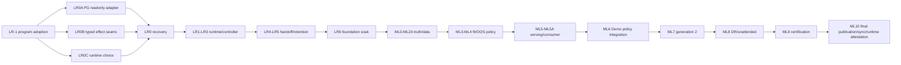

# AI/ML Long-Lived Repair And Landing Plan

**Plan ID**: `AIML-LONG-LIVED-LANDING-V2`
**Original date**: 2026-07-19
**Revised**: 2026-07-22
**Planning baseline**: `b486c0718d1c26820cdb6308cccf74c686547b22`
**Adopted source lineage**: reviewed head
`1a933fcc28e9f7341e023b5d401c479957c14c5f`, merged as
`fed223bebd278c50b0ab3330980e66441a30c9ed`; neither ref is runtime identity.
**Owner**: PM
**Execution mode**: bounded Sessions and Sprints, not an autonomous Codex loop
**Adoption state**: `PROGRAM_ADOPTED` (S0 closed; S1 ready; source adoption only)
**Adoption receipt**:
`docs/execution_plan/ai_ml_landing/receipts/S0.3-program-adoption-receipt-v1.json`
(`sha256:1a124bcaebb741a69c97e37a828e5b85c9b6499cdf053e8ef62451448878f93b`)
**Finalization evidence**: producer-signed
`S0.3-program-adoption-finalization-attestation-v1.json` and signed
`S0.3-trusted-execution-bundle-v1.json` in the same receipts directory; the
adopted source trust root verifies both SSHSIG sidecars.
**Evidence**:
`docs/CCAgentWorkSpace/PM/workspace/reports/2026-07-19--ai_ml_true_state_and_engineering_plan.md`
and
`docs/CCAgentWorkSpace/PM/workspace/reports/2026-07-20--ai_ml_completion_coverage_and_delivery_audit.md`
**Delivery protocol**: `docs/agents/ai-ml-landing-delivery-protocol.md`
**Durable progress ledger**: `docs/execution_plan/ai_ml_landing/PROGRESS.md`

## 1. Re-Audit Decision

Completing V1 LR0-LR6 and ML0-ML8 would **not** guarantee AI/ML engineering
landing. V1 correctly rejected source/tests/migrations as runtime proof, but it
still assumed missing effect capabilities and stopped too early at shadow
serving. At the 2026-07-20 re-audit, the following omissions were
non-bypassable:

1. the plan had not yet been adopted in canonical `main` (closed by S0.3 on
   2026-07-22; all remaining items continue through S1-S8);
2. direct `psql` is denied and no approved local-socket/read-only-identity
   adapter currently exists;
3. generic deploy apply is unconditionally disabled and does not model all AIML
   component effects;
4. OCI readiness was assumed without proving host/systemd/container/cgroup/
   network/PG-identity/rollback seams or selecting a fallback runtime;
5. Scanner nonblocking/drop behavior lacked qualification exclusion and durable
   gap evidence;
6. data qualification lacked a materialized point-in-time dataset rebuilt from
   the actual loaded rows, append-only label revisions and per-value Python/Rust
   parity;
7. trusted fit did not strictly exclude legacy/unqualified registry rows or bind
   a reproducible fit environment;
8. shadow serving did not require a real registry-authorized Rust/downstream
   consumer;
9. bounded Demo did not require causal decision-delta evidence in the actual
   policy path;
10. continuous learning did not prove a complete generation-2 loop;
11. backup/restore, RPO/RTO, dead-man freshness and a compatible-window landing
   manifest were incomplete;
12. final source sync was not explicitly separated from runtime identity proof.

V2 closes these gaps. It retains exactly two root TODO umbrellas: Block One
P0 foundation repair and Block Two P1 ML/AI landing.

Engineering can make the learning platform functional and governed. It cannot
guarantee that data will contain an eligible candidate, exploitable edge or
profit. An operational platform may conclude `NO_EDGE`, `COLLECT_MORE`,
`ROTATE` or `NO_ELIGIBLE_CANDIDATE` indefinitely. That is correct behavior, but
it does not by itself certify the candidate-specific trading landing defined
below.

## 2. Scope And State Model

Every receipt, state and completion claim uses three separate identities:

```text
platform_scope = (venue, instrument_class, strategy_family)
decision_cell = (symbol, side, horizon, regime)
evidence_environment = (mode, account_or_simulator, fee_schedule, execution_policy)
```

`landing_scope_id` binds one platform scope, one hash-bound `policy_surface_id`,
an explicit set of covered decision cells and the permitted promotion edges
between evidence environments. Shadow -> Demo is a reviewed promotion edge,
not a mutation of `mode` or a copied state. Uncovered cells are `OUT_OF_SCOPE`;
one candidate can never certify an entire strategy family.

Normative platform states:

```text
PROGRAM_ADOPTED
  -> EFFECT_SEAMS_READY
  -> FOUNDATION_READY
  -> LEARNING_PIPELINE_FUNCTIONAL
  -> AIML_PLATFORM_LANDED
```

If no decision cell qualifies, the lawful terminal is
`AIML_PLATFORM_LANDED_NO_ELIGIBLE_CANDIDATE`. It proves the autonomous platform
can collect, reject and continue learning; it is not trading landing. Only the
dedicated final S8.NC validator may issue it from
`aiml_platform_no_candidate_receipt_v1`; it cannot close the P1 trading row or
mark ML5-ML10 complete.

Candidate-specific trading states are:

```text
CANDIDATE_SHADOW_ELIGIBLE
  -> SHADOW_SERVING_READY
  -> DEMO_POLICY_INTEGRATED
  -> GENERATION_2_LOOP_PROVEN
  -> AIML_LANDING_CANDIDATE
  -> AIML_MODULE_LANDED_FOR_TRADING
```

Optional economic and activation states are separate:

- `DEMO_ECONOMICALLY_QUALIFIED`: preregistered bounded-Demo evidence supports a
  positive incremental after-cost qualification verdict. It is not live profit.
- `LIVE_ACTIVATION_READY` and `LIVE_ACTIVATION_ACTIVE`: separately governed
  authority states and not required for engineering landing.
- `LIVE_PROFIT_PROVEN`: may be claimed only from post-activation live fills,
  actual costs and a preregistered live evidence contract. Demo/shadow evidence
  can never prove it.

`AIML_LANDING_CANDIDATE` requires ML6 mechanical policy integration and ML7
generation-2 closure. Only ML10's final exact-head and runtime validator may
issue `AIML_MODULE_LANDED_FOR_TRADING`; ML9, shadow-only operation, a
no-eligible-candidate state or positive Demo mean cannot.

## 3. Starting Facts And Guarantee Boundary

The 2026-07-19 observation found `NOT_LANDED_RUNTIME_BROKEN`: engine/Scanner
stale, watchdog circuit broken, ALR restart storm, controller/workers absent,
legacy system-Python cron unable to import LightGBM and blocked, no current model
consumer, and 28 GB of unmanaged learning data. Source contains Scanner-to-PG,
V151-V160 and extensive ALR contracts/tests, but those are reusable inputs, not
running capability.

For a decision cell that produces an eligible candidate, V2 trading completion
guarantees only this engineering proposition: fresh Scanner evidence can durably
enter a loss-aware queue, become a PIT-qualified dataset, train and
adversarially evaluate a reproducible model, reach the real registry-authorized
Rust consumer, causally affect a bounded Demo policy decision under existing
risk authority, feed mature outcomes into a generation-2 evaluation, recover
from declared faults, and remain independently observable. If no cell qualifies,
only the platform/no-candidate state is available.

It does not guarantee positive Demo economics, live activation or live profit.

## 4. Architecture Decisions

1. Scanner remains the upstream opportunity sensor; no duplicate market-wide
   scheduler is introduced.
2. PG is the durable event/state backbone. `LISTEN/NOTIFY` is a wake hint; durable
   rows and reconciliation own recovery.
3. The controller is a persistent state machine, not cron, a Codex loop,
   `ScheduleWakeup`, `_latest`, or a head-specific wrapper.
4. Delivery is at-least-once with immutable effect keys, lease epochs, fencing,
   CAS finalization and reconciliation.
5. Ingestion compatibility is separate from fit/model compatibility. Raw
   compatible Scanner evidence must continue when a training lane is
   quarantined.
6. Self-learning means governed data/model/policy-state evolution, not source
   mutation or automatic authority expansion.
7. Exactly one durable learning runtime is selected by evidence. Exact-image OCI
   is preferred only if its seams pass; otherwise use a content-addressed
   fixed-path runtime. No permanent dual stack.
8. Workers, retention and serving use typed least-privilege identities. Host UID,
   PG role and ACL are authority boundaries; a container username is not.
9. Retention is provenance-driven, tombstone-first and restore-capable. Raw,
   disputed, label-source, fill/cost and accepted-model lineage is protected.
10. Receipts are claims until an independent evidence class observes the
    matching process, data or effect.
11. Intermediate source synchronization is allowed only when the next Sprint
    needs Linux runtime evidence. Final global source synchronization remains a
    separate Sprint 8 action and is never deploy proof.

## 5. Block One: Long-Lived Foundation Repair

### LR-1 - Program Adoption

Adoption is a three-Session gate, not one document merge:

1. S0.1 publishes this V2 plan, TODO v838, delivery protocol, ledger and audit
   through an exact-head reviewed PR. It first integrates current
   `origin/main` without rewriting published history, preserves the IBKR TODO
   delta and revalidates this plan, then emits only
   `planning_documents_published_v1`.
2. S0.2 updates or supersedes ADR-0049 and any required AMD. It defines
   advisory-only serving authority, autonomous retraining boundaries,
   fail-closed rollback and permanent denial of direct model-to-broker
   authority, then emits `serving_authority_receipt_v1`.
3. S0.3 lands the scope/session/effect governance schemas, external GitHub
   repository-policy attestation and authority bindings. Only S0.3 may emit
   `program_adoption_receipt_v1`, binding all accepted document, ADR/AMD,
   schema, reviewed-head and merge-head hashes.

Before S0.3 passes, no Session may claim `PROGRAM_ADOPTED`; ML5/ML6 source,
schema, runtime and effect implementation are all forbidden. Earlier independent
data-contract exploration remains non-authoritative planning only.

### LR0A - PG Read-Only Identity Adapter

Implement a governance Adapter that:

- connects through an allowlisted local Unix socket or explicitly authenticated
  loopback identity;
- scrubs `psqlrc`, service files, shell startup and all ambient `PG*` routing;
- selects a dedicated read-only PG role and allowlists exact `SELECT`/catalog
  queries; no generic SQL text or write-capable role is accepted;
- binds caller, platform, socket/endpoint, database, query ID, source/schema
  hashes, result digest, observation time and TTL;
- redacts secrets and proves negative write/role-escalation/search-path cases.

Direct `psql` remains denied. Exit is an independently reproducible
`pg_readonly_identity_receipt_v1`; absence blocks all PG/runtime claims.

Production observation has a deliberate bootstrap gate. After LR0B is
governance-executable, S2.0 uses one minimal typed external-admin effect only to
create the dedicated observer role/auth mapping/ACL. An independent postcheck
must prove denied write, `SET ROLE`, search-path and credential-escalation cases
before LR0A may query production PG. The observer bootstrap cannot apply an AIML
migration or create a writer.

### LR0B - Typed AIML Effect And Deploy Seams

Do not merely enable a generic deploy helper. Define a typed ownership and
allowlist matrix for each component effect:

| Effect class | Required exact intent and recovery |
|---|---|
| Credential rotation | secret slot/role target, old/new non-secret fingerprints, rotation order, old-credential rejection, rollback or forward-only recovery |
| PG role/ACL/migration | exact migration/checksum and role/ACL delta, pre-state, transactional/double-apply behavior, rollback or approved forward recovery |
| Engine/Scanner | exact binary/unit/env/config, bounded stop/start order, readiness/dead-man checks, prior bundle rollback |
| Learning runtime | selected runtime identity, dependency manifest, mounts/network/socket/secret surface, exact rollback |
| Controller/workers | unit/slice/cgroup/UID/PG-role set, queue fencing state, start order, drain/rollback |
| Retention apply | exact tombstone/object set, deleter identity, restore capacity, interruption recovery and postcheck |
| Terminal receipt append | **staged (Amendment A1)**: `S1.2A` external-**capable** source Adapter (S3-compatible Object-Lock contract: destination/retention identity, checksum, version-id, idempotency key, independent-readback contract; fail-closed with no credential channel) vs `S8.6` external binding/**effect** (the real append + independent readback ACK). Terminal state still requires the real external append + independent readback ACK — the split does not downgrade it. |

Each effect requires OPS preflight, PM/operator-approved exact intent, typed
Adapter execution, a stable observation-window contract and an independent OPS
postcheck. The actor that applies an effect cannot be its sole verifier. A
generic engine-only script cannot satisfy another component class.

LR0B also owns explicit identity/ACL provisioning with LR2: host UIDs, PG roles,
`pg_hba`/`pg_ident` or authenticated loopback, socket directory ACLs, secret
lifecycle, negative ACL tests and exact rollback. The current generic deploy
apply remains disabled until these per-class contracts are implemented and
verified.

The Adapter must also become a first-class governance interface. Registry,
effect vocabulary, route compiler, typed intent/result/preflight/postcheck
schemas, closure validator and generated views must recognize every admitted
component class. Work-package classification derives required effect fields;
the Session cannot self-declare an effectful row as source-only. Bypass-negative
tests plus disposable apply, rollback and independent postcheck acceptance are
required before `EFFECT_SEAMS_READY`.

### LR0C - Runtime Choice Proof

First run a bounded offline/disposable spike for both candidate approaches.
After the LR0B remote/platform seam exists, use a typed
`TARGET_HOST_DISPOSABLE_RUNTIME_PROBE` effect in an isolated unit/container for
each candidate. Exercise start/stop, cgroup/resource isolation, network denial,
PG identity, native-library loading, immutable dependency closure, artifact
persistence, failure recovery, rollback and complete cleanup with an independent
postcheck. Only then select exactly one:

- exact-image-ID OCI, only if all seams pass; or
- content-addressed fixed-path runtime, if OCI cannot satisfy them.

Record separate offline candidate, target-host probe and final
`learning_runtime_choice_receipt_v1` artifacts and remove the unselected
production path. No mutable tag/alias, relocatable renamed venv, system-Python
fallback or dual production stack is allowed. Runtime choice is not a running
attestation: LR2 seals the build, LR0 installs it, and LR6 independently attests
the running process.

### LR0 - Quiesce And Recover Current Runtime

Fixed order:

1. capture process/cgroup/unit/env hashes, restart counters, watchdog/circuit,
   engine failure, disk use and redacted credential exposure;
2. fence ALR and legacy cron, terminate only confirmed stuck work, and prove one
   owner per job class;
3. offline-stage bounded restart, dependency preflight, singleton,
   `RuntimeMaxSec`, cgroup and DLQ controls;
4. use LR0A to re-attest V151-V160, schema/function/ACL/roles and runtime facts;
5. use LR0B to rotate the exposed credential, prove old-value rejection and
   install the selected LR0C runtime plus exact rollback bundle;
6. start engine/Scanner, ingestion, controller and workers one at a time, with
   an independent postcheck after each;
7. reset watchdog breaker last.

Missing/expired PG receipt, ambiguous ownership, credential leakage, absent
rollback, unbounded restart or verify/use identity drift stops the sequence.

### LR1 - Scoped Compatibility Identity

Replace whole-repo-head liveness with a `learning_runtime_digest` over learning
code, V151-V160 fingerprints, feature/label/action-policy contracts, locked
dependencies and runtime config. Whole source head stays deploy telemetry.
Docs-only changes cannot stop ingestion; incompatible training contracts
quarantine fit/promotion while compatible Scanner capture continues. Preflight,
spawn and finalize must bind the same immutable manifest.

### LR2 - Immutable Runtime And Least Privilege

Build the selected LR0C runtime from sealed inputs without network, verify
Python isolated mode, LightGBM/sklearn/ONNX/native-library origins and lock
closure, and forbid `/usr/bin/python3` fallback. Host systemd owns lifecycle;
controller/workers receive neither OCI socket nor DBus authority. Complete the
LR0B identity matrix: separate host UIDs and PG roles, local auth mapping/socket
ACL or authenticated loopback, protected secret loading, negative ACL tests and
rollback. LR2 emits sealed-build and expected-identity receipts only; it does not
attest a running unit, invocation/PID/cgroup, mount, network or PG identity.
Those observations belong exclusively to S2.5/LR6 after S2.4 installation.

### LR3 - Persistent Controller, Queue And Workers

Implement a host-owned controller and fixed bounded worker pools. PG jobs bind
immutable job/effect key, attempt, lease epoch, fencing token, owner heartbeat,
finalize CAS, retry budget, timeout and DLQ. Reconcile durable rows even without
`NOTIFY`. The durable state machine explicitly spans target -> dataset -> fit ->
evaluate -> export -> serve -> retention, and each transition proves replay,
double-apply, concurrent-claim and stale-attempt behavior. Separate controller,
fit/evaluation, serving and deleter identities; prove denied actions. Expose
liveness, readiness, progress and dead-man timestamps. Stale progress cannot
report ready. Crash/split-brain/late worker/duplicate wake tests must converge to
one logical effect.

### LR4 - Loss-Aware Scanner Handoff

Use `trading.scanner_snapshots` and `pg_notify` as the sole handoff. Every cycle
has a monotonic sequence. Persist source event/entry IDs before candidate
derivation. Before filtering, persist every eligible decision cell/event with
its PIT inputs, rejection reason, chosen flag, policy/RNG version and assignment
probability. A deterministic 0/1 policy with no overlap must restrict the
estimand; it cannot claim propensity correction. Scanner production remains
nonblocking, but every dropped, coalesced, missing or out-of-order interval emits
a durable gap receipt with first/last sequence, cause and recovery state. Define
a drop/gap SLO; incomplete intervals are automatically excluded from
qualification and economic cohorts. Recovery reconciles from PG and emits
`SELECT_TARGET`, `COLLECT_MORE`, `ROTATE` or `NO_ELIGIBLE` with input hashes. Ten
natural cycles must show bounded lag, backlog, full-universe and gap accounting.

### LR5 - Physical Retention And Backpressure

Inventory the learning lane by owner/kind/size/hash/provenance/dispute/
rebuildability. Only `ALR_OWNED_REBUILDABLE`, unreferenced, unleased, unpinned
and undisputed objects may advance through `CLAIMED -> QUARANTINED ->
DELETE_INTENT_DURABLE -> DELETED`. Bind root-relative path, device/inode/hash;
reject symlink/hardlink/path-swap/cross-device races; reserve and fsync receipts
before unlink. A separate deleter emits per-object restore/delete receipts.
Backpressure uses explicit disk high/low watermarks and per-job quotas.

### LR6 - Recovery, Observability And 72-Hour Soak

Inject source drift, PG disconnect, missed/duplicate notify, controller/worker
crash, split brain, late completion, disk full, ENOSPC, DB failure, retention
interruption, reboot, stale health, counter reset and rollback. Observability and
dead-man SLOs for engine, Scanner sequence, ingestion watermark, controller,
workers, queue age, disk, PG and model consumer are machine gates, not prose.

The observer is a resident unit under a distinct UID and read-only PG identity;
it is independent from the controller it watches. Persist telemetry and counter
epochs outside the worker lifecycle, test an external alert sink, and enforce an
observer dead-man. A controller, worker or observer cannot certify its own
health after losing its evidence path.

`FOUNDATION_READY` requires exact runtime identities, one real loss-aware
Scanner path, exercised rollback, healthy physical retention, 72 continuous
hours and two maintenance cycles with zero unplanned restart/duplicate owner/
hang/OOM/circuit trip and all declared lag/resource/dead-man bounds passing.

## 6. Block Two: ML/AI Through Landing

Block Two runtime claims start only after scope-compatible `FOUNDATION_READY`.
Independent source work may begin earlier but remains `SOURCE_ONLY`.

### ML0 - Scope And Cohort Truth

Re-attest schema/ACL/row shape through LR0A. Freeze `platform_scope`,
`policy_surface_id`, the explicit decision-cell coverage set, evidence
environments/promotion edges, post-repair cohort epoch, source coverage and all
Scanner gap exclusions. Report fresh source events, decisions, labels, fits,
registry, consumer and outcomes as `CONFIRMED`, `ABSENT`, `STALE` or
`UNVERIFIED`. Pre-outage/outage/post-repair cohorts cannot be pooled and one cell
cannot be generalized to an uncovered policy surface.

### ML1 - Autonomous Target Portfolio

Rank `(strategy, symbol, side, horizon, regime)` cells using expected net edge,
uncertainty/value of information, independent-sample deficit, regime/drift,
execution feasibility, redundancy and compute/storage/Demo-risk budgets. Record
the full candidate universe, selected and rejected reasons, selection
propensity/probability, exploration budget, cooldown and starvation controls so
Scanner selection bias can be reconstructed and corrected. Durable decisions
are `SELECT`, `COLLECT_MORE`, `ROTATE` or `REJECT`; no eligible target never
forces fit.

### ML2 - Labels, Proof And Reward

Bind candidate-matched event/evidence IDs, distinct entry identity, feature
cutoff, horizon, PIT universe, regime and cost source. Separate counterfactual,
shadow, Demo fill and cleanup/unattributed evidence. Net reward includes actual
fees/funding/slippage and declared opportunity cost where observable.
`NO_MATCHED_FILLS` is a blocker, never a positive label. Every cohort reports
`n_raw`, `n_unique`, `n_eff`, days and concentration; disputed evidence remains
held.

### ML2A - Materialized PIT Dataset, Label Revision And Replay

The training dataset must be materialized from the **actual rows loaded by the
fit worker**. Scanner candidate JSON is selection metadata, not a feature
snapshot. Persist an immutable PIT feature vector for every selected event.
Freeze query text/ID, fixed lower/upper bounds and watermark, ordered row IDs,
source snapshots, dataset hash and final matrix hash. Recompute all identities
immediately before fit; mismatch invalidates admission.

Labels are append-only state transitions: `PENDING -> MATURE -> AMENDED` or
`VOID`. Late fills, partial fills, cancels, funding and cost corrections create
new revisions; they never overwrite history. Every revision is bitemporal and
binds `outcome_time`, `first_observed_at`, `revision_recorded_at`, revision ID
and maturity-policy hash. Fit may consume only revisions with
`revision_recorded_at <= fit_cutoff`; dataset and matrix hashes include the exact
revision IDs. Deterministic backfill/replay must reproduce row order, values and
hashes. Golden vectors compare every feature value, missingness, event-time
cutoff, clock skew and stale behavior across Python and the real Rust consumer.
Data quality SLOs cover source completeness, watermark lag, late-label rate,
clock skew and parity.

### ML3 - Qualified-Only Reproducible Fit

Legacy registry rows are serving-ineligible. Fit admission requires the complete
V157-V160/PIT/fit trio, current scope/cohort and all ML2A hashes. Bind runtime,
dependencies, model/export library versions, CPU/architecture, seeds, threads,
determinism settings and resource limits. The trusted-fit host chain also binds
runner and attestor identities, host/PG ACLs, credential rotation/revocation,
trusted time and platform attestation, with negative impersonation, stale-time,
revoked-credential and privilege tests. A clean rerun from the same sealed
inputs must meet preregistered artifact/prediction equivalence. Fit writes a
content-addressed artifact, fsyncs and re-hashes it, then atomically commits the
qualified registry row. Crash/ENOSPC/DB/replay/corruption cases converge or fail
closed.

### ML4 - Adversarial OOS And Frozen Action Policy

Before evaluation, freeze a hash-bound action-policy contract covering
prediction-to-`allow`/`veto`/size mapping, thresholds, horizon, regime, complete
costs, baseline, fallback, gate precedence and authority lattice. The default
model authority is advisory veto/size-down only. Any replacement of an alpha
gate requires the accepted serving-authority ADR/AMD; Decision Lease, Guardian,
RiskConfig and Cost Gate are never bypassable. Golden vectors record baseline
action, model action, final action and every gate reason. OOS, shadow and Demo
must consume identical semantics or pass golden parity.

Use nested purged/embargoed walk-forward or CPCV, one untouched final holdout,
full trial accounting, multiplicity/selection-bias control, power-based
sequential sampling, dependence-aware one-sided bounds, current/stressed costs,
calibration, drawdown/tail/turnover/concentration and expiry/requalification. A
cross-Session/generation trial ledger records every revealed holdout. Generation
2 uses a new forward window or a preregistered sequential alpha/e-process; an
already revealed holdout cannot issue new eligibility. Output `REJECT`,
`COLLECT_MORE` or `CANDIDATE_SHADOW_ELIGIBLE`. Positive mean PnL alone is never
sufficient.

### ML5 - Registry And Shadow Serving

Register only ML3/ML4-qualified models with immutable model/data/feature/action-
policy/runtime lineage. Shadow serving validates the committed artifact and
registry authorization before load, emits typed prediction/uncertainty/model ID
and fallback, and compares baseline/challenger on the same event. No serving
component mints risk, lease, Cost Gate or order authority. Retire or permanently
fail-close legacy writers and consumers: cron trainers, `_latest`, path-only or
hash-null models and DB-only promotion. Exactly one qualified registry writer/
consumer path is admitted.

### ML5A - Real Registry-Authorized Consumer

For the current Rust engine scope, the only qualifying production consumer is
`IntentProcessor + EdgePredictorStore`; Python/report consumers cannot close the
gate. Implement registry-authorized atomic loading with the selected ONNX/ORT
runtime, and load only the committed hash-bound model/feature/action-policy
trio. Atomic canary generation changes bind exact process, artifact and registry
identity. Enforce deadline, stale/missing/corrupt fallback, resource and latency
budgets, per-value feature parity, restart recovery and exact rollback to the
previous committed generation. Independent observation must prove the running
consumer loaded the intended generation. Registry activation is two-phase: a DB
promotion cannot become active before a matching consumer ACK is committed; a
failed/missing ACK preserves the previous generation.

### ML6 - Bounded Demo Policy Integration And Causal Evidence

Prediction must enter the actual policy decision path and produce an attributable
decision delta or veto. Bind the unchanged action-policy semantics to Decision
Lease, Guardian, Cost Gate, GUI/Rust risk lineage and exact order intent. Any
Bybit exchange-facing effect requires a separate current-window PM -> E3 -> BB
authorization; no plan receipt supplies order authority.

Two receipts are deliberately separate:

- required `demo_policy_mechanical_integration_receipt_v1` proves that the model
  caused a reconstructable `allow`/`veto`/size-down delta in the normal Demo
  policy/OMS path without bypassing a risk gate;
- optional `demo_economic_causal_receipt_v1` estimates incremental economics.
  It requires a preregistered randomized/switchback design or an approved
  estimator with overlap and sensitivity proof, plus estimand, MDE/power,
  stopping rule and carryover washout.

Both preserve the full eligible universe, treatment assignment probability,
suppressed actions, baseline/model/final actions, same-event BBO, order intent
and complete lifecycle: reject, partial fill, cancel, forced close, fees,
funding and slippage. Shared capital creates interference, so portfolio/time
block is the default assignment unit; capital, allocator, netting, risk budget
and execution policy are fixed. If identification or power fails, emit
`PORTFOLIO_UTILITY_NOT_IDENTIFIED`, not selected-fill PnL. Insufficient or
adverse evidence returns `COLLECT_MORE`, `ROTATE` or `NO_EDGE`; it never lowers
Cost Gate or grants live authority.

`DEMO_POLICY_INTEGRATED` means the required mechanical receipt passed. Optional
`DEMO_ECONOMICALLY_QUALIFIED` requires the economic receipt and is not required
for engineering integration.

### ML7 - Generation-2 Learning And ModelOps

Prove one natural, controller-triggered second-generation attempt with nonzero
new workload and no human enqueue:

```text
prediction -> outcome -> post-Gen1 mature/amended label -> retrain/evaluate
  -> NEW_CHALLENGER | NO_CHANGE | REJECT_NO_PROMOTION
```

Bind generation-1 and generation-2 dataset/model/action-policy/runtime identities
and explain the changed evidence. `NO_CHANGE` and `REJECT_NO_PROMOTION` are valid
closed-loop outcomes; they must not induce promotion. Only a new challenger that
passes ML4 may request consumer activation, and any activation that changes the
bounded-Demo policy requires a fresh PM -> E3 -> BB runtime gate. Define a
machine-enforced ModelOps SLO/action matrix for feature skew, drift,
calibration, label delay/revision, cost-model error, latency, resource pressure
and outcome deterioration. Each threshold maps to alert, fail-close fallback,
`COLLECT_MORE`, requalification, rollback or retirement. Silent stale-ready
state is forbidden.

### ML8 - Retention, DR And Seven Unattended Days

Back up and restore PG queue/state, qualified datasets/artifacts, registry,
runtime/unit/config/ACL/migration manifests and all gate/effect/authority
receipts. Define non-bypassable RPO/RTO per class. Use an immutable encrypted
off-host failure domain, prove key recovery/rotation, and restore onto a clean
target. Corrupt, partial and missing-backup tests fail closed; a successful drill
re-hashes objects, reconstructs lineage and starts without consuming production
authority. Missing or incompatible receipts remain blocked. Then run seven
consecutive unattended days with the independent observer and external alert
sink active, nonzero natural workload, no manual repair wrapper, stuck job,
duplicate fit, stale-ready state, protected-data deletion or dead-man breach.

### ML9 - Landing Candidate Certification

Independently observe one real chain:

```text
Scanner -> durable loss-aware event -> PIT features -> qualified fit
  -> registry -> real consumer -> bounded Demo policy decision
  -> matched outcome -> mature label -> generation-2 retrain/evaluate
  -> {new consumer ACK | NO_CHANGE/REJECT_NO_PROMOTION + Gen1 continuity}
  -> rollback/requalification
```

The `aiml_landing_manifest_v1` binds `landing_scope_id`, policy surface, explicit
covered cells, promotion edges, candidate, cohort, row/revision IDs, dataset/
matrix, model, feature contract, action policy, runtime, cost, risk, authority
and every ML6/ML7 receipt. It validates a causal directed time graph, not an
impossible same-window TTL intersection:

- authority must have been valid at the exact effect time;
- consumed immutable effect receipts remain valid through their hash and
  `consumed_at` lineage;
- dataset/model lineage is immutable rather than wall-clock expiring;
- runtime, consumer, observer and dead-man receipts must be fresh at final
  terminal validation.

An independent verifier rejects mixed scope, uncovered cells, invalid promotion
edges, non-monotonic time, stale current runtime or broken causality. It also
proves the legacy writer/consumer denylist remains fail-closed and the sole
qualified registry path uses consumer-acknowledged activation.

ML9 emits only `AIML_LANDING_CANDIDATE`. It may coexist with
`DEMO_ECONOMICALLY_QUALIFIED=false`; it is not the terminal landing state.

### ML10 - Publication, Closure And Final Synchronization

Freeze all source-side code, TODO, ledger projection and closure metadata before
the final audit. Run review/required CI on that exact frozen head, then publish it
through one PM-owned exact-head PR lane. After merge is verified:

1. clean dedicated Mac `main` fetches and ff-only merges exact `origin/main`;
2. clean Linux `main` read-only preflight proves ff-only admissibility, then
   fetches and ff-only merges the same exact head;
3. run the four-head reconciliation probe;
4. separately attest selected runtime, engine, Scanner, controller, workers,
   observer, retention/deleter, watchdog, queue/watermark, units/env/cgroups,
   host UIDs/PG roles/ACLs, migrations, dead-man and DR freshness in
   `aiml_final_runtime_attestation_v1`. The `TRADING` profile additionally
   requires registry ACK and loaded model/artifact; the `NO_CANDIDATE` profile
   instead proves no active model, promotion, consumer or order authority;
5. run exactly one branch-specific terminal validator:
   - `TRADING` binds the final source head, `learning_runtime_digest`, ML9
     manifest and fresh `TRADING` runtime attestation;
   - `NO_CANDIDATE` binds the final source head, `learning_runtime_digest`,
     `aiml_platform_no_candidate_candidate_v1` and fresh `NO_CANDIDATE`
     runtime attestation, and rejects any active model, promotion, consumer or
     order authority. It does not require or accept an ML9 trading manifest.

No force, reset, stash or clean is permitted. Dirty/diverged/head-drift state is
a stop, never an automatic repair. `ALL_FOUR_SYNC` proves source/build
reconciliation only; runtime closure needs the distinct identity proof above.
S0.3 defines and S1.2 implements `terminal_receipt_sink_v1`: an external
immutable/WORM destination with typed append intent, dedicated actor, hash
receipt and independent readback ACK. Only the candidate terminal validator may issue
`AIML_MODULE_LANDED_FOR_TRADING`; the separate no-candidate validator may issue
only `AIML_PLATFORM_LANDED_NO_ELIGIBLE_CANDIDATE`. Their immutable Report
Sink/runtime receipts are authoritative, but no state is issued until the WORM
append and independent readback ACK pass. `PROGRESS.md` is a repo projection. No
repository write is allowed after final reconciliation and terminal validation.
Any later repo mutation invalidates final-head closure and requires another
exact-head reconciliation.

## 7. Dependency Graph



Session and multi-agent sequencing is normative in
`docs/agents/ai-ml-landing-delivery-protocol.md`; current work-package state is
normative in `docs/execution_plan/ai_ml_landing/PROGRESS.md`.

## 8. Machine Evidence Contracts

Planned schemas/validators live under
`program_code/ml_training/schemas/aiml_gate_receipts/` and
`program_code/ml_training/aiml_gate_receipt_validator.py`. Runtime artifacts use
exact immutable paths under
`$OPENCLAW_DATA_DIR/learning/gate_receipts/<landing_scope_id>/<cohort_epoch>/<run_id>/`.
No gate consumes `_latest`.

Every receipt declares exactly one validity class:

- `CURRENT_STATE_TTL`: must be fresh when consumed; expiry invalidates the
  receipt and recursively demotes dependents.
- `EFFECT_TIME_AUTHORITY`: must be valid at the exact effect time. Natural
  expiry after legal consumption does not invalidate the resulting effect.
- `IMMUTABLE_CONSUMED_EFFECT`: remains valid through hash/`consumed_at` lineage
  unless a retroactive compromise/revocation explicitly invalidates it.
- `IMMUTABLE_LINEAGE`: content-addressed dataset/model/policy lineage has no
  wall-clock expiry, but hash or causality failure invalidates it.

Recursive demotion follows actual class-specific invalidity, not the mere fact
that an effect-time authority later reached its planned expiry.

| Gate | Minimum receipt |
|---|---|
| LR-1 | S0.1 `planning_documents_published_v1`, S0.2 `serving_authority_receipt_v1`, S0.3 `program_adoption_receipt_v1` |
| LR0A | `pg_readonly_identity_receipt_v1` |
| LR0B | governance-executable typed per-component effect receipt + independent postcheck |
| S2.0 | production observer bootstrap effect + negative ACL postcheck |
| LR0C/LR2 | offline candidate + host-probe `learning_runtime_choice_receipt_v1`; sealed build receipt |
| LR0/LR6 | `runtime_recovery_receipt_v1` + `foundation_ready_receipt_v1` |
| LR1-LR4 | compatibility, queue recovery and loss-aware Scanner handoff receipts |
| LR5 | retention apply plus per-object restore/delete receipts |
| ML0-ML2A | scope/cohort, candidate universe/propensity, label revision and PIT dataset/matrix receipts |
| ML3-ML4 | reproducible fit, OOS and action-policy receipts |
| ML5/ML5A | registry and independent real-consumer receipts |
| ML6 | required `demo_policy_mechanical_integration_receipt_v1`; optional `demo_economic_causal_receipt_v1` |
| ML7 | natural controller-triggered generation-2 evaluation plus ModelOps action receipts |
| ML8 | backup/restore RPO/RTO and seven-day operation receipts |
| S7.NC | `aiml_platform_no_candidate_candidate_v1`, platform branch candidate only |
| S8.NC | `aiml_platform_no_candidate_receipt_v1`, final platform-only terminal |
| ML9 | causal-time `aiml_landing_manifest_v1` emitting `AIML_LANDING_CANDIDATE` |
| ML10 | exact-head publication/four-head plus profile-specific `aiml_final_runtime_attestation_v1` and terminal receipt |

Validators fail closed on missing fields, invalid validity class, stale current
runtime TTL, authority invalid at effect time, mixed scope/cell/environment,
counter reset, unknown fault, broken causal-time/hash edge, identity drift or
ambiguous actor/verifier independence.

## 9. Delivery And CI

One Session owns one coherent work package, isolated branch/worktree, exact file
manifest, one PR/publication lane and one closure. Authoritative attempts and
closures are immutable `session_attempt_v1`/`closure_packet_v1` records;
`PROGRESS.md` is a repo-resident projection and resume index. Builders are
followed by E2, then E4; QC/MIT/AI-E own ML semantics, CC/E3 own
security/authority, OPS owns preflight and a distinct independent postcheck, BB
reviews only Bybit Demo, QA verifies acceptance, and PM signs without erasing
dissent. Maximum two writers may work in parallel only on disjoint paths;
metadata writers are serial and every post-effect closure has an explicit
publication or immutable Report Sink step.

Hosted CI runs only on a stable final head for Rust, migration/ACL, selected
runtime/build, protected workflow or serving-boundary changes. Docs and narrow
Python changes are local-first. A repeated identical failure twice forces
rescope; it is not retried unchanged.

Intermediate exact-head source sync is permitted only before a Sprint that
requires Linux evidence. It is recorded as an integration checkpoint, not final
sync, deploy or runtime proof. Sprint 8 performs the final global synchronization.

## 10. Effort Estimate

| Segment | Engineering estimate | Evidence wait |
|---|---:|---:|
| Sprint 0 adoption and Sprint 1 effect seams | 6-11 days | external/admin access if required |
| Sprints 2-3 foundation/runtime | 10-18 days | 72-hour soak and two cycles |
| Sprints 4-5 data/fit/OOS | 10-19 days | independent samples are data-dependent |
| Sprint 6 consumer/Demo integration | 8-15 days | authorized Demo windows/data-dependent |
| Sprint 7 generation-2/DR/unattended | 6-12 days | seven unattended days |
| Sprint 8 audit/publication/sync | 3-5 days | effect-window availability |

Critical engineering estimate: **43-80 engineering days**, plus the explicit
72-hour and seven-day gates and sample-dependent Demo/economic evidence. Parallel
source Sessions can reduce calendar time but cannot shorten evidence windows.

## 11. Non-Goals

- no LLM or RL agent receives direct broker authority;
- no official exchange MCP is proof, model runtime or order authority;
- no global Cost Gate/risk weakening;
- no source/test/CI/schema/report artifact substitutes for runtime or outcome;
- no deletion of raw, disputed or irreproducible evidence;
- no promise of Demo economics, live activation or live profit;
- no open-ended Codex loop, cron controller or head-repin repair wrapper.

## 12. Adversarial Review History And V2 Closure

The 2026-07-19 V1 draft received four substantive initial `REJECT` verdicts and
was corrected for PG sequencing, runtime identity, at-least-once convergence,
host/PG isolation, crash-safe fit, safe retention, dependence-aware economic
evidence and review order. Correction reviews returned
`ACCEPT_AFTER_REWORK`. That history remains valid for the defects it covered.

The first 2026-07-20 completion re-audit found additional P0/P1 coverage gaps rather
than treating V1 acceptance as permanent proof. V2 adds program adoption,
LR0A/LR0B/LR0C, loss-aware Scanner gaps, materialized PIT/label revisions,
qualified-only reproducible fit, a real registry-authorized consumer, frozen
action-policy parity, causal bounded-Demo integration, generation-2 closure,
ModelOps SLOs, RPO/RTO restore, causal-time certification and separate
final runtime attestation.

The post-draft cold review then rejected four remaining structural classes:
premature ADR/program/landing issuance, coarse scope and impossible same-window
TTL, governance adapters that were not yet routable/executable, and a final
closure write that would drift the just-synchronized head. Quant review also
required pre-filter universe persistence, bitemporal labels, gate precedence,
cross-generation holdout accounting, separate mechanical/economic Demo receipts
and no-promotion generation-2 outcomes. This revision incorporates those items,
adds PG observer bootstrap, target-host runtime-choice ordering, independent
observer/off-host DR, immutable Session closure authority and a final no-write
terminal validation.

Targeted correction verification then returned `ACCEPT` from all four final
lenses: architecture/authority, operations/runtime, quant/statistics and
failure/delivery. This accepts V2 as a complete conditional engineering plan;
it does not assert that any Session has executed or that an eligible/profitable
candidate exists.

At final document review, PM disposition was planning-only:
`ACCEPT_V2_FOR_PROGRAM_ADOPTION`. Canonical adoption subsequently completed on
2026-07-22 through the S0.3 trusted-host receipt. That receipt still does not
pre-approve a PG query, deploy, restart, credential rotation, retention apply,
broker contact or order; those remain separately governed S1-S8 effects.

## Amendment A1 (2026-07-23) — Sprint-1 Formal Governance Closure

Accepted decisions closing S1's `EFFECT_SEAMS_READY` governance wiring (the delivery protocol requires "governance Registry/router/schema/closure wiring, bypass-negative tests and disposable apply/rollback/postcheck, not contract prose alone"). Design + CC/E2 architecture verification: `docs/execution_plan/ai_ml_landing/design/S1-formal-closure-wave-a.md` (§13 authoritative).

1. **Target-host probe becomes a closure-admissible effect seam** (was self-validating/disjoint). Added: a `target_host_probe` `side_effect_class` (forward-only surface rule; risk∈{high,critical}); a `route_task` branch `ops_preflight → pm_target_host_approval → target_host_disposable_runtime_probe_adapter_v1 (effect node) → ops_postcheck` (applier ≠ verifier); the Registry adapter `target_host_disposable_runtime_probe_adapter_v1`; a typed `target_host_disposable_runtime_probe_intent_v1` (probe authorization derives from the admitted intent, NOT a user-set `AIML_TARGET_HOST_PROBE=1`; capture-command env-strip unchanged); a dedicated `target_host_effect_result_v1` (mirrors the P0-B dedicated-result pattern, adapter_id const = the route-node id) carrying/binding the typed `learning_runtime_choice_receipt_target_host_v1`. The choice receipt is now registered in `aiml_gate_receipt_validator.SCHEMA_FILES`; the central offline gate validates STRUCTURE only (`require_target_host_attested=False`, per CLAUDE.md "the standalone CLI cannot authenticate PASS") while the STRICT attested gate lives in the effect/closure lane (`require_target_host_attested=True`, a mandatory bypass-negative). The sealed receipt's `probe_scope.adapter_id` const stays `learning_runtime_deploy_adapter_v1` (the exercised S1.5 deploy adapter) — a distinct notion from the new DAG effect-node adapter.

2. **Additive `aiml_landing_session_attempt_v1`** for S1+ durable attempts (session/attempt/DAG/admission/owned-paths/effect-class/source-head/authority/status + explicit `closure_binding`). It has its OWN sibling validator and rejects `session_id` beginning `"S0."`. The frozen S0.3 `session_attempt_v1.schema.json` and its S0.3-hardcoded validator are untouched.

3. **SSHSIG signed evidence** reuses `agent_governance_aiml_trusted_host._verify_ssh_signature` (no new crypto); a new S1 target-host evidence kind + a parameterized S1 signer profile provide cryptographic domain separation from S0.3 (the S0.3 signer consts/fingerprint and bundle path are byte-identical). The real S1 signer public-key/fingerprint is an **operator-gated** input; the actual trusted-host signing is an out-of-band operator step (like S0.3's `aiml-trusted-finalize`).

4. **WORM staging** split into `S1.2A` (external-capable source Adapter, this sprint) vs `S8.6` (external binding/effect). The S8.6 terminal rule (successful external append + independent readback ACK, stored outside the repo, no post-write) is unchanged; the split only stops S1.2 from implying the external destination is already bound.

5. **Frozen-surface guarantee**: `aiml_effect_classifier_digest()` stays `sha256:1cf8c021b066ceeb364e968add074d263cb28d63db421fdc40620e9904d0ddbc`; `PROGRAM_SCHEMA_PATHS`, `S0_DEPENDENCY_DIGESTS`, the S0.3 sealed schemas/consts, and the nine authority grants (all false) are untouched. `source_adoption_only` holds; no production/runtime/broker/order/live authority is created.

6. **Terminal state**: source-side is landable now; a fully-attested PASS is gated on two operator inputs — the S1 target-host SSHSIG signer key (§3) and the external S3 Object-Lock WORM config (§4). Absent those, the honest terminal is `S1_ENGINEERING_CLOSED_EXTERNAL_WORM_BINDING_PENDING`, never a claim of terminal WORM completion.

### §7 — Post-merge findings closed (2026-07-23; supersedes §3 signing choice and §6 terminal state)

PR #114 (Wave A-C source landing, merge `7d78765a2`) merged before Codex review completed and surfaced two P1 + one P2. All three are fixed on branch `agent/aiml-s1-closure-p1p2-fixes` (source commit `af2491300`); source-only, nine authorities false, no runtime/broker/order. Frozen-surface guarantee (§5) holds — `aiml_effect_classifier_digest()` byte-unchanged.

- **P1 — OPS postcheck evidence binding**: `validate_target_host_effect_binding` previously accepted any runtime evidence labeled `source==ops_postcheck` (empty `evidence_refs` passed). It now requires the distinct-verifier UPGRADED effect result (new structured `verifier_capture_digest`, non-null — an applier self-run cannot close), an ops_postcheck bound to the verifier's own governed `command_capture_v2` (structural + self-digest integrity; distinct role/node/process/capture from the applier), a fully-clean residue observation (nonzero fails closed), `source_head`/`host`/`observed_at` bound to the receipt, a three-way digest cross-check, and acceptance binding all three evidence ids. `target_host_effect_result_v1` gains `verifier_capture_digest` (schema + builder + validator, cross-checked with the durable seam-note binding).
- **P1 — process-global authorization removed**: the applier no longer sets `AIML_TARGET_HOST_PROBE` on the parent process. The real runner derives an intent-bound authorization capsule and delegates to an isolated `python3 -E` child (new `agent_governance_target_host_child_apply.py`) over a one-time stdin pipe; the child re-validates the capsule and opens the gate only in its own env. `-E` ignores `PYTHON*`/`PYTHONPATH` injection while preserving the target host's user-site `psycopg2`; direct/expired/tampered/replayed/host-mismatch all fail closed; the governed capture-command env-strip is unchanged; thread-local was NOT used.
- **P2 — external WORM retention**: readback + idempotent-dedup now require observed `retain_until` ≥ approved (tz-normalized; shorter fails closed), on top of exact mode + future-date.

- **§3 signing — REVISED AND COMPLETED (supersedes the operator-placeholder plan)**: the S1 target-host signer profile **reuses the S0.3 trust root** — `TRUSTED_EXECUTION_PUBLIC_KEY` / `EXPECTED_EXECUTION_SIGNER_FINGERPRINT` — under the domain-separated S1 identity (`aiml-s1-target-host-operator-v1`) and namespace (`arcane-equilibrium-aiml-s1-target-host`). No second physical key is introduced; the placeholder consts are removed and the S1 profile is self-consistent (fingerprint == public-key fingerprint). S0.3 identity/namespace/keys/schemas/receipts/signatures are byte-unchanged. On 2026-07-24, the operator authorized the current SSH agent key `SHA256:uGJ9veN7PoE6BBgfsSP2aiMndrwgbt7o/7/YfdzNzCQ`; the exact H_effect bundle was signed and independently verified.

- **§6 terminal — REVISED**: the external S3 Object-Lock **effect** (real bind/append/readback) is `S8.6`, **NOT an S1 blocker** — an S3 config is not required to close S1 (§4's S1.2A source Adapter is the S1 scope). `S1_ENGINEERING_CLOSED_EXTERNAL_WORM_BINDING_PENDING` and `BLOCKED_OPERATOR_SIGNING_ACTION` are superseded. The authenticated durable state is now `S1_CLOSURE_AUTHENTICATED_PENDING_MERGE`; it reaches `S1_CLOSED` only after exact-head review, required CI, PR #115 merge, final ledger projection and three-way synchronization.

- **CI**: the `development-agent-governance` job and the change classifier now explicitly run/trigger the target-host effect/apply and external-WORM-sink suites (they do not match `test_agent_governance_*`). Evidence: +38 focused tests; full local `tests/structure/` green (2138 passed, 6 skipped). Design detail: `docs/execution_plan/ai_ml_landing/design/S1.6B-real-target-host-probe.md` §11.

### §8 — Authenticated closure emission (2026-07-24)

The final H_effect is `e6572b96e60ac305e2ff2bedffa1cf148e75aa7a`.
Linux `trade-core` revalidated the still-fresh, source/schema-identical
six-class S1.5 receipt
(`sha256:ab63d9db3682e94be195446e4e4d9a586d1ef327427547d88347d934914b140f`)
and produced a fresh eight-seam S1.6 target-host effect
(`sha256:e4efb9bc82f49278c8ab889eadf23f7de4767967aa5d406d9adb87623b1250db`);
both passed with exact rollback/postcheck and zero residue. The authenticated
closure digest is
`sha256:55a1fe393d13baf3b341505be0965d101b4c16972699e22d5c48665b943bad47`.
The signed bundle and complete causal artifacts are durable under
`docs/execution_plan/ai_ml_landing/receipts/S1-closure-fix-2026-07-24/`.
This emission grants none of the nine runtime/trading authorities.

The final adversarial closeout also repaired three load-bearing P1s before this
emission: generated one-line receipts can no longer exhaust the supposedly
bounded direct-caller Context preview (full-match digest remains binding), and
the target-host run driver now refuses any caller-supplied source head that is
not the exact clean worktree `HEAD`. It also records `evaluated_at` only after
trusted finalization completes, so the durable result cannot predate Context
source validity. Immediate trusted-host validation and receipt-time historical
replay both pass.
