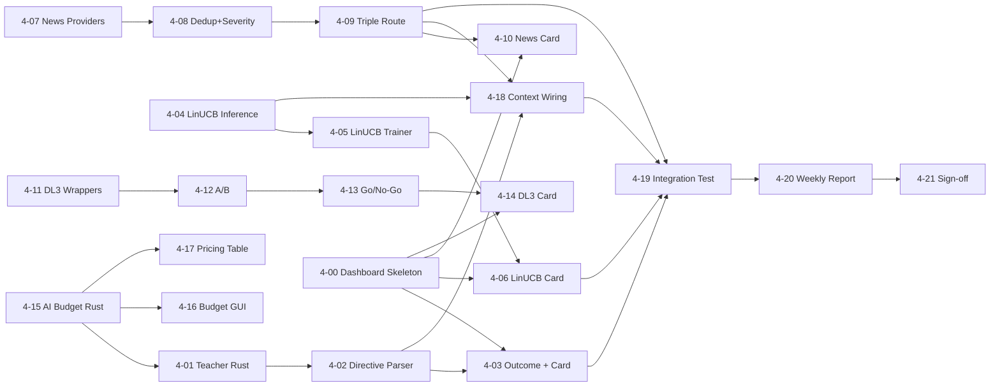

# Phase 4 Execution Plan V2 — Claude Teacher + LinUCB + News + DL-3
# Phase 4 執行計劃 V2 — Claude 教師 + LinUCB + 新聞 + DL-3
# 日期 / Date: 2026-04-06
# 週期 / Window: W13-15（7/03–7/23，15 工作日）
# 前置 / Prereq: Phase 3b 完成 + V009 已 apply
# 上游 spec / Source spec: docs/references/2026-04-04--execution_plan_v1.md §Phase 4
# 取代關係 / Supersedes: 無（v1 spec 保留作為高階規格，本文件為可執行拆解）

> 本文件將 v1 spec 的 5 行高階描述拆成 22 個可執行子任務（4-00~4-21）。
> This document expands the v1 spec's 5-line summary into 22 executable subtasks (4-00~4-21).
> 所有新建/修改文件必須中英對照注釋（CLAUDE.md §七），列為每個任務 DoD 的硬性條件。
> Every new/modified file must carry bilingual (CN/EN) comments as a hard DoD item.

---

## 1. 背景與決策摘要 / Background & Decisions

2026-04-06 operator 拍板的設計決策（嚴格遵守，禁止自行擴張規格）。

### Q1 — AI Budget 雙層預算 + GUI 可調 / Two-tier AI Budget
- **本地預算 / Local cap**：$100/月 default，GUI 可調。
- **平台硬上限 / Platform cap**：$150/月（手動於 console.anthropic.com 設定，GUI 僅存備註）。
- **Per-agent 配額**：Teacher $60 / Analyst $30 / Reserve $10（總和 ≤ Local）。
- **新表 / New tables**：
  - `learning.ai_budget_config (scope TEXT PK, monthly_usd NUMERIC, updated_at TIMESTAMPTZ, updated_by TEXT)`
  - `learning.ai_usage_log (ts TIMESTAMPTZ, scope TEXT, model TEXT, purpose TEXT, tokens_in INT, tokens_out INT, cost_usd NUMERIC, request_id TEXT, success BOOL)`，hypertable 7d。
- **IPC**：`update_ai_budget_config(scope, monthly_usd)` / `get_ai_budget_status()`。
- **GUI**：Risk tab 新增 "AI Budget" 區塊（預算輸入 + 綠/黃/紅進度條 + 分項 + reset month 按鈕）。
- **Fail-closed 降級**：$80 停 Analyst → $95 只留 Teacher → $100 全關 LLM 路徑。
- **原則 #13**：cost_edge_ratio ≥ 0.8 建議關倉，必須能在 budget tracker 即時查得。
- **歸屬決策**：tracker 在 **Rust 側**（openclaw_engine/src/ai_budget/），低延遲、引擎內可直接查。Python ml_training 透過 PyO3 讀。

### Q2 — News Provider / 新聞來源
- **採用 / Use**：CryptoPanic free (50 req/day, 28min 輪詢) + CoinTelegraph RSS + Google News crypto RSS + mock provider。
- **不用 / Reject**：NewsAPI ($449/月，違規 #14)。
- **Dedup**：headline SHA1 前 16 字 + 24h 時間窗。
- **Severity (Phase 4)**：keyword × source weight（不接 LLM severity，留 Phase 5）。
- **存儲**：`market.news_signals` (V002 已建)。
- **三層消費路由 / Triple-route**：Guardian (severity ≥ 0.8 觸發 halt check) / Regime (進 regime feature) / Learning (進 decision_context)。
- **Decision context**：`news_severity` + `hours_since_last_major_news` 已存在於 V003。

### Q3 — LinUCB Arms / 機械臂空間（已定案 2026-04-06：Hierarchical Warm-Start）
- 起步：v1_15 arms (5 strategy × 3 regime)。
- GUI：Phase 4 tab 提供 dropdown 可切 v2_25 / v3_375。
- DB：`learning.linucb_state` (V009 已建，arm_id PK)。
- **遷移策略 / Migration strategy**：sufficient-statistics hierarchical warm-start（**無 reset**）
  - 升維公式：`A_c_init = λI + (γ/K)·(A_parent − λI)`，`b_c_init = (γ/K)·b_parent`，`γ ≈ 0.5`
  - 降維公式（exact）：`A_p = λI + Σ(A_c − λI)`，`b_p = Σb_c`
  - 切換後 1-2 週 **Shadow compare**（新舊版同時跑，新版只 log 不交易）
  - 自動回滾：cumulative regret Δ < -2σ → 回舊版 + Telegram 告警，無需人工確認
  - 必須 reset 的硬邊界：reward 重定義 / feature 語義漂移 / 父 arm n_pulls < 30 / 黑天鵝後結構斷裂
  - 安全偵測：`feature_schema_hash` 強制一致性檢查，不一致 fail-closed
- **V010 migration schema**（納入 4-15，取代原 TBD）：
  - `linucb_state` ADD `arm_space_version TEXT NOT NULL DEFAULT 'v1_15'` + `parent_arm_id TEXT` + `inheritance_gamma REAL` + `feature_schema_hash TEXT`
  - PK 改為 `(arm_id, arm_space_version)` 支援多版本共存
  - 新表 `learning.linucb_state_archive`（回滾快照）
  - 新表 `learning.linucb_migrations`（遷移 audit log + rollback 鏈）
- 實作成本：+2 天一次性投入（相較純 reset 方案），換掉後續每次遷移 1-2 週學習浪費
- 研究依據：Li et al. 2010 (LinUCB 原論文) + T-LinUCB transfer + Stanford XCB hierarchy paper + Yahoo/Netflix 工業案例

### Q4 — DoD + Dashboard 分散歸屬
- **DoD 指標 / Metrics**：
  - **A**：Sharpe 改善 ≥ +0.15 vs Phase 3 baseline（CPCV 4-fold OOS）
  - **C**：Scorer Tier-1 AUC ≥ 0.55
  - **D**：Operator 看週報點 approve（4-20 提供 approval flow）
  - **E**：Teacher directive 執行率 ≥ 80% 且效果追蹤非負
- **Dashboard 歸屬**：
  - 4-00（Day 0-1）建骨架 + 共用 card template + 紅黃綠燈聚合層 + `get_phase4_status` IPC。
  - 每個 Group 交付各自的 Card 作為自身 DoD 一部分。
  - 4-20 整合週報 plain English generator + operator approval flow。

---

## 2. 子任務清單 / Subtask Catalog

> 角色縮寫 / Roles：E1=後端 · E1a=前端 · E2=代碼審查 · E4=測試 · E5=優化 · AI-E=AI 效果評估 · QA=驗收
> 工作量 / Effort：0.5d / 1d / 2d / 3d（≤3d 顆粒度上限）

### Group 0 — Dashboard 骨架 / Dashboard Skeleton

| ID | 標題 | Role | 描述 | 依賴 | 交付物 | 工時 | DoD |
|----|------|------|------|------|--------|------|-----|
| **4-00** | Phase 4 Dashboard 骨架 + 共用 card template | E1a | 在 GUI 新增 "Phase 4" tab，骨架 + 通用 `dashboard_card.html` template + 紅/黃/綠燈聚合層 + `get_phase4_status` IPC stub。後續每組交付 Card 插槽。 | — | `gui/templates/phase4_tab.html` · `gui/templates/_dashboard_card.html` · `control_api/routes/phase4_routes.py` (stub) · IPC `get_phase4_status` (engine 回 placeholder) | 1d | Tab 可開、4 個空 card 插槽渲染、紅燈狀態正確顯示、CN/EN 雙語注釋齊全 |

### Group 1 — Claude Teacher / Claude 教師（4-01 ~ 4-03）

| ID | 標題 | Role | 描述 | 依賴 | 交付物 | 工時 | DoD |
|----|------|------|------|------|--------|------|-----|
| **4-01** | Teacher directive Rust 接口 + ExperimentLedger 寫入 | E1 | Rust `claude_teacher` 模組：呼叫 Claude API 取得 directive，schema 化解析（type/scope/param/expiry），寫入 `learning.teacher_directives` 並 link `experiment_ledger`。 | 4-15（budget tracker）| `rust/openclaw_engine/src/claude_teacher/{mod.rs,client.rs,parser.rs}` · IPC `submit_teacher_directive` · 5 unit tests | 3d | 真實 directive 寫入 PG · cost 計入 ai_usage_log · parser 拒絕未知欄位 fail-closed · 雙語注釋 |
| **4-02** | Directive 指令解析 + 風控過濾 | E1 | 將 directive 轉成可執行 hint（adjust_param / pause_strategy / boost_arm）並過濾掉觸碰 P0/P1 硬邊界的指令。Guardian 必須有否決權。 | 4-01 | `claude_teacher/applier.rs` · 整合 GovernanceHub veto · 6 tests（含 3 個拒絕案例）| 2d | P0/P1 違規 directive 100% 拒絕 · 拒絕原因寫 directive_executions · 雙語注釋 |
| **4-03** | directive_executions 效果追蹤 + Card | E1 + E1a | 為每條已執行 directive 追蹤 N 小時內 PnL/Sharpe 變化，寫 `learning.directive_executions.outcome_*`。GUI Card：本週 directive 列表、執行率、效果直方圖。 | 4-02, 4-00 | `claude_teacher/outcome_tracker.rs` · `phase4_routes.py` Teacher card 端點 · `gui/templates/cards/teacher_card.html` | 2d | 執行率 ≥ 80% 可量測 · 7d 效果非負 · Card 紅黃綠對應 DoD-E |

### Group 2 — LinUCB（4-04 ~ 4-06）

| ID | 標題 | Role | 描述 | 依賴 | 交付物 | 工時 | DoD |
|----|------|------|------|------|--------|------|-----|
| **4-04** | LinUCB Rust inference + arm space v1_15 + versioned state | E1 | Rust `linucb` 模組：load (A,b) from `learning.linucb_state` WHERE `arm_space_version='v1_15'`，計算 UCB，select arm，update。讀寫都帶 `arm_space_version` + `feature_schema_hash` 一致性檢查（不一致 fail-closed）。IPC: `linucb_select_arm` / `linucb_get_arm_state`. | 4-15 (V010 schema) | `rust/openclaw_engine/src/linucb/{mod.rs,inference.rs,state_io.rs,schema_hash.rs}` · 8 tests | 3d | 15 arms cold-start 不 panic · UCB 公式對齊 v0.4 §LinUCB · 寫回 PG 一致 · schema_hash 失配 fail-closed · 雙語注釋 |
| **4-05** | LinUCB Python training + 收斂監控 | E1 | Python `ml_training/linucb_trainer.py`：批次重訓 A/b（從 `decision_context_snapshots` 抽 reward），寫回 PG。CPCV embargo 對齊 Phase 3b。 | 4-04 | `program_code/ml_training/linucb_trainer.py` · 4 tests | 2d | 重訓收斂 cumulative_reward 上升 · n_pulls 增加 · 雙語注釋 |
| **4-06** | Model Performance rolling + LinUCB Card + arm dropdown + warm-start migrate | E1a + E1 | GUI Card：per-arm pulls/reward/UCB heatmap、收斂曲線、shadow compare 狀態條。Dropdown 切 v1_15/v2_25/v3_375，切換呼叫 **hierarchical warm-start migration script**（§Q3）：父→子 sufficient statistics 攤分 + γ=0.5 折扣，舊版 state archive 保留。Shadow mode 強制 1-2 週，自動 regret 監控。`observability.model_performance` 7d hypertable rolling 接線。 | 4-04, 4-05, 4-00 | `phase4_routes.py` LinUCB endpoints · `cards/linucb_card.html` · `program_code/ml_training/linucb_arm_migration.py` (warm-start + archive + audit) · `model_performance` writer · shadow compare harness · 6 migration tests | 3d | 15→25 warm-start 測試通過（θ 保留檢驗）· shadow 2 週後自動 regret 比較 · rollback 單命令可觸發 · DoD-A 可從 Card 讀出 · 雙語注釋 |

### Group 3 — News（4-07 ~ 4-10）

| ID | 標題 | Role | 描述 | 依賴 | 交付物 | 工時 | DoD |
|----|------|------|------|------|--------|------|-----|
| **4-07** | News provider abstract + CryptoPanic + RSS + mock | E1 | Rust trait `NewsProvider`，三實現：CryptoPanic free（28min 輪詢，50/day quota guard）、CoinTelegraph RSS、Google News crypto RSS、`MockProvider`（測試用）。 | — | `rust/openclaw_engine/src/news/{mod.rs,cryptopanic.rs,rss.rs,mock.rs}` · 6 tests | 3d | 三 provider 都能拉到 ≥ 1 條新聞 · quota 不超 · fail-closed 降級到 mock · 雙語注釋 |
| **4-08** | Headline dedup + severity scorer (keyword × source) | E1 | SHA1[:16] dedup + 24h 滑窗。Severity = Σ keyword_weight × source_weight，clamp [0,1]。寫 `market.news_signals`（V002）。**不接 LLM severity（Phase 5）。** | 4-07 | `news/dedup.rs` · `news/severity.rs` · keyword YAML config · 5 tests | 2d | dedup 命中率 ≥ 95% (測試集) · severity 與 hand-labeled 樣本 Spearman ≥ 0.5 · 雙語注釋 |
| **4-09** | Triple-route 消費路由 (Guardian/Regime/Learning) | E1 | NewsBus 三路 fan-out：(a) Guardian halt check (severity ≥ 0.8) (b) Regime feature 注入 (c) decision_context 寫 `news_severity` + `hours_since_last_major_news`。 | 4-08 | `news/router.rs` · 接入 `governance_hub.rs` · 接入 `context_writer` · 6 integration tests | 2d | 三路都能收到 · halt check fail-closed · context 欄位 100% 寫入 · 雙語注釋 |
| **4-10** | News Card + provider health 監控 | E1a | GUI Card：最新 10 條 headline、severity 顏色、provider quota 殘量、24h 觸發 halt 次數。 | 4-09, 4-00 | `phase4_routes.py` news endpoints · `cards/news_card.html` | 1d | 三 provider 狀態可見 · severity 過 0.8 紅燈 · 雙語注釋 |

### Group 4 — DL-3 Foundation Models（4-11 ~ 4-14）

| ID | 標題 | Role | 描述 | 依賴 | 交付物 | 工時 | DoD |
|----|------|------|------|------|--------|------|-----|
| **4-11** | TimesFM/Chronos async wrapper + foundation_model_features 表 | E1 | Python async wrapper（非阻塞 inference，超時 → 降級）。新增 `learning.foundation_model_features` (ts, symbol, model, horizon, forecast JSONB, latency_ms)。 | — | `program_code/ml_training/dl3_foundation.py` · migration V010 (僅本任務需要時建) · 4 tests | 3d | 兩模型都能跑 ≥ 1 prediction · 超時降級不阻塞主路徑 · 雙語注釋 |
| **4-12** | DL-3 A/B 框架 + 基準對比 | E1 | A/B：Phase 3 Scorer baseline vs Scorer + DL-3 features。AUC 提升 < 0.01 → 自動標記棄用。 | 4-11 | `ml_training/dl3_ab_runner.py` · 4 tests | 2d | A/B 完整跑通 · 棄用邏輯觸發測試覆蓋 · 雙語注釋 |
| **4-13** | DL-3 降級 + Go/No-Go 決策腳本 | E1 + AI-E | 自動產生 Go/No-Go 報告 (Markdown)：AUC delta、latency、cost、推薦決定。AI-E 簽核。 | 4-12 | `helper_scripts/phase4/dl3_go_no_go.py` · 報告 template | 1d | 報告含 AUC/latency/cost · AI-E 簽核欄位 · 雙語注釋 |
| **4-14** | DL-3 Card + 決策展示 | E1a | Card：兩模型 latency/cost、AUC delta vs baseline、Go/No-Go 狀態燈。 | 4-13, 4-00 | `cards/dl3_card.html` · phase4_routes endpoint | 1d | Card 顯示決定 · 棄用後紅燈 + 自動隱藏 inference 路徑 · 雙語注釋 |

### Group 5 — Cross-cutting / 跨切面（4-15 ~ 4-19）

| ID | 標題 | Role | 描述 | 依賴 | 交付物 | 工時 | DoD |
|----|------|------|------|------|--------|------|-----|
| **4-15** | AI Budget tracker (Rust) + DDL V010 (budget + linucb versioning) + IPC | E1 | Rust `ai_budget` 模組：load `ai_budget_config`，append `ai_usage_log`，計算 per-scope/per-month 殘量，fail-closed 降級狀態。V010 **同時加 linucb_state versioning schema**（arm_space_version + parent_arm_id + inheritance_gamma + feature_schema_hash + PK 改 (arm_id, arm_space_version)）+ linucb_state_archive + linucb_migrations 表，供 4-06 warm-start 遷移使用。**併入原 CONF-D** LinUCB 調參 IPC：`update_strategy_params` 接收 confidence override。 | — | `rust/openclaw_engine/src/ai_budget/{mod.rs,tracker.rs,config_io.rs}` · `sql/migrations/V010__ai_budget_and_linucb_versioning.sql`（5 tables/alters）· IPC `update_ai_budget_config` / `get_ai_budget_status` / `update_strategy_params` 擴充 · 10 tests | 3d | V010 apply 成功（5 changes）· linucb PK 升級不破壞既有 row · 三段降級閾值 ($80/$95/$100) 觸發測試 · per-agent 殘量正確 · cost_edge_ratio 0.8 信號 · 雙語注釋 |
| **4-16** | Q1 GUI: AI Budget Risk-tab 區塊 | E1a | Risk tab 新增 "AI Budget" 區塊：local cap 輸入、platform cap 備註、per-agent 配額、綠黃紅進度條、reset month 按鈕。 | 4-15 | `gui/templates/risk_tab.html` 擴充 · `control_api/routes/ai_budget_routes.py` | 2d | 預算可改 · 進度條對應實際用量 · reset 寫 audit log · 雙語注釋 |
| **4-17** | Provider pricing table 綁定 (Anthropic/OpenAI/Local) | E1 | 把原 FA GAP-10（pricing table）正式落地：YAML config + Rust loader + Python loader + ai_usage_log 寫入時用真實單價。 | 4-15 | `settings/ai_pricing.yaml` · `rust/openclaw_engine/src/ai_budget/pricing.rs` · `program_code/llm/pricing.py` · 4 tests | 1d | 5+ 模型 pricing 正確 · 缺項 fail-closed · 雙語注釋 |
| **4-18** | Decision_context 接線（claude_directive_id / linucb_arm_id / linucb_confidence_bound + news 欄位） | E1 | `context_writer` 接入 V009 三個新欄位 + V003 已存在 news 欄位的實際寫入。Phase 3b 已寫框架，本任務補欄位映射。 | 4-02, 4-04, 4-09 | `rust/openclaw_engine/src/database/context_writer.rs` 擴充 · 5 tests | 1d | 5 欄位 ≥ 99% 非 NULL（有 directive/arm/news 時）· 雙語注釋 |
| **4-19** | Phase 4 集成測試 (test_full_learning_loop) | E4 | 端到端：mock news → severity → Guardian halt check → LinUCB select arm → directive → context_writer → ledger → outcome tracker。3 個 integration tests。 | 4-03, 4-06, 4-09, 4-18 | `tests/integration/test_phase4_loop.py` · `rust/openclaw_engine/tests/phase4_integration.rs` | 2d | 3 tests pass · 端到端 < 5s · 雙語注釋 |

### Group 6 — 週報 + 驗收 / Weekly Report + Sign-off

| ID | 標題 | Role | 描述 | 依賴 | 交付物 | 工時 | DoD |
|----|------|------|------|------|--------|------|-----|
| **4-20** | 週報 plain-English generator + operator approval flow | E1 + E1a | 每週生成 Markdown 報告：DoD A/C/E 指標、本週 directives、LinUCB 收斂、News 觸發、DL-3 狀態、AI cost。GUI approval 按鈕，approve 寫 `learning.weekly_review_log`。 | 4-03, 4-06, 4-10, 4-14, 4-19 | `helper_scripts/phase4/weekly_report.py` · `cards/weekly_review_card.html` · approval IPC + DDL（併入 V010）| 2d | 報告涵蓋全部 DoD · operator approve 持久化 · DoD-D 可量測 · 雙語注釋 |
| **4-21** | E2 + E4 + E5 + AI-E + QA + PM 簽收 | E2/E4/E5/AI-E/QA | 強制工作鏈最終回合：E2 review、E4 全量回歸、E5 優化審查、AI-E DL-3 Go/No-Go 簽核、QA 端到端、PM 確認。 | 4-20 | 6 個 audit 報告 in `docs/audits/2026-04-XX--phase4_*.md` | 2d | 0 P0 / 0 P1 · 全綠 · PM 簽字 |

---

## 3. 依賴圖 / Dependency Graph

---

## 4. 並行 Wave / Parallel Waves

| Wave | Day | 並行子任務 | 阻塞 | 目標 |
|------|-----|------------|------|------|
| **W0** | D0-D1 | 4-00, 4-15 | — | 骨架 + budget 基建先行 |
| **W1** | D2-D5 | 4-01, 4-04, 4-07, 4-11, 4-17 | W0 (4-15) | 五路並行啟動 |
| **W2** | D6-D8 | 4-02, 4-05, 4-08, 4-12, 4-16 | W1 | 各組第二步 |
| **W3** | D9-D11 | 4-03, 4-06, 4-09, 4-13, 4-18 | W2 | Card 接線 + 路由完成 |
| **W4** | D12 | 4-10, 4-14 | W3 | 剩餘 Card |
| **W5** | D13-D14 | 4-19 | W4 | 集成測試 |
| **W6** | D14-D15 | 4-20, 4-21 | W5 | 週報 + 簽收 |

**關鍵路徑 / Critical Path**：
`4-15 (3d) → 4-01 (3d) → 4-02 (2d) → 4-03 (2d) → 4-19 (2d) → 4-20 (2d) → 4-21 (2d) = 16d`
但 4-19 並行壓在 4-18 後 → 實際 critical path 14-15d，落在 W13-15 視窗內。

---

## 5. 工作量總和 / Effort Total

| Group | 任務數 | 工時 |
|-------|--------|------|
| 0 Dashboard | 1 | 1d |
| 1 Teacher | 3 | 7d |
| 2 LinUCB | 3 | 7d |
| 3 News | 4 | 8d |
| 4 DL-3 | 4 | 7d |
| 5 Cross-cut | 5 | 9d |
| 6 Sign-off | 2 | 4d |
| **總計 / Total** | **22** | **43 person-days** |

5 路並行假設（5 個 E1 + 1 E1a + 共享 E2/E4）→ wall-clock ≈ **15 工作日**，落在 W13-15（15d）視窗內。

---

## 6. DoD 清單 / DoD Checklist

- [ ] **A** Sharpe 改善 ≥ +0.15 vs Phase 3 baseline（CPCV 4-fold OOS · 由 4-06 / 4-19 量測）
- [ ] **C** Scorer Tier-1 AUC ≥ 0.55（由 4-12 量測）
- [ ] **D** Operator 看週報點 approve（4-20）
- [ ] **E** Teacher directive 執行率 ≥ 80% 且 7d 效果追蹤非負（4-03）
- [ ] V010 (ai_budget_config + ai_usage_log) apply 成功
- [ ] AI Budget fail-closed 三段降級實測通過（$80/$95/$100）
- [ ] 三 News provider 都拉到真實數據 + dedup 正確
- [ ] LinUCB 15 arms 收斂可見
- [ ] DL-3 Go/No-Go 報告由 AI-E 簽核
- [ ] 22 子任務全 [x] · 0 P0/P1 · E2 + E4 + E5 + QA + PM 簽收
- [ ] 全部新文件中英對照注釋（CLAUDE.md §七）

---

## 7. 風險登記 / Risk Register

| # | 風險 | Likelihood | Impact | Mitigation | 觸發子任務 |
|---|------|------------|--------|------------|------------|
| R1 | **Claude API cost 超預算** | M | H | 4-15 fail-closed 三段降級 + 4-17 真實 pricing | 4-01, 4-15 |
| R2 | **CryptoPanic free quota 超限** | H | M | 4-07 quota guard + fallback 到 RSS+mock | 4-07 |
| R3 | **DL-3 latency > 主路徑 SLA** | M | H | 4-11 async + 超時降級 + 4-13 棄用條件 | 4-11, 4-13 |
| R4 | **LinUCB cold start arm 偏差** | M | M | 4-04 alpha 較大初始化 + 4-05 batch retrain | 4-04, 4-05 |
| R5 | **LinUCB warm-start 遷移 bias** | M | M | 4-06 shadow compare 1-2 週 + KL divergence 監控 + 自動 regret 回滾 + `feature_schema_hash` fail-closed | 4-06 |
| R6 | **Teacher directive 觸碰硬邊界** | M | **CRITICAL** | 4-02 GovernanceHub veto fail-closed + 100% 拒絕測試覆蓋 | 4-02 |
| R7 | **News severity 誤觸 Guardian halt** | M | H | 4-08 Spearman ≥ 0.5 驗證 + 4-09 halt check 需 ≥0.8 高門檻 | 4-08, 4-09 |
| R8 | **Integration test 範圍蔓延** | M | M | 4-19 限定 3 個端到端 case，不擴張 | 4-19 |

**最高風險 / Highest risk task**：**4-02 Directive Parser + 風控過濾**——一旦 GovernanceHub veto 漏網，Teacher 可繞過 P0/P1 硬邊界，違反根原則 #4 #11。必須 100% 拒絕測試覆蓋 + E3 安全審計強制介入。

---

## 8. 不變約束 / Invariants

1. 所有改動必須對齊 Q1/Q2/Q3/Q4 已拍板決策（Q3 採用 hierarchical warm-start，見 §Q3）。
2. Phase 3b 已完成模組（optuna / cpcv / thompson / scorer）**禁止重複實作**。
3. 新代碼 Rust-first（feedback_new_code_rust_first）。
4. 風控參數改動必須走 RiskManagerConfig + IPC（feedback_risk_changes_scoped）。
5. 中英對照注釋（CLAUDE.md §七）為每個任務 DoD 硬性條件。
6. 跨平台兼容性（CLAUDE.md §七）：禁硬編碼 `/home/ncyu/`，E2 必查。

---

*V2 · 2026-04-06 · 拆解 22 子任務 · 對應 v1 spec Phase 4 · operator 拍板 Q1/Q2/Q3/Q4（Q3=hierarchical warm-start）*
